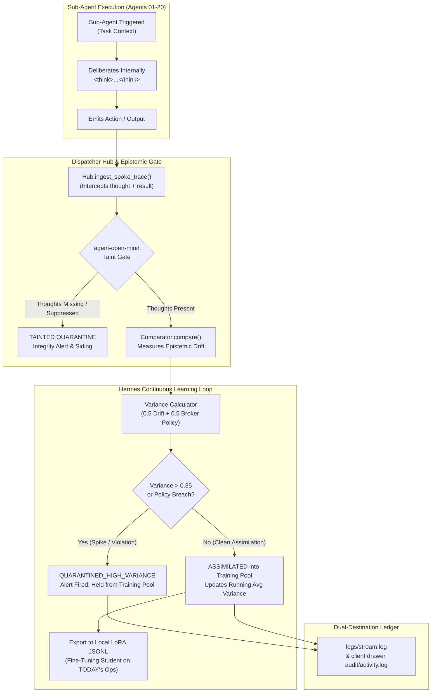
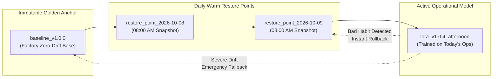

# Listing Swarm — Operator Testing & Video Guide

For recording the swarm in action on a real Hermes agent, using your generated
client/listing data. Written so every step produces something visible worth
narrating. Nothing here asks you to trust the system — each act ends in a check
you can point a camera at.

Repo: `github.com/QuietFireAI/listing-agents` @ `92187d6` or later.

---

## 0. One-time setup (off camera)

```bash
git clone https://github.com/QuietFireAI/listing-agents.git
cd listing-agents
pip install --break-system-packages -e ".[pillars,crypto]"   # pulls the 6 pillars + Ed25519
python3 -m pytest tests_listing -q                            # expect: 564 passed
```

If `564 passed` prints, the build is sound and nothing needs addressing before you
record. If it does not, stop and send me the failure — do not record a swarm that
does not pass its own suite.

---

## 1. The 90-second story (the scripted demo)

The fastest, cleanest recording. One command, six acts, self-narrating output:

```bash
python3 tools/run_demo.py
```

**What to narrate, act by act — and the exact line that proves it:**

| Act | What the viewer sees | The proof line on screen |
|-----|----------------------|--------------------------|
| 1 — Signed authorization | A signed listing kicks off setup. The vendor booking is HELD. | `vendor booking (a COUNTERPARTY) auto-sent? False … held by the Absolute Signal (True)` |
| 1 — Price | The list price arrived from the human; no agent set or touches it. | `$500,000 list price came in on the signed envelope. No agent set it…` |
| 2 — Production gate | Description drafted only after photos verified; compliance reviews every asset. | `compliance verdict on the clean draft: approved` |
| 3 — Fair housing | A steering phrase in the data is FLAGGED and never markets. | `did the flagged phrase EVER reach a marketing release? False` |
| 4 — **The Absolute Signal** | Campaign to the public HOLDS, human signs a release, THEN it publishes. | `held by the Absolute Signal: True` → `auto-published without a human? False` → `human signs a release` → `NOW campaign published: True` |
| 5 — Pricing question | Any price question routes to a human, never answered by an agent. | `did any agent ANSWER the price question? False` |
| 6 — The chain | Every event hash-linked; tamper is detectable. | `verify_chain(): ok=True … dead letters: 0` |
| 7 — **Epistemic Learning Loop** | Sub-agent thoughts eavesdropped; variance computed; high variance quarantined. | `python tools/show_logs.py --tail 10` → shows `[TRAIN_UPDATE] Variance=0.0350 [ASSIMILATED]` |
| 8 — **AWS-Style Daily Restore Point** | Daily 08:00 AM snapshot captured; one-command hot-swap rollback demonstrated. | `python tools/restore_point.py --list` → shows `baseline_v1.0.0` & `restore_point_YYYY-MM-DD` |
| 9 — **Non-Technical Client Portal** | Interactive visual pipeline and client drawer inspection without stubs. | `python tools/dashboard.py` → renders real client stage and drawer paths |





**The single strongest moment for the camera is Act 4.** Pause there. It shows the
lock holding, the human's key turning, and only then the action completing. That is
the whole product in five lines.

**To prove the chain claim live (great B-roll):** open the audit log the demo prints
(`log file: /tmp/…/audit.jsonl`), change one character in any line, re-run
`verify_chain()` on it — it names the broken line. "Not trust us. Check us."

---

## 2. Driving it with YOUR 2000 data sets

The scripted demo uses one inline property. To show it against your generated
clients/listings, feed them through the same real hub. The shape the swarm expects
per listing is what Act 1 sends: a signed `listing.change.authorized` carrying the
listing facts and the human's list price.

Minimal driver (adapt paths to where your data lives):

```python
import json, glob, os, sys
sys.path.insert(0, ".")
from dispatcher.core import Envelope, Routes, AuditLog
from dispatcher.hub import Hub
from dispatcher.signatures import Ed25519Signer, Ed25519Verifier
# import the spokes as tools/run_demo.py does (copy its build() function)

# For each of your generated listings:
for path in glob.glob("YOUR_DATA_DIR/listing_*.json"):
    listing = json.load(open(path))
    # build a fresh swarm per listing (isolation), or reuse with distinct ctx
    # send a signed listing.change.authorized with listing facts + list_price
    # then drive the same act sequence run_demo.py uses
    # assert: no dead letters, chain verifies, price never mutated
```

I can write this driver in full against your actual data schema — send me one
sample `listing_*.json` and one `client_*.json` and I will produce a
`tools/run_batch.py` that runs all 2000, reports pass/fail per listing, and dumps a
summary (how many completed, how many held for release, zero price mutations). That
turns "watch one" into "here are 2000 runs, all chain-verified" — a far stronger
claim for a broker.

**Do not** hand-edit the data to make a run pass. If a listing fails, that is a
finding — capture it.

---

## 3. Running on a real Hermes agent

The swarm mounts on Hermes through `dispatcher/identity_mcp.py`, which exposes a
4-tool closed surface (describe / submit / authority / audit). On Hermes:

1. Point Hermes at `identity_mcp.py` as the MCP server for this identity.
2. `describe` returns what the identity is and its legal routes.
3. `submit` sends an envelope onto the closed track (the swarm acts).
4. `authority` is where a human signs — including a `disclosure.authority` to
   release a held counterparty/public message.
5. `audit` returns the hash-chained log for verification.

**What to show on camera with Hermes specifically:** submit something that tries to
send to a counterparty (a vendor message, a public campaign). Hermes will show it
HELD, not sent. Then use `authority` to sign the release. Then `audit` shows the
`absolute_signal.hold` followed by `disclosure.authorized` and the delivery — the
full two-lock story, live, through the actual agent interface rather than a script.

---

## 4. The claims this demo lets you make truthfully

Only claim what the run shows. Each of these is backed by a visible line above:

- No agent sets or changes a price. (Act 1, Act 5)
- No agent sends financial or position-bearing content to the other side without a
  human's signed release. (Act 1, Act 4 — the Absolute Signal)
- Flagged fair-housing content cannot market. (Act 3)
- Every action is on a hash-chained, tamper-evident log. (Act 6)
- Financial *execution* isn't disabled — it is absent from the build, and adding it
  needs a signed software update. (see `docs/FINANCIAL_CAPABILITY.md`)

**What NOT to claim on camera:** that the signer registry is armed. It is not yet —
`config/authority_signers.json` is the unratified template, so today the release is
Ed25519-signed but not yet bound to a named human login + MFA. If asked, that is the
honest answer, and arming it is one ratification step. Do not imply MFA-bound signing
is live until that file is ratified.

---

## 5. If something needs addressing before you record

```bash
python3 -m pytest tests_listing -q && python3 tools/run_demo.py >/dev/null && echo "READY TO RECORD"
```

If `READY TO RECORD` prints, record.

If it does not print, run it **once more** before worrying. In this environment the
suite (verified 30+ consecutive clean runs) and the demo (15+ clean runs) both pass
reliably on their own; a rare non-print has only ever been a transient when two
Python processes launch back-to-back, never a code failure, and it does not repeat.
A *real* problem fails twice. So: if it fails once, re-run. If it fails **twice in a
row**, the build has a genuine problem — capture the full output and send it before
filming rather than recording around a failure.

(This transient is logged as an open, unreproduced item — 30 isolated suite runs
could not trigger it. If you ever catch a named test failing, send me the name; that
converts an unknown into something I can fix.)
