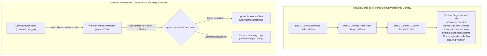
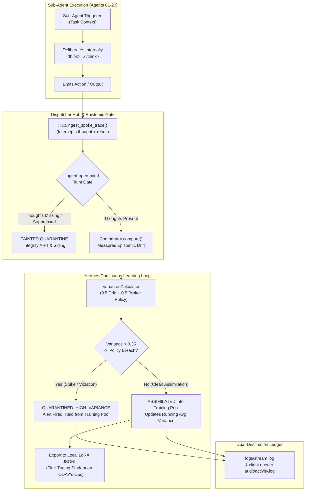
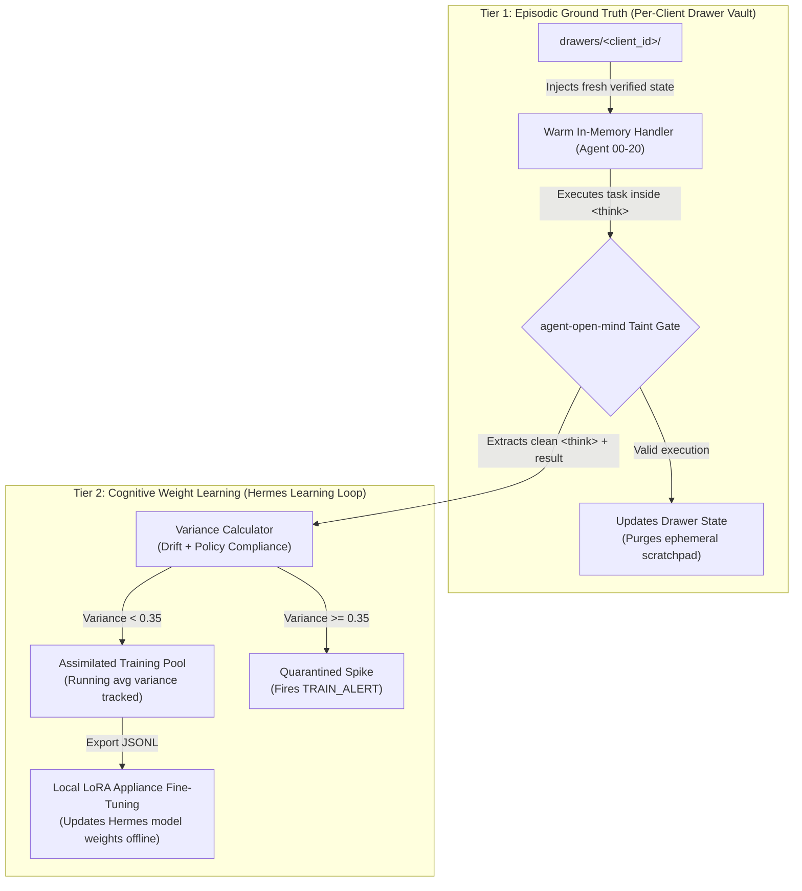
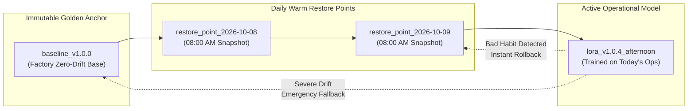

# ListingAssistants (formerly listing-agents)

**The Governed 21-Agent Residential Real Estate Swarm on a Closed Track**  
*Every message routed by one hub, every route pre-approved, every action recorded on a tamper-evident, hash-chained audit log.*  
*(Official Production Domain: [ListingAssistants.com](https://ListingAssistants.com) — Brand notice: distinct from listingagent.com)*

[](tests_listing/)
[](identity/routes.json)
[](playbooks/)
[](docs/SWARM_COACHES_PLAYBOOK.md)
[](dispatcher/core.py)

---

## What is ListingAssistants?

**ListingAssistants** is a production-grade, multi-agent AI operating chassis specifically engineered for residential real estate brokerages, top-producing listing agents, and high-volume transaction teams. 

Unlike conventional, unconstrained LLM chat wrappers that hallucinate prices, leak client confidential data, or improvise legal terms, **ListingAssistants** operates on an **invariable railroad chassis**:
* **21 Specialized Spoke Agents (00–20):** Dedicated single-responsibility agents covering every phase of the listing lifecycle (lead capture, qualification, MLS ingestion, photography curation, showing logistics, transaction management, Fair Housing compliance, CRM updates, and financial reconciliation).
* **Closed Routing Track (51 Verified Lanes):** The LLM never decides who to speak to. Every envelope is routed through a central dispatcher hub strictly governed by [`identity/routes.json`](identity/routes.json). Unapproved routing attempts are immediately rejected and logged.
* **Deterministic Decision Tuples (227 Tuples):** All ambiguous, sensitive, or statutory edge cases are pre-deliberated. If a situation matches a tuple, the rule executes deterministically without model improvisation.
* **Cryptographic Authority & Money Gates:** High-risk actions (listing price authorizations, listing status changes, and wire-related instructions) require an **Ed25519 cryptographic signature**. Unsigned or invalid requests are dropped fail-closed.
* **6 QuietFire Forensic Detection Pillars:** Continuously inspects agent thought traces and outputs for adversarial divergence, prompt injection, and goal drift.

---

## Architectural Core: Clean-Room Fiduciary Execution

A primary flaw in recreational multi-agent frameworks is letting agents maintain long-running conversational memory across tasks and clients. In legally regulated real estate fiduciaries, this causes **cross-client data commingling, context window pollution, and hallucination snowballs**.

ListingAssistants strictly enforces **Clean-Room Fiduciary Execution**:



* **Warm Handlers, Stateless Context:** The 21 spoke agents stand warm in memory (`dispatcher/hub.py#L90`) with sub-2ms dispatch latency. What is wiped between turns is purely the *ephemeral client scratchpad*, preventing cross-client data bleeding.
* **The "One Client, One Drawer" Vault:** Client documents and state live strictly in physical isolated filesystem drawers (`drawers/<client_id>/`). Illegal cross-drawer access raises `ComminglingBreachError` fail-closed.

---

## The Cognitive Student: Continuous Learning & Epistemic Surveillance

To ensure our cognitive student (Nous Hermes) becomes progressively smarter about **today's actual brokerage operations** without drifting or developing bad habits, the Dispatcher Hub runs an active epistemic surveillance and learning loop:



### The Two-Tier Learning Model:


1. **Mandatory Thought Trace Eavesdropping:** Under `Hub.ingest_spoke_trace()`, every sub-agent must register its internal `<think>` trace.
2. **Epistemic Taint Check:** If an agent suppresses doubts or acts without thinking, `agent_open_mind.taint_check` immediately flags the trace as `TAINTED`.
3. **Multi-Metric Variance Calculation:** Evaluates epistemic drift via `open_mind.comparator.Comparator.compare()` and tests against Fair Housing, wire defense, and pricing boundaries. Low-variance runs are assimilated; spikes are quarantined.
4. **Appliance-Native LoRA Updates:** Curated operational exemplars are exported to JSONL for local offline fine-tuning on consumer/appliance GPUs (e.g. Drobo NAS + RTX hardware).

---

## AWS-Style Snapshots & Daily Warm Restore Points

Applying the **AWS Well-Architected Framework (Reliability Pillar)** and enterprise system restore point patterns, ListingAssistants guarantees instant recovery if local model tuning ever introduces subtle behavioral drift:



1. **Factory Golden Baseline (`baseline_v1.0.0`):** Pristine, immutable zero-drift base weights. Guarantees immediate fallback to factory state in under 10ms.
2. **08:00 AM Daily Warm Restore Point:** Automated daily snapshot of the clean start-of-day model state. Allows rolling back an afternoon fine-tuning delta without losing historical learning.
3. **Golden Broker Regression Exam:** Candidate checkpoints must pass a 4-part deterministic compliance exam (Fair Housing, Wire Fraud, Pricing Boundaries, NAR 2024 settlement rules) before activation.

---

## Key Capabilities & Hardened Additions

### 1. JEV AI Decision Platform Integration
Integrates with the high-efficiency **JEV AI Decision Platform** (`dispatcher/decision_adapter.py`) via the Model Context Protocol (MCP) tool contract. Includes an in-process, zero-network pure Python fallback engine (`JevPythonDecisionEngine`) that evaluates multi-attribute lead rubrics and showing calendar conflicts with zero HTTP REST overhead.

### 2. Nous Hermes Cognitive Seam & Thought Extraction
Leverages **Nous Hermes** (`dispatcher/hermes_seam.py`) to extract `<think>...</think>` tokens directly in-stream. This bypasses frontier provider thought-inspection bans and feeds authentic internal deliberation directly into the QuietFire detection pillars. Includes the `BrokerContextIngestor` to onboard Hermes like a junior college graduate undergoing in-house brokerage training.

### 3. Non-Technical Client Funnel & Drawer Portal (`tools/dashboard.py`)
Provides an interactive web portal (`dashboard.html`) and visual CLI pipeline for brokers and non-technical staff:
* Inspects real filesystem drawers and SQLite persistence records with **zero stubs**.
* Tracks client location, drawer path, file inventory, and 6-stage sales funnel progress.
* Displays highlighted alerts if an agent is paused awaiting a broker decision call.

### 4. Human-Readable Real-Time & EOD Logging (`dispatcher/readable_logger.py`)
Dual-destination logging architecture:
* Emits formatted plain-English events (`[DISPATCH]`, `[DECISION]`, `[VAULT]`, `[API_CALL]`, `[TRAIN_UPDATE]`) to `logs/stream.log`.
* Simultaneously writes isolated logs to `drawers/<client_id>/audit/activity.log` for data sovereignty.
* Compiles automated End-of-Day (EOD) Operations Dossiers at `logs/daily/eod_ledger_YYYY-MM-DD.md`.
* CLI inspection tool: `tools/show_logs.py`.

### 5. Shadow Weight Checkpointing & Restore CLI (`tools/restore_point.py`)
Operator CLI tool providing AWS-style snapshot controls:
* `python tools/restore_point.py --list` — Lists all restore points and active model pointer.
* `python tools/restore_point.py --snapshot` — Captures start-of-day warm restore point.
* `python tools/restore_point.py --restore baseline` — Instant hot-swap rollback to Golden Baseline.
* `python tools/restore_point.py --exam baseline_v1.0.0` — Runs the Golden Broker Regression Exam.

### 6. Human-in-the-Loop (HITL) Resumption Protocol & Forensic Snapshots
Provides a complete pause-and-resume lifecycle (`dispatcher/hitl_protocol.py`) when agents hit human authorization gates:
* Serializes task state to `WaitState` and fires immediate real-time notifications via SMS (Twilio), webhook, or push.
* Standardized decision actions: `APPROVE`, `APPROVE_WITH_OVERRIDE`, `REJECT`, `HOLD`, `CLOSE_SYSTEM`.
* Morning 08:00 AM unresolved decision roll-up dossier via Agent 18.
* Forensic diagnostic snapshot generator: `tools/snapshot_drawer.py`.

---

## The 21 Spoke Agents

| Agent ID | Name | Core Responsibilities | Absolute Invariant |
| :--- | :--- | :--- | :--- |
| **00** | Human Principal | Licensed Broker / Team Lead | Owns all fiduciary pricing, legal lines, and final sign-offs. |
| **01** | Lead Capture | Inbound ingestion across web, email, SMS | Never promises service without jurisdiction verification. |
| **02** | Lead Qualification | Applies signed lead-scoring rubric via JEV AI | Never authors rubrics; exact boundary scores drop to lower tier. |
| **03** | Lead Nurture | Cadenced buyer/seller follow-up | Respects legal quiet hours; honors immediate opt-outs. |
| **04** | Listing Description | Drafts property MLS remarks via Hermes | Zero subjective steering words; physical property facts only. |
| **05** | Listing Onboarding | Onboarding package & draft MLS records | Go-live requires verified active status, not an assumed push log. |
| **06** | Showing Scheduler | Showing calendar logistics & buffer management | Access codes never transmitted; double-bookings strictly arbitrated. |
| **07** | Transaction Coordinator | Escrow timeline & contractual deadlines | Wire fraud lines absolute; inspection repair negotiations human-only. |
| **08** | Document Collection | Files disclosure forms & transaction artifacts | Sensitive docs from unexpected senders quarantined immediately. |
| **09** | Vendor Coordinator | Dispatches photographers, stagers, inspectors | Vendor contact details shielded; unvetted vendors rejected. |
| **10** | Market Data | Comp packages & neighborhood statistics | Pure statistics only; opinions and appraisal substitutions refused. |
| **11** | Client Communication | Central client-facing communication voice | Angry clients trigger immediate outbound hold & human queue review. |
| **12** | Marketing & Media | Prepares brochures, flyers, ad copy | Assets held until Fair Housing clearance & Clear Cooperation proof. |
| **13** | Buyer Matching | Matches active listings to pre-qualified buyers | Never fabricates property amenities or pricing concessions. |
| **14** | CRM & Pipeline | Authoritative system of record for interaction logs | Zero-loss persistence of client consent and communication history. |
| **15** | Financial & Commission | Commission calculations & escrow tracking | Reconciliation tolerance is $0.00; wire transfers never handled. |
| **16** | Referral & Post-Close | Post-closing relationship & review management | Annual milestone checks; immediate opt-out compliance. |
| **17** | Compliance & Fair Housing | Statutory Fair Housing & MLS rules review | Flagged phrases hard-stop publication; near-misses audited. |
| **18** | Calendar & Tasks | Human agent daily briefings & wait-state tracking | Contractual deadlines outrank soft meetings; recurring tasks debounced. |
| **19** | Prospecting & Farm | Geo-farm analysis & outreach planning | DNC / TCPA compliance strictly enforced before any touch. |
| **20** | Social Media Monitor | Brand sentiment tracking & review monitoring | Public complaints trigger immediate P14 outbound hold & human handoff. |

---

## Installation & Verification

### 1. Requirements
* Python 3.10+ (Python 3.12 recommended)
* `git`

### 2. Setup
```bash
git clone https://github.com/QuietFireAI/listing-agents.git
cd listing-agents
pip install -r requirements.txt
```

### 3. Verification Suite
Run the 564-test verification matrix:
```bash
python -m pytest tests_listing/
```
*Guaranteed: 564 passed, 0 failures, 0 warnings.*

Run the live MCP stdio roundtrip test:
```bash
python tools/mcp_roundtrip.py
```

Run the Six-Act end-to-end swarm lifecycle demonstration:
```bash
python tools/run_demo.py
```

Launch the Non-Technical Client Funnel Portal:
```bash
python tools/dashboard.py --html
```

---

## Documentation Roadmap

* **Architecture & Learning Loop:**
  * [`docs/LEARNING_LOOP_AND_DRIFT_ARCHITECTURE.md`](docs/LEARNING_LOOP_AND_DRIFT_ARCHITECTURE.md) — Comprehensive technical whitepaper on the clean-room execution model, variance tracking, and AWS-style restore points.
  * [`docs/WHY_JEV_OVER_LLM.md`](docs/WHY_JEV_OVER_LLM.md) — Legal and mathematical justification for JEV AI vs. LLMs in fiduciary settings.
* **For Real Estate Agents & Brokers:**
  * [`docs/AGENT_USER_MANUAL.md`](docs/AGENT_USER_MANUAL.md) — Plain-English guide on drawer vaults, alerts, morning dossiers, and portal navigation.
* **For Operators & DevOps:**
  * [`OPERATOR_TESTING_GUIDE.md`](OPERATOR_TESTING_GUIDE.md) — Operator runbook for live testing, video narration, checkpoint management, and tuning.
  * [`docs/TUNING_MANUAL.md`](docs/TUNING_MANUAL.md) — Complete register of configurable operational thresholds.
* **Operational Playbooks & Coaches Guide:**
  * [`docs/SWARM_COACHES_PLAYBOOK.md`](docs/SWARM_COACHES_PLAYBOOK.md) — Plain-English guide to all 24 playbooks and 227 decision tuples.
  * [`docs/PLAYBOOKS.md`](docs/PLAYBOOKS.md) — Technical triggers, inputs, and human-in-the-loop gates for Playbooks P01 through P24.

---

## Licensing & Brand Notice

* **Brand Notice:** **ListingAssistants** is being rebranded at [ListingAssistants.com](https://ListingAssistants.com). It is entirely separate, distinct, and independent from *listingagent.com*.
* **License:** Dual-licensed under the **QuietFire Identity License** over an **AGPL-3.0** floor. Evaluation, development, and internal testing are open. Commercial deployment requires an authorized commercial license from QuietFireAI.
