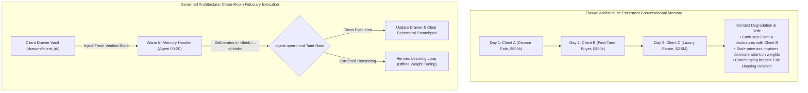
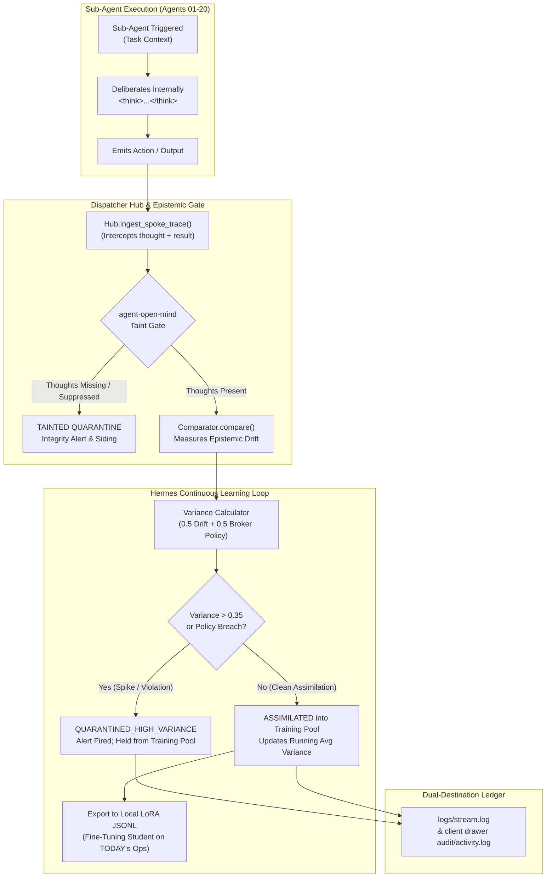
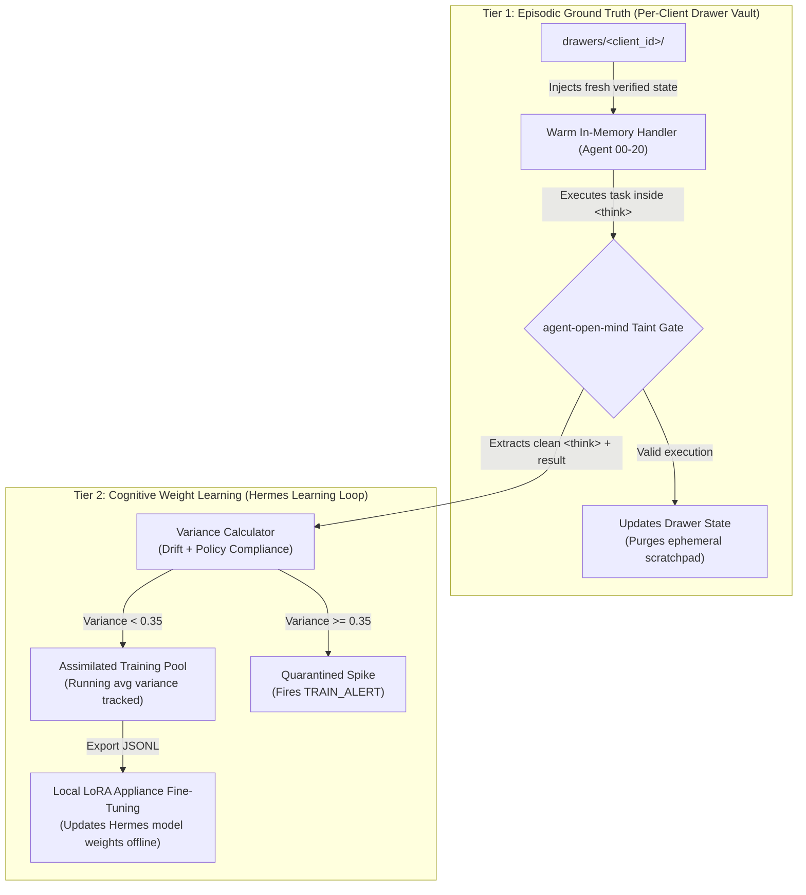
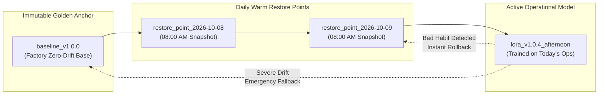
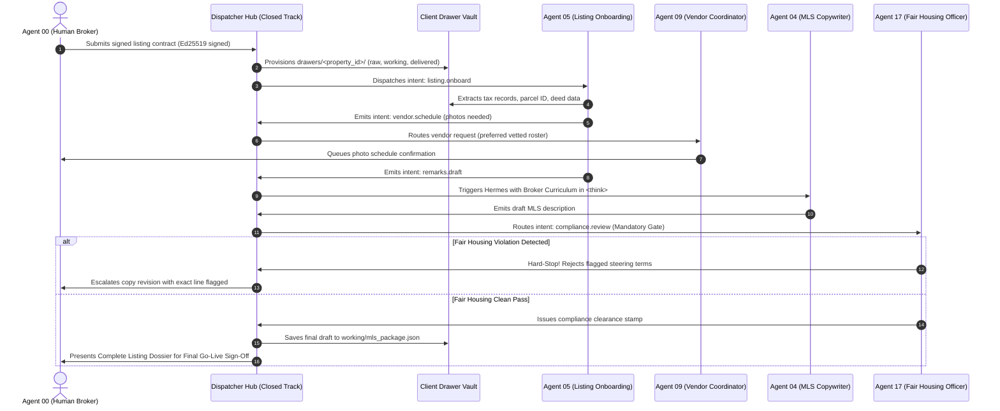

# ListingAssistants (formerly listing-agents)

**The Governed 21-Agent Residential Real Estate Swarm on a Closed Track**  
*Every message routed by one hub, every route pre-approved, every action recorded on a tamper-evident, hash-chained audit log.*  
*(Official Production Domain: [ListingAssistants.com](https://ListingAssistants.com) — Brand notice: distinct from listingagent.com)*

[](tests_listing/)
[](identity/routes.json)
[](playbooks/)
[](docs/SWARM_COACHES_PLAYBOOK.md)
[](dispatcher/core.py)

---

## What is ListingAssistants?

**ListingAssistants** is a production-grade, multi-agent AI operating chassis specifically engineered for residential real estate brokerages, top-producing listing agents, and high-volume transaction teams. 

Unlike conventional, unconstrained LLM chat wrappers that hallucinate prices, leak client confidential data, or improvise legal terms, **ListingAssistants** operates on an **invariable railroad chassis**:
* **21 Specialized Spoke Agents (00–20):** Dedicated single-responsibility agents covering every phase of the listing lifecycle (lead capture, qualification, MLS ingestion, photography curation, showing logistics, transaction management, Fair Housing compliance, CRM updates, and financial reconciliation).
* **Closed Routing Track (51 Verified Lanes):** The LLM never decides who to speak to. Every envelope is routed through a central dispatcher hub strictly governed by [`identity/routes.json`](identity/routes.json). Unapproved routing attempts are immediately rejected and logged.
* **Deterministic Decision Tuples (227 Tuples):** All ambiguous, sensitive, or statutory edge cases are pre-deliberated. If a situation matches a tuple, the rule executes deterministically without model improvisation.
* **Cryptographic Authority & Money Gates:** High-risk actions (listing price authorizations, listing status changes, and wire-related instructions) require an **Ed25519 cryptographic signature**. Unsigned or invalid requests are dropped fail-closed.
* **6 QuietFire Forensic Detection Pillars:** Continuously inspects agent thought traces and outputs for adversarial divergence, prompt injection, and goal drift.

---

## For the Managing Broker & Team Leader: Why Not Just Use ChatGPT or Claude?

If you are a Managing Broker, Broker of Record, or top-producing team leader, your natural first question is:  
> *"Claude and ChatGPT are already incredible writers. Why can't my agents just use a $20/month subscription?"*

Here is the unvarnished reality of using unconstrained frontier chatbots in a licensed real estate fiduciary practice:

```
┌──────────────────────────────────────┬────────────────────────────────────────────────────────┐
│ The $20/Month Frontier Chatbot Trap   │ The Governed ListingAssistants Chassis                 │
├──────────────────────────────────────┼────────────────────────────────────────────────────────┤
│ • "AI makes mistakes. Check my work" │ • Hardware-Enforced Legal Brakes:                      │
│   (Micro-print disclaimer shifts all │   It is physically impossible for the AI to publish an │
│   legal liability onto your license) │   MLS remark without verified Fair Housing clearance.  │
├──────────────────────────────────────┼────────────────────────────────────────────────────────┤
│ • Commingling & Context Bleed:       │ • "One-Client-One-Drawer" Vaults:                      │
│   Chatbots share memory across chats.│   Client A's divorce and financials are isolated in    │
│   Seller A's minimum price leaks     │   a dedicated filesystem vault. Zero cross-client      │
│   into Buyer B's disclosures.        │   data bleeding or conversational contamination.       │
├──────────────────────────────────────┼────────────────────────────────────────────────────────┤
│ • Hallucinated Price Guidance:       │ • Fiduciary Pricing Firewall:                          │
│   Chatbots try to be helpful and     │   The AI is hard-coded to refuse valuation. If a buyer │
│   improvise price opinions or terms. │   asks "What's the lowest they'll take?", it halts live│
│   into Buyer B's disclosures.        │   and escalates to the licensed human broker.          │
├──────────────────────────────────────┼────────────────────────────────────────────────────────┤
│ • The Wire Fraud Cyber Threat:       │ • Wire Fraud Zero-Tolerance Shield:                    │
│   Chatbots summarize incoming emails │   The instant any email mentions routing numbers, the  │
│   and accidentally relay fake wire   │   conversation locks down and rings the broker's phone.│
│   instructions to anxious buyers.    │   It never transmits bank wiring instructions.         │
├──────────────────────────────────────┼────────────────────────────────────────────────────────┤
│ • 180 Administrative Deadlines:      │ • 21 Specialized Back-Office Operators:                │
│   Chatbots don't track earnest money │   Dedicated agents track 3-day earnest money deposits, │
│   receipts, inspection contingency   │   10-day inspection windows, and deliver an 08:00 AM   │
│   deadlines, or vendor calendars.    │   morning dossier of pending milestones.               │
└──────────────────────────────────────┴────────────────────────────────────────────────────────┘
```

### The Three Questions Every Broker Should Ask:
1. **"Can this software get my license suspended?"**  
   *No.* Recreational AI hallucinates freely. ListingAssistants is built on the **Restricted Speed Doctrine**: when any agent encounters ambiguous information or an unapproved communication track, it comes to a slow, graceful stop and holds for human authorization.
2. **"Does my client's confidential data train a public cloud model?"**  
   *No.* All documents, drafts, and communications live in private, encrypted client drawers (`drawers/<client_id>/`). When paired with local models (like Nous Hermes on your own hardware), zero bytes leave your office.
3. **"Does this replace my agents or my transaction coordinator?"**  
   *No.* It liberates them. It eliminates the 70% secretarial drag—chasing signatures, organizing disclosures, tracking timelines—allowing your human team to focus 100% on high-touch client relationships, negotiation, and closing transactions.
4. **"Can an agent perform a financial transaction, wire funds, or disburse commission?"**  
   ***ABSOLUTELY NOT. IT IS NOT WIRED.*** Neither Dispatcher agents nor listing agents have any financial execution wiring. There is no payment SDK, no automated wire gateway, and no banking execution pathway anywhere in this platform. Fiduciary responsibility belongs 100% to the licensed broker-in-charge. Under no circumstances—especially during training, onboarding, or fine-tuning—is an agent ever permitted to handle financial authority. Only after an agent has demonstrated proven proficiency in administrative tasks can a human release a held *text communication*—and even then, financial *execution* remains completely unwired.

> ### ⚠️ CRITICAL FIDUCIARY INVARIANT
> **DISPATCHER AGENTS AND LISTING AGENTS ARE FUNDAMENTALLY INCAPABLE OF PERFORMING FINANCIAL TRANSACTIONS. IT IS NOT WIRED.**  
> Fiduciary duty is legally non-delegable. The licensed human broker maintains sole, unyielding responsibility for all client funds, escrow deposits, and pricing decisions.

### The Accountability Gap: Why JEV AI Over Pure LLMs
> **The Legal Reality:** If an unconstrained frontier LLM hallucinating in the cloud causes an escrow deadline breach, leaks a seller's bottom-line price, or triggers a statutory Fair Housing complaint, the cloud AI provider will never apologize, pay your damages, or defend your license at a state commission hearing. Their Terms of Service explicitly disclaim all fiduciary liability.
> 
> **Why JEV AI Changes the Equation:** ListingAssistants purposefully couples two different engines:
> * **Nous Hermes (The Creative Drafter):** Handles natural language remarks and email drafts—always quarantined behind exit-gate compliance reviews.
> * **JEV AI (The Fiduciary Evaluator):** JEV AI was chosen specifically because **it does NOT create, invent, or improvise.** It strictly evaluates structured facts (scoring buyer pre-approvals, arbitrating tour conflicts, calculating contractual milestone timelines) using deterministic mathematical logic. It cannot hallucinate. Where an LLM guesses, JEV AI calculates.

#### The 0.45 Confidence Floor: Why JEV Refuses to Guess (Calibration Holds)
When a standard cloud LLM encounters contradictory or missing facts, it invents a plausible guess to keep the conversation flowing. In real estate, an AI guess can blow an escrow contingency or trigger a lawsuit.

JEV AI operates with a **default 0.45 Confidence Floor**:
* **Deterministic Stop, Not a Bug:** If data certainty scores below 0.45 (`confidence < 0.45`), JEV AI **refuses to guess**. It immediately triggers a deterministic stop (`held_confidence_underflow`) and places the lead or decision into a **Calibration Hold** in siding.
* **Dual-Notification Flow:**
  * **To the Broker:** An instant, reassuring notification:
    > `"[JEV CALIBRATION HOLD] Agent 02 on Client 'Bob Seller': Data certainty scored below 0.45 safety floor. Parked in siding for your quick review rather than guessing."`  
    The broker is kept fully in the loop immediately. They know this is designed mathematical safety working as intended—not an error, crash, or broken agent.
  * **To the Platform Operator:** An automated high-priority escalation ping (`escalation.confidence_underflow`) alerting the system architect that local rubric weights or neighborhood criteria in `config/` warrant fine-tuning evaluation for that market.
* **Why JEV Outperforms LLMs & Saves Money:** JEV calculations execute in under 5 milliseconds with zero cloud token costs, zero API latency, and zero hallucination risk, providing mathematical guarantees at a tiny fraction of the cost of cloud LLM inference.

---

## Physical Hard Drive Architecture: Where Your Data Lives & How It Is Protected

In a licensed real estate practice, the greatest fear is two-fold: **the fear of what you might lose** (lost contracts, blown deadlines, corrupted files), and **the fear of what might be taken from you** (confidential client financial records stolen, wire routing compromised, or closing terms altered without your knowledge).

ListingAssistants solves this by replacing fragile cloud databases with **sovereign physical filesystem isolation** and **zero-daemon local transactional persistence** directly on your local hard drive:

```
C:\ListingAssistants\ (or local Drobo NAS RAID partition)
├── drawers/                               <-- PHYSICAL CLIENT DRAWER VAULTS (One Client, One Drawer)
│   ├── ctx-100-oak-lane/                  <-- Isolated Directory Vault for Bob Seller
│   │   ├── drawer_manifest.json           <-- Master inventory with SHA-256 cryptographic fingerprints
│   │   ├── documents/                     <-- Original contracts, inspection PDFs, title commitments
│   │   ├── artifacts/                     <-- MLS draft packages, comp analyses, marketing flyers
│   │   ├── interactions/                  <-- Client communication transcripts & TCPA consent logs
│   │   ├── financials/                    <-- Title escrow deposit receipts, commission net sheets
│   │   ├── timeline/                      <-- Pause/resumption records (_pause.json, _resumed.json)
│   │   └── audit/                         <-- Sovereign client activity log & forensic diagnostic snapshots
│   └── ctx-456-elm-street/                <-- Isolated Directory Vault for Alice Buyer (Strictly Partitioned)
│       └── ...
├── data/
│   └── listing_appliance.db               <-- LOCAL ZERO-DAEMON SQLite TRANSACTIONAL DATABASE
│       ├── crm_interactions              <-- Complete CRM interaction ledger (Agent 14)
│       ├── communication_consent          <-- Opt-in/opt-out TCPA/DNC statutory registry
│       ├── client_drawer_files            <-- Master file index & SHA-256 verification table
│       ├── commission_ledgers             <-- Commission calculations reconciled to $0.00
│       └── showing_calendar               <-- Showing appointments & 30-minute buffer registry
├── logs/
│   ├── audit.jsonl                        <-- PRE-PERSIST SHA-256 HASH-CHAINED AUDIT LEDGER
│   ├── stream.log                         <-- Plain-English human-readable operational event stream
│   └── daily/
│       └── eod_ledger_YYYY-MM-DD.md       <-- Automated End-of-Day Operations Dossiers
├── checkpoints/                           <-- AWS-STYLE MODEL RESTORE POINTS & SNAPSHOTS
│   ├── baseline_v1.0.0/                   <-- Factory immutable zero-drift base weights
│   ├── restore_point_YYYY-MM-DD/          <-- 08:00 AM daily warm restore snapshots
│   └── local_lora_training.jsonl          <-- Offline student fine-tuning training pool
└── config/
    └── integrations.json                  <-- BYOK credentials (masked in memory; zero cloud upload)
```

### The Three Vault Protections:

#### 1. Cryptographic Tamper-Evidence: Protecting What Cannot Be Taken From You
Real estate transactions involve hundreds of thousands of dollars in commission and immense legal liability. If an adversary, malicious insider, or rogue software script attempts to silently alter an inspection repair addendum (e.g. changing a \$2,500 credit to \$25,000) or manipulate a commission split, **how do you prove in court what the original document said?**
* **Immutable SHA-256 Fingerprinting:** Every contract, inspection PDF, addendum, and photo placed into `documents/` is cryptographically hashed with SHA-256 upon arrival and indexed in `drawer_manifest.json` and the SQLite database.
* **Instant Tamper Detection:** If a single byte of any file on your hard drive is altered outside the system, the platform detects the hash mismatch, immediately locks the file, and fires an alert. Your files cannot be silently altered or manipulated behind your back.
* **Pre-Persist Hash-Chained Audit Ledger:** Every agent action is cryptographically chained (`hash = sha256(prev_hash + envelope)`) and committed to `logs/audit.jsonl` *before* the action executes. It is append-only; historical entries cannot be deleted or rewritten without breaking the cryptographic chain.

#### 2. Physical Anti-Commingling (`ComminglingBreachError`)
In consumer AI chatbots, prompts share a common context where Client A's data can accidentally bleed into Client B's communications.
* In ListingAssistants (`dispatcher/client_drawer.py`), every client has an isolated physical folder.
* If an agent working on `ctx-100-oak-lane` ever attempts to read or write a file in `ctx-456-elm-street`, the micro-kernel immediately throws a `ComminglingBreachError` and halts. Client A's confidential divorce status, bottom-line price, and financial disclosures can never cross-pollinate into Client B's file.

#### 3. Zero Cloud Transmission vs. Mobile Carrier Communication
> **"If I text my assistant over WhatsApp or Signal, doesn't that mean my data is in the cloud?"**  
> **No.** There is a critical architectural distinction between your **Confidential Data Vault** and an **Ephemeral Mobile Wire**:
> 
> * **Your Heavy Data Vault (Zero Cloud Transmission):** 100% of your confidential client documents—45-page inspection reports, preliminary title commitments, buyer pre-approval letters, W-2s, tax returns, and bank wire routing numbers—**NEVER leave your local physical computer**. They never sit on AWS S3 buckets, never enter OpenAI or Anthropic training sets, and never reside in a third-party multi-tenant SaaS database.
> * **The Mobile Carrier Pipe (Ephemeral Notification & Command):** When you text your assistant from the grocery store checkout line or a softball game, you are transmitting an ephemeral supervisory *instruction* (e.g. `APPROVE`, `MODIFY: credit=2500`) or receiving a distilled factual *summary* (e.g. *"2 showings confirmed at 1:30 PM and 3:30 PM"*). The heavy confidential files remain locked securely inside your office machine.

---

## Architectural Identity: Under the Hood

### What ListingAssistants Is (And Is NOT)
* **NOT a LangChain, CrewAI, or AutoGen Wrapper:** ListingAssistants is **not** a collection of chained prompt templates, unconstrained autonomous agent loops, or generic wrapper scripts.
* **Custom In-House Actor Micro-Kernel:** Developed entirely in-house by **QuietFire AI Labs**, ListingAssistants is a deterministic, event-driven actor micro-kernel built on pure Python standard library primitives. It enforces strict actor encapsulation, fail-closed state transitions, zero-dependency core dispatching, and cryptographic auditability.

### The Five Core Subsystems
1. **`dispatcher/` (The Actor Micro-Kernel & Transport Hub):**
   Manages message dispatch, route legality enforcement, idempotency deduplication (`envelope_id`), loop suspension, and SHA-256 hash-chained append-only logging (`Hub`, `AuditLog`, `Envelope`, `Routes`). Includes `ConcurrentHubDispatcher` for high-throughput multi-client partitioning and ASGI/asyncio coroutine integration.
2. **`identity/` (The Closed Track & Capability Governance):**
   Houses the immutable closed-track routing specification (`routes.json`), authority capability matrices, and cryptographic signer bindings (`config/authority_signers.json`). Agents cannot invent destinations or bypass routing lanes.
3. **`tools/` (Deterministic Tooling & Mutation Harness):**
   Production CLI suites, dashboard visualizers, schema validators, AST sweep runners, and mutation hardening engines ensuring complete operational visibility without external network dependencies.
4. **`checkpoints/` (Model Lifecycle & Warm Snapshot Restoration):**
   AWS-style snapshot management, start-of-day warm restore points, LoRA delta state tracking, and sub-10ms hot-swap rollback mechanisms to prevent cognitive drift.
5. **`tests_listing/` (Exhaustive Verification Suite):**
   570 deterministic tests spanning individual agent units, end-to-end playbooks (P01–P24), multi-tenant concurrency, cryptographic authority gates, and AST mutation survival sweeps.

### The Five Architectural Pillars
1. **Closed-Track Tuple Routing:** Every message is governed by an immutable `(from_agent, intent, to_agent)` tuple. Unapproved paths are blocked before dispatch.
2. **Pre-Persist Audit Trail:** Envelopes are cryptographically hashed and committed to an append-only SHA-256 audit ledger *prior* to handler delivery.
3. **Fail-Closed Authority Gates:** Statutory, financial, and legal actions require verified Ed25519 signatures and ratified IdP/MFA login identity bindings.
4. **Restricted-Speed Live Holding:** Ambiguous or out-of-track envelopes never silently fail or drop; they hold live in `clarification.request` for human triage.
5. **Client-Partitioned FIFO Concurrency:** Multi-tenant operations scale across thread pools while enforcing strict sequential FIFO processing per client context, preventing state tearing and race conditions.

### The Four Engineering Strengths (Objective Technical Analysis)
1. **Zero Flakiness Testing:** 570 out of 570 tests execute in ~11 seconds with zero network calls, zero sleep delays, and zero mock pollution. Test results are deterministic and reproducible.
2. **Mutation Hardening & Survivor Sweeps:** The codebase is hardened via AST-level mutation sweeps, systematically validating that tests assert behavioral invariants rather than superficial code execution.
3. **Defensive Fail-Closed Architecture:** Missing signatures, unratified signers, unparseable timestamps, or absent MFA flags result in immediate fail-closed rejection into audited quarantine queues.
4. **Zero-Stub Runtime Integrity:** All 21 agents and hub subsystems consist of complete, working, executable logic—free of dummy placeholders or `NotImplementedError` stubs.

### Technical Implementation Status & Roadmap
* **[COMPLETED] Client-Partitioned Concurrency & Async Dispatch (Item d2):** Delivered in v1.0.0 via `dispatcher.concurrent_dispatcher.ConcurrentHubDispatcher`. Features client-keyed FIFO sequencing, worker thread pooling, and `async_send()` coroutines for FastAPI/ASGI production deployments.
* **[COMPLETED] Ratified Signer Registry & IdP Binding (Item d3):** Delivered in v1.0.0 via ratified `config/authority_signers.json` and `Hub.arm_signer_registry()`, enforcing broker IdP identities and mandatory MFA for all authority actions.
* **[ROADMAP v1.1.0] Spoke Module Namespace Reorganization (Item d1):** Currently structured as `dispatcher/listing_spokes_*.py` across 570 passing tests. Scheduled for relocation to a dedicated `spokes/` package in v1.1.0 with backward-compatible import shims.
* **[ROADMAP v1.2.0] Local GPU LoRA Execution Appliance (Item d4):** Checkpoint metadata, training pool assimilation, and LoRA delta export are fully active in `checkpoints/`. Standalone on-prem GPU containerized inference execution is scheduled for v1.2.0.

---

## Architectural Core: Clean-Room Fiduciary Execution

A primary flaw in recreational multi-agent frameworks is letting agents maintain long-running conversational memory across tasks and clients. In legally regulated real estate fiduciaries, this causes **cross-client data commingling, context window pollution, and hallucination snowballs**.

ListingAssistants strictly enforces **Clean-Room Fiduciary Execution**:



* **Warm Handlers, Stateless Context:** The 21 spoke agents stand warm in memory (`dispatcher/hub.py#L90`) with sub-2ms dispatch latency. What is wiped between turns is purely the *ephemeral client scratchpad*, preventing cross-client data bleeding.
* **The "One Client, One Drawer" Vault:** Client documents and state live strictly in physical isolated filesystem drawers (`drawers/<client_id>/`). Illegal cross-drawer access raises `ComminglingBreachError` fail-closed.

---

## The Cognitive Student: Continuous Learning & Epistemic Surveillance

To ensure our cognitive student (Nous Hermes) becomes progressively smarter about **today's actual brokerage operations** without drifting or developing bad habits, the Dispatcher Hub runs an active epistemic surveillance and learning loop:



### The Two-Tier Learning Model:


1. **Mandatory Thought Trace Eavesdropping:** Under `Hub.ingest_spoke_trace()`, every sub-agent must register its internal `<think>` trace.
2. **Epistemic Taint Check:** If an agent suppresses doubts or acts without thinking, `agent_open_mind.taint_check` immediately flags the trace as `TAINTED`.
3. **Multi-Metric Variance Calculation:** Evaluates epistemic drift via `open_mind.comparator.Comparator.compare()` and tests against Fair Housing, wire defense, and pricing boundaries. Low-variance runs are assimilated; spikes are quarantined.
4. **Appliance-Native LoRA Updates:** Curated operational exemplars are exported to JSONL for local offline fine-tuning on consumer/appliance GPUs (e.g. Drobo NAS + RTX hardware).
5. **Ongoing Human Personalization (The Feedback Flywheel):** When the broker reviews an agent output and modifies the phrasing, approves a variation, or leaves notes (e.g., *"highlight the mid-century clerestory windows; never use the word cozy"*), `HermesLearningLoop.assimilate_human_feedback()` ingests that correction as a **Gold-Standard Training Exemplar**.
   * **Learns Your Firm's Voice:** The local model tunes directly to your personal communication style, regional subdivision terminology, and individual market flair.
   * **Compounds Knowledge Across Transactions:** With every listing onboarded, every showing coordinated, and every escrow closed, your assistant gets progressively smarter and more aligned with your specific practice.
   * **Invariable Legal Firewalls:** While the model personalizes to your style, the six detection pillars guarantee it will never adopt bad habits: Fair Housing lines, wire fraud tripwires, and pricing firewalls remain mathematically immutable.

---

## AWS-Style Snapshots & Daily Warm Restore Points

Applying the **AWS Well-Architected Framework (Reliability Pillar)** and enterprise system restore point patterns, ListingAssistants guarantees instant recovery if local model tuning ever introduces subtle behavioral drift:



1. **Factory Golden Baseline (`baseline_v1.0.0`):** Pristine, immutable zero-drift base weights. Guarantees immediate fallback to factory state in under 10ms.
2. **08:00 AM Daily Warm Restore Point:** Automated daily snapshot of the clean start-of-day model state. Allows rolling back an afternoon fine-tuning delta without losing historical learning.
3. **Golden Broker Regression Exam:** Candidate checkpoints must pass a 4-part deterministic compliance exam (Fair Housing, Wire Fraud, Pricing Boundaries, NAR 2024 settlement rules) before activation.

---

## Key Capabilities & Hardened Additions

### 1. JEV AI Decision Platform Integration (Live API & Explicit Fallback)
Integrates with the high-efficiency **JEV AI Decision Platform** (`dispatcher/decision_adapter.py`) using a three-tier operational hierarchy:
1. **Tier 1 (Live Cloud API):** Direct HTTPS REST client to `https://api.typesafe.ai/v1/decisions` when an authenticated `JEV_API_KEY` is provided.
2. **Tier 2 (In-Process / Local MCP):** Model Context Protocol tool invocation (`jev_evaluate_decision`).
3. **Tier 3 (Local Fallback Mode):** In-process, zero-network pure Python deterministic fallback engine (`JevPythonDecisionEngine`) evaluating multi-attribute lead rubrics and showing calendar conflicts offline.
* **100% Explicit Fallback Transparency:** Whenever operating without live keys or offline, every decision output is stamped with `coprocessor_status: "FALLBACK_LOCAL_RULES"`, `is_fallback: true`, and an explanatory warning. Dispatcher Agent 00 logs `jev.unarmed_fallback` on boot so operators always know whether decisions came from the live model or local deterministic rules.

### 2. Nous Hermes Cognitive Seam & Thought Extraction
Leverages **Nous Hermes** (`dispatcher/hermes_seam.py`) to extract `<think>...</think>` tokens directly in-stream. This bypasses frontier provider thought-inspection bans and feeds authentic internal deliberation directly into the QuietFire detection pillars. Includes the `BrokerContextIngestor` to onboard Hermes like a junior college graduate undergoing in-house brokerage training.

### 3. Non-Technical Client Funnel & Drawer Portal (`tools/dashboard.py`)
Provides an interactive web portal (`dashboard.html`) and visual CLI pipeline for brokers and non-technical staff:
* Inspects real filesystem drawers and SQLite persistence records with **zero stubs**.
* Tracks client location, drawer path, file inventory, and 6-stage sales funnel progress.
* Displays highlighted alerts if an agent is paused awaiting a broker decision call.

### 4. Human-Readable Real-Time & EOD Logging (`dispatcher/readable_logger.py`)
Dual-destination logging architecture:
* Emits formatted plain-English events (`[DISPATCH]`, `[DECISION]`, `[VAULT]`, `[API_CALL]`, `[TRAIN_UPDATE]`) to `logs/stream.log`.
* Simultaneously writes isolated logs to `drawers/<client_id>/audit/activity.log` for data sovereignty.
* Compiles automated End-of-Day (EOD) Operations Dossiers at `logs/daily/eod_ledger_YYYY-MM-DD.md`.
* CLI inspection tool: `tools/show_logs.py`.

### 5. Shadow Weight Checkpointing & Restore CLI (`tools/restore_point.py`)
Operator CLI tool providing AWS-style snapshot controls:
* `python tools/restore_point.py --list` — Lists all restore points and active model pointer.
* `python tools/restore_point.py --snapshot` — Captures start-of-day warm restore point.
* `python tools/restore_point.py --restore baseline` — Instant hot-swap rollback to Golden Baseline.
* `python tools/restore_point.py --exam baseline_v1.0.0` — Runs the Golden Broker Regression Exam.

### 6. The Human Decision Cockpit: Approve, Reject, Hold, or One-Click "Escalate to Support"
Provides a complete pause-and-resume lifecycle (`dispatcher/hitl_protocol.py`) when agents hit human authorization gates or encounter ambiguous contract language:
* **Standardized Human Decisions:**
  * `APPROVE` — Validates the proposed action and resumes agent execution along ratified tracks.
  * `APPROVE_WITH_OVERRIDE` / `MODIFY` — Allows the broker to inject specific numeric values (e.g. updating an inspection concession from \$5,000 to \$3,000) and resumes.
  * `REJECT` — Aborts the proposed transaction step safely without side effects.
  * `HOLD` — Moves the task into a siding track awaiting further client or title information.
  * `CLOSE_SYSTEM` — Immediate emergency circuit breaker shutdown in event of detected security or wire anomalies.
  * `ESCALATE_TO_SUPPORT` — **The One-Click Support Lifeline:** When a broker is uncertain, busy, or leery of making an operational mistake, they click/reply "Escalate to Support". The system instantly:
    1. Compiles a redacted forensic diagnostic snapshot (`drawers/<client_id>/audit/`) with file hashes and agent deliberation traces.
    2. Generates an institutional support ticket (`TICKET-<ID>`).
    3. Routes the ticket to the QuietFire Support Desk SLA queue (`hub.escalate("escalation.complaint")`).
    4. Safely parks the agent on hold until support engineering assists.

### 7. The Field Cockpit: Pocket Dispatcher & Remote Hermes Interaction
**Real estate brokers do not sit behind dual desktop monitors all day.** They are in the field: walking properties with sellers, hosting open houses, meeting appraisers, and driving between showings. An AI system that forces an agent to sit in an office chair to click buttons is an operational failure.

ListingAssistants decouples the **heavy sovereign execution engine** from the **mobile communication layer**:
* **The On-Premise Anchor:** The local appliance (office workstation, Drobo NAS, or local GPU mini-PC) houses the sovereign client drawers, JEV AI coprocessor, SQLite audit ledgers, and Nous Hermes model weights. Confidential client PII, pre-approval letters, and wire instructions never sit on a public third-party cloud.
* **Transport-Agnostic Mobile Bridge:** Hermes and the Dispatcher Hub can be spoken to remotely across the broker's preferred messaging transport—whether **WhatsApp**, **Signal**, **encrypted SMS/webhooks**, or **Telegram**:
  1. **Instant Field Alerts:** When Agent 04 drafts remarks or Agent 07 flags an inspection repair credit addendum, the broker's phone buzzes immediately with the exact context and decision choices.
  2. **One-Tap Actioning:** The broker replies directly from their phone (`APPROVE`, `MODIFY: credit=2500`, or `ESCALATE`) while waiting for an elevator or sitting at a traffic light.
  3. **Conversational Hermes Inquiries:** The broker texts natural-language queries to their office assistant while on the road, receiving instant, factual summaries.

#### What Happens Behind the Scenes: Three Real-World Field Scenarios

When you are out living your life—standing in a grocery store checkout line, waiting in the school pickup queue, or sitting on the bleachers at your child's softball game—you don't have time to log into a laptop or parse a database. You text your assistant, slide your phone into your pocket, and receive a complete, verified answer in seconds.

Here is what actually happens across your digital team in the background:

```
┌────────────────────────────────────────────────────────────────────────────────────────┐
│               SCENARIO 1: STANDING IN THE GROCERY STORE CHECKOUT LINE                  │
├────────────────────────────────────────────────────────────────────────────────────────┤
│ YOU TEXT: "What showings are scheduled for 100 Oak Lane this afternoon?"               │
├────────────────────────────────────────────────────────────────────────────────────────┤
│ WHAT HAPPENS IN THE BACKGROUND ON YOUR OFFICE APPLIANCE:                               │
│ 1. Mobile Ingress parses the incoming query and hands it to the Hub with context.      │
│ 2. Hermes deliberates inside <think> tags: targets '100 Oak Lane' and 'this afternoon'.│
│ 3. Dispatcher Hub routes the intent to Agent 06 (Showing Coordinator).                 │
│ 4. Agent 06 inspects the verified calendar ledger in drawers/ctx-100-oak/calendar/.   │
│ 5. JEV AI Decision Coprocessor verifies that confirmed appointments honor the seller's│
│    mandatory 24-hr advance notice and 30-minute post-showing cleaning buffers.         │
│ 6. Agent 08 (Document Collector) verifies buyer agents have signed representation      │
│    agreements on file before access confirmation is logged.                            │
│ 7. Hermes synthesizes the verified findings into a crisp, professional text.          │
├────────────────────────────────────────────────────────────────────────────────────────┤
│ YOU RECEIVE: "You have 2 confirmed private showings at 100 Oak Lane this afternoon:    │
│ • 1:30 PM: Sarah Jenkins (Re/Max, buyer pre-approval verified)                         │
│ • 3:30 PM: Mike Chang (Compass, 30-min cleaning buffer enforced)                       │
│ Electronic lockbox codes remain secured. No conflicting escrow appointments."          │
└────────────────────────────────────────────────────────────────────────────────────────┘
```

```
┌────────────────────────────────────────────────────────────────────────────────────────┐
│                 SCENARIO 2: WAITING IN THE CAR AT SCHOOL PICKUP LINE                   │
├────────────────────────────────────────────────────────────────────────────────────────┤
│ YOU TEXT: "Summarize the inspection report flags on Elm Street."                       │
├────────────────────────────────────────────────────────────────────────────────────────┤
│ WHAT HAPPENS IN THE BACKGROUND ON YOUR OFFICE APPLIANCE:                               │
│ 1. Mobile Ingress routes query to Hub; Hermes identifies '456 Elm St' and inspection. │
│ 2. Agent 08 (Document Collector) retrieves inspection_report.pdf from the sovereign   │
│    client drawer vault, verifying the file's SHA-256 hash against the audit ledger.   │
│ 3. Agent 07 (Transaction Coordinator) extracts the inspector's physical defect flags   │
│    and maps them against the contractual contingency deadline.                         │
│ 4. Agent 17 (Compliance Officer) enforces the fiduciary boundary: factual defect      │
│    extraction only; no automated repair concessions or price guesses permitted.       │
│ 5. Hermes structures the factual briefing inside <think> and emits the mobile summary. │
├────────────────────────────────────────────────────────────────────────────────────────┤
│ YOU RECEIVE: "Inspection summary for 456 Elm Street (Report SHA-256 verified):        │
│ • Electrical: Main panel has double-tapped neutral breakers (safety item)              │
│ • Plumbing: 14-yr-old water heater with minor corrosion at supply valves               │
│ • Exterior: Minor flashing gap near south chimney; sewer scope is 100% clean           │
│ Contract Alert: Inspection objection deadline is tomorrow at 5:00 PM. Agent 07 is      │
│ holding in wait-state for your repair concession instructions."                        │
└────────────────────────────────────────────────────────────────────────────────────────┘
```

```
┌────────────────────────────────────────────────────────────────────────────────────────┐
│             SCENARIO 3: SITTING ON THE BLEACHERS AT A YOUTH SOFTBALL GAME              │
├────────────────────────────────────────────────────────────────────────────────────────┤
│ YOU TEXT: "Did the buyer's earnest money deposit clear title yet?"                     │
├────────────────────────────────────────────────────────────────────────────────────────┤
│ WHAT HAPPENS IN THE BACKGROUND ON YOUR OFFICE APPLIANCE:                               │
│ 1. Mobile Ingress routes inquiry; Hermes recognizes escrow milestone financial check.  │
│ 2. Dispatcher Hub queries Agent 15 (Financial & Commission) and Agent 07 (TC).         │
│ 3. Agent 08 (Document Collector) verifies that the Title Company's official Escrow     │
│    Deposit Receipt artifact was ingested and cryptographically signed.                 │
│ 4. Agent 15 validates the ledger balance: $15,000 required vs $15,000 received ($0.00  │
│    variance). Wire security firewall ensures account numbers are never transmitted.    │
│ 5. Agent 14 (CRM Ledger) confirms the escrow status transitioned to 'EMD_VERIFIED'.    │
│ 6. Hermes formats the instant confirmation for mobile display.                         │
├────────────────────────────────────────────────────────────────────────────────────────┤
│ YOU RECEIVE: "Yes. First American Title confirmed receipt of the $15,000 earnest money │
│ deposit today at 2:15 PM. Wire receipt is filed in Bob's client drawer. Agent 07 has   │
│ advanced the milestone to 'EMD Cleared'. Financing contingency clock is active         │
│ (18 calendar days remaining)."                                                         │
└────────────────────────────────────────────────────────────────────────────────────────┘
```

### 8. Target Market Economics: Why a $500/Month Retainer Makes Total Financial Sense
ListingAssistants is **not a $29/month self-serve toy or a fragile GoHighLevel wrapper**. It is a hardened enterprise operating system backed by active engineering support:
* **High-Producing Solo Agents (15–35 deals/year, $150k–$350k GCI):** A single prevented escrow delay, one saved commission dispute, or 5 reclaimed administrative hours per week covers the entire $6,000 annual retainer multiple times over.
* **Mega-Agent Teams (35–80 deals/year, 3–7 producing agents):** Replaces the overhead and turnover of a $4,000/month full-time administrative assistant or $500/file transactional coordinator with 24/7 automated compliance, Fair Housing tripwires, and institutional audit trails—backed by human support.
* **Boutique Brokerages (10–25 agents):** Provides turnkey statutory broker supervision, wire fraud tripwires, and verifiable compliance records that protect the broker's license and lower E&O insurance risk.

### 9. The External Provider Gateway: Bring-Your-Own-Key (BYOK) Integration Ecosystem
Licensed agents already rely on mission-critical real estate platforms and workplace suites. ListingAssistants is engineered with an on-premise **External Provider Gateway** (`dispatcher/provider_gateway.py` and `config/integrations_template.json`) that connects directly into your existing ecosystem once you provide your own API credentials:

```
┌────────────────────────────────────────────────────────────────────────────────────────┐
│                        EXTERNAL PROVIDER GATEWAY ARCHITECTURE                          │
├───────────────────────────────────┬────────────────────────────────────────────────────┤
│ 1. REAL ESTATE ECOSYSTEM          │ • Zillow (Bridge Interactive MLS syndication feed) │
│                                   │ • Redfin (Partner feed integration & inventory)    │
│                                   │ • Realtor.com / Move (ListHub syndication mapping) │
│                                   │ • Local Boards / RESO MLS Web API (Direct feeds)   │
├───────────────────────────────────┼────────────────────────────────────────────────────┤
│ 2. WORKPLACE & PRODUCTIVITY       │ • Google Workspace (Gmail sync, Calendar, Drive)   │
│    SUITES                         │ • Microsoft 365 (Outlook, Exchange, MS Calendar)   │
├───────────────────────────────────┼────────────────────────────────────────────────────┤
│ 3. DIGITAL SIGNATURES & ESCROW    │ • DocuSign & Dotloop (Listing & disclosure forms)  │
│                                   │ • Title Company Portals (Qualia / Stewart Title)   │
├───────────────────────────────────┼────────────────────────────────────────────────────┤
│ 4. SECURE MOBILE CHANNELS         │ • Twilio (Verified WhatsApp & SMS notifications)   │
│                                   │ • Signal Messenger REST (End-to-end encrypted)     │
└───────────────────────────────────┴────────────────────────────────────────────────────┘
```

* **Sovereign Local Key Storage:** All API keys, OAuth refresh tokens, and private RSA keys live exclusively in your local `config/integrations.json` file on your private hardware. Keys are **never** synced to a public SaaS multi-tenant server.
* **Strict Secret Redaction:** Keys are automatically masked in all logs, audit drawers, and CLI inspection outputs (e.g. `sk_...def`), preventing accidental credential leakage.
* **Turnkey Onboarding Baseline:** The system ships with `config/integrations_template.json` pre-structured, ready for plug-and-play activation once operational validation is complete.

---

## The 21 Specialized Spoke Agents: Why Single-Responsibility Beats "Super Agents"

In recreational AI, builders create a single "Super Agent" prompt and tell it to handle everything from writing ad copy to reading bank wires and negotiating offers. In a licensed real estate practice, that design is catastrophic: **cognitive overload, context pollution, and zero auditability.**

ListingAssistants is engineered around the **Single-Responsibility Principle**. Every operational task in the lifecycle of a residential listing is isolated into a dedicated specialist agent with its own immutable behavioral boundary:

### The Four Operational Divisions

```
┌────────────────────────────────────────────────────────────────────────────────────────┐
│                        THE 4 HIGH-COORDINATION DIVISIONS                               │
├───────────────────────────────────┬────────────────────────────────────────────────────┤
│ DIVISION 1: CLIENT RELATIONS &    │ • Agent 01: Lead Intake (24/7 Multi-channel)       │
│ INBOUND FRONT DESK                │ • Agent 02: Lead Qualification (JEV AI Rubrics)    │
│                                   │ • Agent 03: Lead Nurture (Quiet-hours compliant)   │
│                                   │ • Agent 11: Client Communication (Central voice)   │
│                                   │ • Agent 13: Buyer Matching (Inventory match)       │
│                                   │ • Agent 16: Referral & Post-Close (Milestones)     │
├───────────────────────────────────┼────────────────────────────────────────────────────┤
│ DIVISION 2: CREATIVE & MEDIA      │ • Agent 04: Listing Remarks (MLS Copywriter)       │
│ PRODUCTION                        │ • Agent 05: Listing Onboarding (MLS Package)       │
│                                   │ • Agent 09: Vendor Dispatch (Vetted photo/staging) │
│                                   │ • Agent 12: Marketing & Media (Ad flyers/social)   │
│                                   │ • Agent 19: Farm Prospector (Geo-turnover/DNC)     │
│                                   │ • Agent 20: Reputation Sentinel (Review monitor)   │
├───────────────────────────────────┼────────────────────────────────────────────────────┤
│ DIVISION 3: TRANSACTION & ESCROW  │ • Agent 06: Showing Coordinator (Buffer logistics) │
│ OPERATIONS                        │ • Agent 07: Transaction Manager (Escrow timeline)  │
│                                   │ • Agent 08: Document Collector (Disclosures/chase) │
│                                   │ • Agent 10: Market Data (Comps & statistics only)  │
│                                   │ • Agent 14: CRM Ledger (Zero-loss persistence)     │
│                                   │ • Agent 15: Commission & Finance ($0.00 balance)   │
├───────────────────────────────────┼────────────────────────────────────────────────────┤
│ DIVISION 4: GOVERNANCE, RISK &    │ • Agent 00: Human Principal (YOU - Broker/Lead)    │
│ EXECUTIVE COMMAND                 │ • Agent 17: Fair Housing Officer (Statutory gate)  │
│                                   │ • Agent 18: Personal Assistant (Morning Dossier)   │
└───────────────────────────────────┴────────────────────────────────────────────────────┘
```

---

### The 21 Spoke Register & Fiduciary Invariants

| Agent ID | Name | Division | Core Responsibilities | Absolute Invariant (Cannot be overridden) |
| :--- | :--- | :--- | :--- | :--- |
| **00** | Human Principal | Executive | Licensed Broker of Record / Team Lead | Owns all fiduciary pricing, legal lines, and final sign-offs. |
| **01** | Lead Capture | Relations | Inbound ingestion across web, email, SMS | Never promises service without jurisdiction verification. |
| **02** | Lead Qualification | Relations | Applies signed lead-scoring rubric via JEV AI | Never authors rubrics; exact boundary scores drop to lower tier. |
| **03** | Lead Nurture | Relations | Cadenced buyer/seller follow-up | Respects legal quiet hours; honors immediate opt-outs. |
| **04** | Listing Description | Creative | Drafts property MLS remarks via Hermes | Zero subjective steering words; physical property facts only. |
| **05** | Listing Onboarding | Creative | Onboarding package & draft MLS records | Go-live requires verified active status, not an assumed push log. |
| **06** | Showing Scheduler | Escrow | Showing calendar logistics & buffer management | Access codes never transmitted; double-bookings strictly arbitrated. |
| **07** | Transaction Coordinator | Escrow | Escrow timeline & contractual deadlines | Wire fraud lines absolute; inspection repair negotiations human-only. |
| **08** | Document Collection | Escrow | Files disclosure forms & transaction artifacts | Sensitive docs from unexpected senders quarantined immediately. |
| **09** | Vendor Coordinator | Creative | Dispatches photographers, stagers, inspectors | Vendor contact details shielded; unvetted vendors rejected. |
| **10** | Market Data | Escrow | Comp packages & neighborhood statistics | Pure statistics only; opinions and appraisal substitutions refused. |
| **11** | Client Communication | Relations | Central client-facing communication voice | Angry clients trigger immediate outbound hold & human queue review. |
| **12** | Marketing & Media | Creative | Prepares brochures, flyers, ad copy | Assets held until Fair Housing clearance & Clear Cooperation proof. |
| **13** | Buyer Matching | Relations | Matches active listings to pre-qualified buyers | Never fabricates property amenities or pricing concessions. |
| **14** | CRM & Pipeline | Escrow | Authoritative system of record for interaction logs | Zero-loss persistence of client consent and communication history. |
| **15** | Financial & Commission | Escrow | Commission calculations & escrow tracking | Reconciliation tolerance is $0.00; wire transfers never handled. |
| **16** | Referral & Post-Close | Relations | Post-closing relationship & review management | Annual milestone checks; immediate opt-out compliance. |
| **17** | Compliance & Fair Housing | Risk | Statutory Fair Housing & MLS rules review | Flagged phrases hard-stop publication; near-misses audited. |
| **18** | Calendar & Tasks | Executive | Human agent daily briefings & wait-state tracking | Contractual deadlines outrank soft meetings; recurring tasks debounced. |
| **19** | Prospecting & Farm | Creative | Geo-farm analysis & outreach planning | DNC / TCPA compliance strictly enforced before any touch. |
| **20** | Social Media Monitor | Creative | Brand sentiment tracking & review monitoring | Public complaints trigger immediate P14 outbound hold & human handoff. |

---

## The 227 Decision Tuples & 24 Operational Playbooks

### What is a Decision Tuple?
A **Decision Tuple** is an immutable, pre-deliberated routing and policy rule: `(from_agent, intent, to_agent) + deterministic invariant`. 

When an event occurs (e.g. an inspection repair request arrives), the system does **not** ask an LLM to improvise a reaction. It evaluates against the **227 ratified tuples**:
* If the tuple exists and satisfies statutory invariants: it routes deterministically along verified tracks.
* If the tuple requires human authorization (e.g. price change, repair credit): it halts into a `WaitState` for Agent 00.
* If the intent is unknown or out-of-track: it holds live in `clarification.request`. It never improvises.

### The 24 Master Playbooks (P01–P24)
The entire operational lifecycle of residential real estate is codified into 24 end-to-end playbooks:

| Playbook | Name | Primary Agents | Trigger Event | Mandatory Human Gate |
| :--- | :--- | :--- | :--- | :--- |
| **P01** | New Listing Onboarding | 00, 04, 05, 09, 17 | Signed listing agreement submitted | Fiduciary list price & broker go-live sign-off |
| **P02** | Price Improvement Authorization | 00, 05, 10, 11, 14 | Seller authorizes price adjustment | Cryptographic Ed25519 signature + MFA required |
| **P03** | Showing Request & Lockbox Shield | 06, 14, 18 | Buyer's agent requests private tour | Lockbox codes shielded behind secure gate |
| **P04** | Open House Coordination | 06, 09, 12, 18 | Open house scheduled by broker | Vendor signpost & marketing material clearance |
| **P05** | Offer Ingestion & Seller Summary | 00, 07, 10, 11 | Purchase offer PDF received | Valuation commentary prohibited; broker-led review |
| **P06** | Showing Conflict Arbitration | 06, 07, 18 | Overlapping tour requests | Contractual escrow deadlines outrank soft tours |
| **P07** | Escrow Milestone Timeline | 07, 08, 14, 18 | Mutual contract execution | Critical contingency dates mapped into vault |
| **P08** | Inspection Contingency Tracking | 07, 08, 09, 18 | Inspection report filed to drawer | Repair requests remain 100% human-directed |
| **P09** | Appraisal Contingency Review | 07, 10, 15, 18 | Appraisal report received | Valuation disputes escalated to human broker |
| **P10** | Loan Commitment Verification | 07, 08, 14 | Lender loan approval issued | Contingency removal verified before status advance |
| **P11** | Title & HOA Package Audit | 07, 08, 14 | Preliminary title / HOA docs arrive | Restrictive covenants flagged for broker review |
| **P12** | Repair Request & Seller Credit | 00, 07, 11, 15 | Repair addendum submitted | Financial concessions require Ed25519 signature |
| **P13** | Wire Fraud Threat Neutralization | 00, 07, 11 | Incoming message mentions wire details | Immediate conversation lockdown & human phone alert |
| **P14** | Angry Client Outbound Freeze | 00, 11, 18 | Negative sentiment detected | Instant freeze on all outbound automated drips |
| **P15** | Commission Disbursement Audit | 00, 14, 15 | Closing settlement statement arrives | Net sheet reconciliation must balance to exact $0.00 |
| **P16** | Post-Close Client Review & Referral | 03, 14, 16 | Escrow record marked closed | Respects opt-outs; annual anniversary touches |
| **P17** | Fair Housing Marketing Clearance | 04, 12, 17 | New marketing copy drafted | Zero steering terms; hard-stop on violations |
| **P18** | Morning Operational Briefing | 00, 18 | 08:00 AM daily cron sweep | Consolidates all open wait-states and deadlines |
| **P19** | Geo-Farm Prospecting & DNC Gate | 14, 19 | Neighborhood outreach list created | Strict TCPA and National Do-Not-Call scrubbing |
| **P20** | Social Media Complaint Intercept | 11, 20 | Negative review or comment detected | Halts autonomous replies; alerts broker queue |
| **P21** | Unrepresented Buyer Tour Screening | 02, 06, 14 | Buyer requests tour without agent | Enforces mandatory 2024 NAR buyer rep agreement |
| **P22** | Closing Date Extension & Addendum | 00, 07, 14 | Closing delay requested | Extension addendum requires signed broker authority |
| **P23** | Earnest Money Escrow Receipt Chase | 07, 08, 14 | Day 2 of escrow execution | Automated follow-up for official escrow receipt |
| **P24** | Final Walk-Through & Possession | 06, 07, 18 | 48 hours prior to closing | Verifies walk-through completion before keys |

---

### Spotlight Walkthrough: Playbook P01 (New Listing Onboarding)

To see how the 21 agents collaborate across closed tracks without ever speaking directly to one another, consider what happens when a new exclusive listing is signed:



**Notice the Fiduciary Guarantees in Action:**
1. **No Agent Speaks to Another Directly:** Everything flows through `Hub.send()`.
2. **Every Turn is Persisted:** The drawer tracks every draft version with SHA-256 hashes.
3. **The Compliance Officer Cannot be Bypassed:** Agent 04 cannot send copy directly to the MLS—it is forced along the closed track to Agent 17 first.
4. **The Human Broker Holds the Final Switch:** The listing cannot go live until the licensed Human Principal gives final cryptographic clearance.

---

## Installation & Verification

> [!TIP]
> **Setting up on a fresh Windows PC or Touchscreen All-in-One?**  
> Follow the complete, step-by-step [Windows Quickstart Guide](QUICKSTART_WINDOWS.md) for cold-start PowerShell setup, execution policy tips, touchscreen dashboard launch, and test data ingestion.

### 1. Requirements
* Python 3.10+ (Python 3.12 recommended)
* `git`

### 2. Setup
```bash
git clone https://github.com/QuietFireAI/listing-assistants.git
cd listing-assistants
pip install -r requirements.txt
```

### 3. Verification Suite
Run the 570-test verification matrix:
```bash
python -m pytest tests_listing/
```
*Guaranteed: 570 passed, 0 failures, 0 warnings.*

Run the live MCP stdio roundtrip test:
```bash
python tools/mcp_roundtrip.py
```

Run the Six-Act end-to-end swarm lifecycle demonstration:
```bash
python tools/run_demo.py
```

Launch the Non-Technical Client Funnel Portal:
```bash
python tools/dashboard.py --html
```

---

## Documentation Roadmap

* **Architecture & Learning Loop:**
  * [`docs/LEARNING_LOOP_AND_DRIFT_ARCHITECTURE.md`](docs/LEARNING_LOOP_AND_DRIFT_ARCHITECTURE.md) — Comprehensive technical whitepaper on the clean-room execution model, variance tracking, and AWS-style restore points.
  * [`docs/WHY_JEV_OVER_LLM.md`](docs/WHY_JEV_OVER_LLM.md) — Legal and mathematical justification for JEV AI vs. LLMs in fiduciary settings.
* **For Real Estate Agents & Brokers:**
  * [`docs/AGENT_USER_MANUAL.md`](docs/AGENT_USER_MANUAL.md) — Plain-English guide on drawer vaults, alerts, morning dossiers, and portal navigation.
* **For Operators & DevOps:**
  * [`OPERATOR_TESTING_GUIDE.md`](OPERATOR_TESTING_GUIDE.md) — Operator runbook for live testing, video narration, checkpoint management, and tuning.
  * [`docs/TUNING_MANUAL.md`](docs/TUNING_MANUAL.md) — Complete register of configurable operational thresholds.
* **Operational Playbooks & Coaches Guide:**
  * [`docs/SWARM_COACHES_PLAYBOOK.md`](docs/SWARM_COACHES_PLAYBOOK.md) — Plain-English guide to all 24 playbooks and 227 decision tuples.
  * [`docs/PLAYBOOKS.md`](docs/PLAYBOOKS.md) — Technical triggers, inputs, and human-in-the-loop gates for Playbooks P01 through P24.
* **Engineering Roadmap & Milestones:**
  * [`docs/ROADMAP.md`](docs/ROADMAP.md) — Target milestone `v1.1.2`: Physical production hardening (Drobo RAID, Apricorn hardware handshake) and BYOK credential validation (RESO MLS, Twilio A2P 10DLC, DocuSign).

---

## Fiduciary Terms of Use & Supervisory Boundaries

> [!IMPORTANT]
> ### The Licensed Human Supervisory Standard
> **ListingAssistants** is an administrative and workflow execution chassis designed to assist licensed real estate professionals. It does **not** practice real estate, offer legal advice, or perform statutory appraisals.
> 
> * **Supervisory Role of Agent 00 (Human Principal):** Under state real estate licensing law and the NAR Code of Ethics, the licensed Broker of Record and designated agent retain ultimate fiduciary responsibility for all client representations, contractual obligations, and statutory disclosures.
> * **Zero Autonomous Valuation:** ListingAssistants will never establish listing prices, offer recommendations, or negotiate financial concessions without an Ed25519 cryptographic authorization from the Human Principal.
> * **Restricted Speed / Fail-Closed Design:** Unlike consumer LLMs that provide micro-print disclaimers while hallucinating answers, ListingAssistants is engineered to fail closed: in the event of conflicting documents, unverified identity signatures, or unroutable intents, the system legally halts into a human review queue rather than improvising.

---

## Licensing & Brand Notice

* **Brand Notice:** **ListingAssistants** is being rebranded at [ListingAssistants.com](https://ListingAssistants.com). It is entirely separate, distinct, and independent from *listingagent.com*.
* **License:** Dual-licensed under the **QuietFire Identity License** over an **AGPL-3.0** floor. Evaluation, development, and internal testing are open. Commercial deployment requires an authorized commercial license from QuietFireAI.
