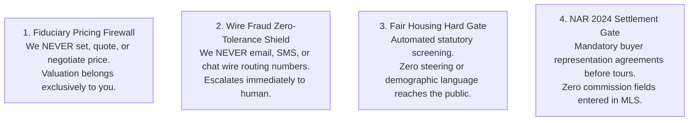
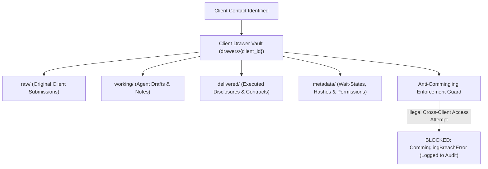
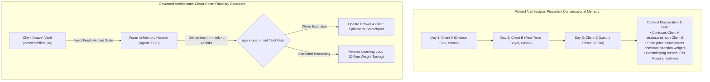
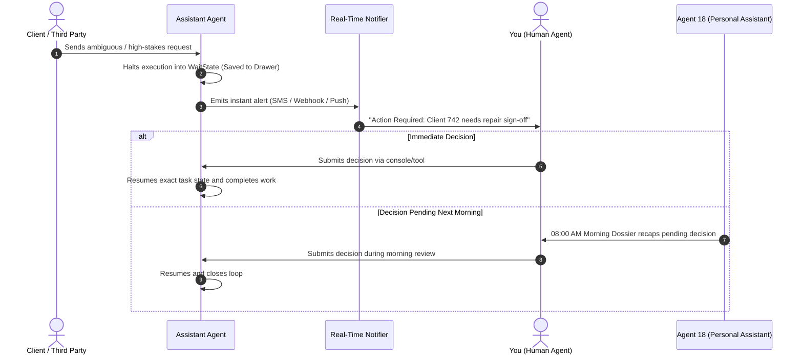
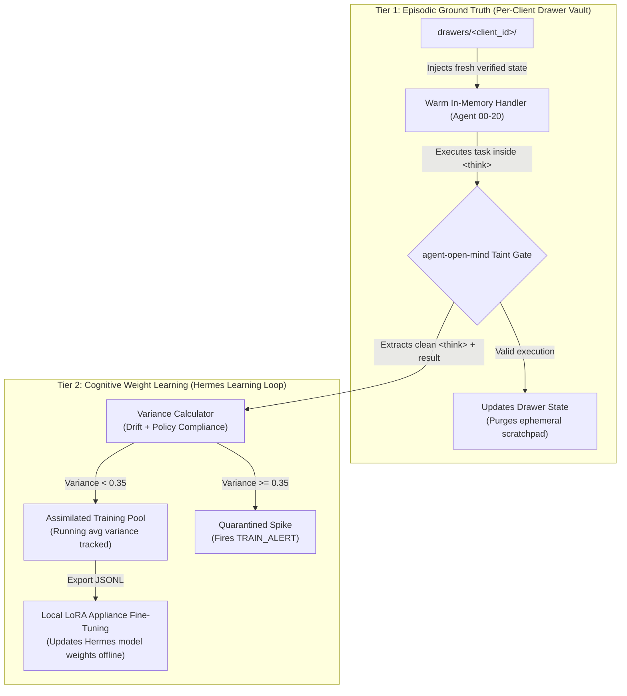
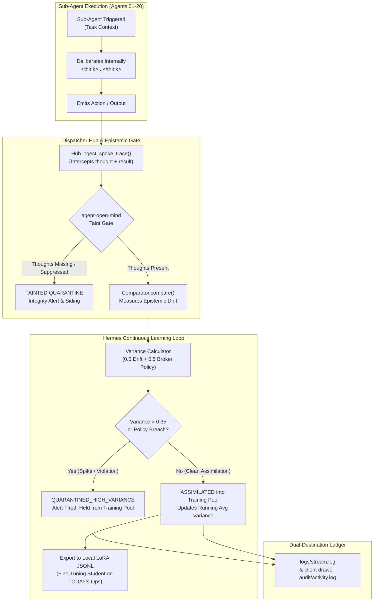
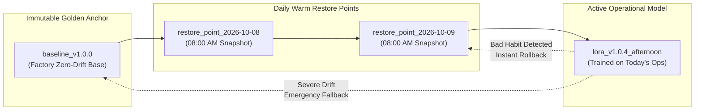

# ListingAssistants Agent User Manual
### The Modern Real Estate Professional's Operating Playbook
*(Powered by the 21-Agent Governed Swarm Chassis — [ListingAssistants.com](https://ListingAssistants.com))*

---

## 1. Welcome to Your Operations Team

Congratulations on onboarding **ListingAssistants**. 

You now have a dedicated, 21-member specialized digital operations team working for your listing business 24 hours a day, 7 days a week. Unlike generic generative AI chatbots that can make embarrassing mistakes, fabricate property details, or expose you to severe legal liability, ListingAssistants is built on an **invariable railroad chassis**:

* **Every agent has one specific job** (e.g., showing logistics, document collection, compliance review).
* **Every message follows an approved closed track** (no unauthorized cross-talk).
* **High-stakes decisions are guarded by hard stops** that never proceed without your explicit review and cryptographic authorization.
* **Every client has an isolated physical vault** so documents, contracts, and notes never mix between clients.

ListingAssistants takes over the crushing administrative burden of real estate—organizing paperwork, tracking contingency deadlines, reminding parties of pending disclosures, coordinating vendor appointments, and drafting marketing copy—so you can focus on what actually builds your business: **client relationships, expert negotiation, and closing deals.**

### Under the Hood: Built on an In-House Actor Micro-Kernel (Not a Fragile LLM Wrapper)
To understand why ListingAssistants never hallucinates or leaks confidential client data, consider how it was engineered:
* **NOT LangChain, CrewAI, or an Unconstrained Chat Wrapper:** Most AI tools in real estate are lightweight wrappers around public chat APIs that improvise and lose track of instructions. ListingAssistants is a custom, in-house actor micro-kernel designed from the ground up by **QuietFire AI Labs**.
* **The Five Subsystems Protecting Your Practice:**
  1. **The Dispatcher Hub (`dispatcher/`):** A central railroad switchboard that routes every message between agents, manages client isolation, and records all activities on an append-only, tamper-evident SHA-256 audit log. Includes the `ConcurrentHubDispatcher` for high-throughput multi-client parallel processing.
  2. **The Identity & Capability Registry (`identity/`):** Defines the exact 51 legal communication lanes and enforces who is authorized to sign off on price reductions or legal disclosures (`config/authority_signers.json`).
  3. **The Deterministic Tool Suite (`tools/`):** Runs automated Fair Housing scanners, showing buffer checkers, and operator dashboards without relying on unpredictable third-party web services.
  4. **The Model Checkpoint Manager (`checkpoints/`):** Protects your brokerage from "AI drift" by taking daily 08:00 AM warm restore points and allowing instant one-click rollbacks if a newly trained model develops an unwanted habit.
  5. **The Verification Matrix (`tests_listing/`):** 570 automated tests run across all agents and playbooks, guaranteeing 100% operational reliability before any software release.
* **The Five Core Architectural Pillars:**
  1. *Closed-Track Routing:* Agents can only talk along pre-approved tracks.
  2. *Pre-Persist Audit Trail:* Every action is written to disk before it executes.
  3. *Fail-Closed Authority Gates:* Real estate transactions require verified human signatures and multi-factor authentication (MFA).
  4. *Restricted-Speed Safety Holding:* If a request is unclear, the system pauses and asks you rather than guessing.
  5. *Multi-Client Partitioned Concurrency:* High-speed operations across dozens of listings simultaneously, while preserving strict chronological order for each individual property file.
* **Our Four Engineering Strengths:**
  1. *Zero Flakiness:* 100% deterministic test execution with no random failures across 570 tests.
  2. *Mutation Hardening:* Rigorously stressed against code mutations to verify safety gates can never be bypassed.
  3. *Defensive Fail-Closed Design:* If any check fails, the system safely halts instead of guessing.
  4. *Zero-Stub Integrity:* 100% complete, fully implemented operational code across all 21 agents.

---

> ### ⚠️ CRITICAL FIDUCIARY INVARIANT (FRONT AND CENTER)
> **DISPATCHER AGENTS AND LISTING AGENTS ARE FUNDAMENTALLY INCAPABLE OF PERFORMING FINANCIAL TRANSACTIONS. IT IS NOT WIRED.**
> 
> * **Zero Financial Execution Wiring:** There is no payment SDK, no automated wire gateway, and no banking transfer execution path anywhere in this software.
> * **Sole Human Fiduciary Responsibility:** Under state real estate licensing law and the REALTOR® Code of Ethics, fiduciary responsibility belongs 100% to you, the licensed broker-in-charge (Agent 00). Fiduciary duty is legally non-delegable and cannot be transferred to an AI agent.
> * **NEVER During Training Under Any Circumstances:** Under no circumstances—whether during broker onboarding, model training, prompt personalization, or local fine-tuning—is an agent ever permitted to handle financial authority. You must maintain full fiduciary control. You must NEVER attempt to delegate financial actions to an agent during training. Only after an agent has been formally deployed into production motion and has demonstrated repeated, verified proficiency in its assigned administrative tasks can you even release a held *text disclosure*—and even then, financial *execution* remains completely unwired.

## 2. The Four Fiduciary Guardrails (Our Promise to You)

Your real estate license and your client's fiduciary trust are your most valuable assets. ListingAssistants is hard-coded with four non-negotiable legal firewalls:



### 1. The Fiduciary Pricing Firewall
* **Rule:** No AI agent will ever invent a listing price, suggest an offer number, comment on whether a property is "worth it," or negotiate a counteroffer.
* **What happens:** If a buyer or seller asks, *"What would you offer on this house?"* or *"What's the absolute lowest price the seller will take?"*, the system halts autonomous replies, flags the inquiry to your queue with verbatim message context, and sends a professional template: *"I have escalated your pricing inquiry directly to your agent, who will provide customized market guidance."*

### 2. The Wire Fraud Zero-Tolerance Shield
* **Rule:** Wiring instructions are the #1 source of real estate cybercrime. ListingAssistants will **never** transmit routing numbers, bank details, or wire instructions over email, SMS, or chat.
* **What happens:** If incoming correspondence mentions "updated wire instructions" or asks for wire routing information, the system immediately locks the conversation, alerts you via high-priority notification, and informs the client that wire verification must occur strictly via secure voice contact or certified escrow closing portals.

### 3. The Fair Housing Hard Gate
* **Rule:** Every property description, social media blurb, and marketing flyer passes through **Agent 17 (Compliance & Fair Housing)** before release.
* **What happens:** Phrases like *"family-friendly neighborhood,"* *"walk to temple,"* or *"safe area"* are caught instantly. The draft is stopped in its tracks, the problematic phrase is excised, and the revised copy is routed to you. Non-compliant copy **cannot** be published to the MLS or ad networks.

### 4. NAR 2024 Settlement Compliance Gate
* **Rule:** Buyer tour requests require a verified written buyer representation agreement on file. MLS listing remarks will **never** publish offers of buyer broker compensation.
* **What happens:** If an unrepresented buyer requests a showing through Agent 06, the system checks Agent 14's CRM record. If a signed buyer representation agreement is absent, Agent 06 holds the appointment and routes the buyer representation onboarding disclosure to you first.

---

## 3. The "One Client, One Drawer" Privacy Vault

In a busy real estate practice, you are constantly juggling multiple buyers, sellers, and escrows simultaneously. The catastrophic failure mode of traditional AI tools is **data cross-contamination**—mentioning Buyer A's maximum budget in a disclosure for Seller B, or attaching Client C's pre-approval letter to Client D's transaction file.

ListingAssistants permanently eliminates this risk through our physical **"One Client, One Drawer" Architecture**:



#### Why Clean-Room Execution Protects Your License:
Unlike chatbots that keep an ongoing conversation memory where Client A's divorce details can accidentally bleed into Client B's listing, ListingAssistants runs in a **Clean Room**:



### What This Means For You:
1. **Dedicated Client Drawer:** The moment a client is entered into the system, ListingAssistants provisions an isolated physical and logical drawer (`drawers/<client_id>/`).
2. **Strict Compartmentalization:** When an agent (such as Agent 04 drafting copy, or Agent 08 collecting disclosures) does work, it is physically restricted to that client's drawer. It cannot read, write, or leak files from any other client's drawer.
3. **Cryptographic Fingerprinting (SHA-256):** Every document, contract, inspection PDF, or photo uploaded is SHA-256 fingerprinted. If an adversary, rogue script, or software error ever attempts to alter an inspection addendum or modify closing terms, the platform detects the hash mismatch and immediately halts. Your files cannot be silently altered or stolen from you.
4. **Complete Chain of Custody:** If a client or licensing board asks, *"Who had access to my confidential financial statements?"*, you can produce a tamper-evident audit report proving exactly which agent handled each file and when.

#### Physical Hard Drive Directory Structure
```
C:\ListingAssistants\ (or local Drobo NAS RAID partition)
├── drawers/                               <-- PHYSICAL CLIENT DRAWER VAULTS (One Client, One Drawer)
│   ├── ctx-100-oak-lane/                  <-- Dedicated Vault for Bob Seller
│   │   ├── drawer_manifest.json           <-- Master inventory with SHA-256 cryptographic fingerprints
│   │   ├── documents/                     <-- Original contracts, inspection PDFs, title commitments
│   │   ├── artifacts/                     <-- MLS draft packages, comp analyses, marketing flyers
│   │   ├── interactions/                  <-- Client communication transcripts & TCPA consent logs
│   │   ├── financials/                    <-- Title escrow deposit receipts, commission net sheets
│   │   ├── timeline/                      <-- Pause/resumption records (_pause.json, _resumed.json)
│   │   └── audit/                         <-- Sovereign client activity log & forensic diagnostic snapshots
│   └── ctx-456-elm-street/                <-- Dedicated Vault for Alice Buyer (Strictly Partitioned)
│       └── ...
├── data/
│   └── listing_appliance.db               <-- LOCAL ZERO-DAEMON SQLite TRANSACTIONAL DATABASE
│       ├── crm_interactions              <-- Complete CRM interaction ledger (Agent 14)
│       ├── communication_consent          <-- Opt-in/opt-out TCPA/DNC statutory registry
│       ├── client_drawer_files            <-- Master file index & SHA-256 verification table
│       ├── commission_ledgers             <-- Commission calculations reconciled to $0.00
│       └── showing_calendar               <-- Showing appointments & 30-minute buffer registry
├── logs/
│   ├── audit.jsonl                        <-- PRE-PERSIST SHA-256 HASH-CHAINED AUDIT LEDGER
│   ├── stream.log                         <-- Plain-English human-readable operational event stream
│   └── daily/
│       └── eod_ledger_YYYY-MM-DD.md       <-- Automated End-of-Day Operations Dossiers
├── checkpoints/                           <-- AWS-STYLE MODEL RESTORE POINTS & SNAPSHOTS
│   ├── baseline_v1.0.0/                   <-- Factory immutable zero-drift base weights
│   ├── restore_point_YYYY-MM-DD/          <-- 08:00 AM daily warm restore snapshots
│   └── local_lora_training.jsonl          <-- Offline student fine-tuning training pool
└── config/
    └── integrations.json                  <-- BYOK credentials (masked in memory; zero cloud upload)
```

> **Zero Cloud Transmission vs. Mobile Carrier Communication:**  
> When you text Hermes over WhatsApp or Signal from the road, you are transmitting an ephemeral supervisory *instruction* (e.g. `APPROVE`) or receiving a factual *summary*. 100% of your confidential client documents (tax records, W-2s, 45-page inspection reports, wire instructions) **remain strictly on your physical office machine**. Zero bytes of your client data ever touch public cloud training clusters.

---

## 4. Real-Time Decision Alerts & The Morning Recap (HITL Resumption)

ListingAssistants is built to do the heavy lifting while keeping **you in total command**. When an agent encounters a high-stakes fork in the road—such as a counteroffer decision, an ambiguous repair request, or a missing lead consent—it does not guess, nor does it freeze forever in a digital black hole.

It initiates our formal **Human-in-the-Loop (HITL) Resumption Protocol**:



### 1. Instant Real-Time Notifications
When an agent reaches a decision boundary that requires human authority, it immediately freezes its exact execution context into a `WaitState` file in that client's drawer and emits an **instant real-time alert** to your phone via SMS, mobile push, or webhook. You know about the decision within seconds, not at the end of the day.

### 2. Deterministic Resumption (No Starting Over)
When you review the situation and make your decision, you submit your approval or directive. The agent **resumes immediately from the exact point it paused**. It doesn't lose its train of thought, it doesn't re-ask questions, and it doesn't re-run earlier steps.

### 3. The 08:00 AM Morning Dossier Recap
If an alert came in while you were sleeping or in a closing meeting, **Agent 18 (Personal Assistant)** automatically sweeps the system at 08:00 AM and places every unresolved decision right at the top of your morning agenda. Nothing is ever forgotten, dropped, or buried in an email thread.

---

## 5. Meet Your 21 Digital Team Members

Think of ListingAssistants as your boutique brokerage front office:

```
[ FRONT DESK & CLIENT RELATIONS ]
  Agent 01: Lead Intake           - Grabs incoming inquiries from website, email, SMS 24/7.
  Agent 02: Lead Qualification    - Scores buyer readiness using your custom rubric (HOT/WARM/COLD).
  Agent 03: Lead Nurture          - Executes thoughtful, non-spammy drip touches within legal hours.
  Agent 11: Client Communication  - The calm, polished unified voice for client updates.
  Agent 13: Buyer Matching        - Matches new listings to your qualified buyer rolodex.
  Agent 16: Post-Close Referral   - Annual anniversary checks and review asks (never pesters).

[ PRODUCTION & MARKETING CREATIVE ]
  Agent 04: Listing Copywriter    - Drafts vivid property remarks using local architectural nuances.
  Agent 05: Listing Onboarding    - Assembles the MLS package and validates active go-live status.
  Agent 09: Vendor Dispatch       - Coordinates stagers, photographers, and inspectors.
  Agent 12: Marketing & Social    - Generates social teasers, flyers, and digital campaign assets.
  Agent 19: Farm Prospector       - Analyzes turnover rates and target neighborhoods.
  Agent 20: Reputation Sentinel   - Monitors Google and social channels for reviews and mentions.

[ TRANSACTION & ESCROW OPERATIONS ]
  Agent 06: Showing Coordinator   - Books showings with mandatory buffer spacing and notice windows.
  Agent 07: Transaction Manager   - Tracks every escrow milestone (inspection, appraisal, loan contingency).
  Agent 08: Document Collector    - Chases disclosures and signs forms; quarantines suspicious attachments.
  Agent 10: Market Data           - Pulls verified comps and neighborhood historical statistics.
  Agent 14: CRM Ledger            - Securely logs all client notes, interaction dates, and channel consent.
  Agent 15: Commission & Finance  - Verifies commission splits and tracks net sheet figures to $0.00.

[ GOVERNANCE, RISK & PERSONAL ASSISTANT ]
  Agent 00: Human Principal       - YOU. The licensed broker-in-charge.
  Agent 17: Fair Housing Officer  - Reviews every marketing word against federal, state, and local law.
  Agent 18: Personal Assistant    - Delivers your morning agenda, flags wait-states, and recaps open decisions.
```

---

## 6. Dual-Engine Intelligence: JEV AI & Nous Hermes

Behind the scenes, ListingAssistants utilizes two specialized artificial intelligence engines working in tandem to protect and elevate your business:

> ### The Legal Accountability Gap: Why JEV AI Over Pure LLMs
> If a frontier cloud AI (Claude, ChatGPT) hallucinating in the cloud miscalculates an earnest money deposit deadline, misreads a financing contingency date, or invents a non-existent property concession, **the cloud AI provider will never apologize, reimburse your client's lost earnest money, or defend your license at a state real estate commission hearing.** Their Terms of Service explicitly disclaim all liability.
> 
> **JEV AI was chosen specifically because it does NOT create, invent, or improvise.** Large language models are probabilistic text generators. JEV AI is a deterministic evaluation coprocessor: it evaluates verified documentation, scores multi-attribute qualification rubrics, and arbitrates calendar buffers using strict mathematical logic. Where a generative LLM guesses, JEV AI calculates.

### 1. JEV AI Decision Platform (The Deterministic Decision Coprocessor)
* **What It Is:** JEV AI is our structured, high-precision decision evaluation engine. While large language models excel at writing prose, they are notoriously inconsistent at mathematical logic, multi-criteria scoring, and rigid rule enforcement. JEV AI handles all deterministic calculations for **Agent 02 (Lead Qualification)** and **Agent 06 (Showing Conflict Resolution)**.
* **Why It Matters to Your Practice:**
  1. **Strict Documentation Precedence:** If a prospective buyer claims on a web form that their budget is $800,000, but their verified pre-approval letter from a lender states $650,000, JEV AI evaluates against the verified $650,000 pre-approval letter. You will never waste time driving across town for an unverified lead whose stated claims contradict their documentation.
  2. **Conservative Safety on Tier Boundaries:** In real estate, misclassifying a lead can either burn client goodwill or overwhelm your schedule. If your HOT threshold is set to 70 points and an incoming lead scores exactly 70.0, JEV AI **drops the lead conservatively to WARM** and routes the lead dossier to your personal review queue. Borderline cases are never blindly accelerated without human eyes.
  3. **Showing Conflict & Escrow Milestone Protection:** When showing requests flood in for a hot new listing, JEV AI arbitrates the schedule. It automatically enforces your seller's required notice windows (e.g. 24-hour notice for occupied homes) and mandatory 30-minute cleaning and transition buffers between private tours. Crucially, contractual escrow appointments (such as a structural engineering inspection or lender appraisal from Agent 07) **strictly outrank** routine showing tours—your transaction deadlines are never compromised.
  4. **Live Cloud API vs. 100% Offline Local Fallback Mode:** JEV AI operates in two verified modes:
     * **Live Mode:** Connects directly to TypeSafe's JEV cloud API via secure HTTPS when an authenticated `JEV_API_KEY` is supplied in your environment or configuration.
     * **Local Fallback Mode:** Operates 100% offline via our in-process, zero-network pure-Python deterministic engine. It requires zero internet access, incurs zero per-token subscription charges, and never transmits client data off-premises.
     * **Explicit Fallback Transparency:** When running in Local Fallback Mode, every single decision output, Dispatcher Agent 00 boot event, and spoke trace is explicitly stamped with `coprocessor_status: "FALLBACK_LOCAL_RULES"` and `is_fallback: True`. You and your operators always know with 100% certainty whether an external model or your local deterministic rules evaluated the file.
  5. **Customizable for Your Market:** You can calibrate your lead qualification rubrics for your specific market tier (e.g., luxury coastal versus entry-level suburban) simply by setting your budget, timeline, and financing weights in your configuration.
  6. **The 0.45 Confidence Floor (Why JEV Refuses to Guess):**
     * **What is a Calibration Hold?** If incoming lead data is sparse, contradictory, or lacks verified documentation, JEV's certainty rating drops below its default safety floor of 0.45 (`confidence < 0.45`). Instead of guessing or improvising like a typical chatbot, JEV AI applies a **deterministic mathematical stop** (`held_confidence_underflow`) and moves the file to a **Calibration Hold** in siding.
     * **What You See as the Broker:** Your phone buzzes with a clear, reassuring notice:
       > `"[JEV CALIBRATION HOLD] Agent 02 on Client 'Bob Seller': Data certainty scored at 0.38 (below 0.45 floor). Parked in siding for your quick review rather than guessing."`
     * **What This Means:** *Nothing is broken.* The agent did not crash, throw a code exception, or fail. This is the platform's mathematical safety brake working exactly as intended. It protects your practice from chasing phantom buyers or acting on contradictory claims.
     * **What You Do:** You can review the file in seconds and text your decision: approve it as-is (`APPROVE`), provide the missing verified detail (`CONTINUE_WITH_UPDATE: preapproval=550000`), or leave it in siding (`HOLD`).
     * **Automated Platform Calibration Ping:** Simultaneously, the system dispatches an automated high-priority notice to the platform operator queue (`escalation.confidence_underflow`). If leads in a specific market tier consistently stop at the 0.45 floor, it signals to the operator that your local scoring rubric may warrant a quick recalibration to better reflect that neighborhood's market dynamics.


### 2. Nous Hermes Cognitive Engine (The Creative Real Estate Associate)
* **What it does:** Nous Hermes powers your creative drafting—authoring compelling listing descriptions (Agent 04) and client messages (Agent 11).
* **Trained in Your Office's Voice:** We treat Nous Hermes like an exceptionally bright college graduate starting their first job at your firm. Through our built-in broker onboarding curriculum, Hermes has been pre-trained on the 2024 NAR settlement guidelines, Fair Housing mandates, wire fraud defense, and your brokerage's distinctive marketing standards. It never sounds like a generic robot—it speaks like an experienced member of your team.

### 3. Continuous Learning Without Drift (The Two-Tier Learning Model)
How does your digital assistant get smarter over time without picking up bad habits? Through our **Two-Tier Architecture**:



The system continuously eavesdrops on sub-agent thinking traces. Clean, verified executions are assimilated into a curated training pool; any task with missing thoughts or high variance is quarantined immediately:



### 4. Ongoing Broker Personalization: How Your Feedback Trains the Team
Your digital operations team is not a static, generic chatbot. It is designed to compound in value and personalize to your specific practice over time:
* **Your Corrections Become Training Data:** When you review an agent's work—whether modifying an MLS description draft, adjusting an email greeting, or giving specific feedback (e.g. *"emphasize the landscaped terrace, don't mention the school district"*), `HermesLearningLoop.assimilate_human_feedback()` immediately ingests your correction as a **Gold-Standard Personalization Exemplar**.
* **Gets Smarter With Every Closed Deal:** Every transaction you run through the platform, every client conversation, and every supervisory modification compounds into local LoRA model weights. Hermes steadily adapts to your personal style, your brokerage's branding standards, and your local neighborhood nuances.
* **Guarded by the Six Detection Pillars:** Even as your assistant adapts to your voice, the QuietFire six-pillar safety net ensures it remains 100% compliant with legal invariants—it will never absorb discriminatory phrasing, violate Fair Housing laws, or compromise wire transfer security.

---

## 7. The Safety Net: Daily Warm Restore Points & The Non-Technical Portal

### 1. AWS-Style Daily Restore Points (Your Undo Button)
Borrowing from enterprise AWS cloud architecture and Windows System Restore Points, ListingAssistants takes an automated **Daily Warm Restore Point** at 08:00 AM every business day:



* **Instant Hot-Swap Rollback:** If afternoon local fine-tuning ever introduces an unwanted tone or subtle phrasing drift, you don't start from scratch—a single operator command (`python tools/restore_point.py --restore restore_point_YYYY-MM-DD`) rolls the active model back to that morning's clean state in milliseconds.
* **Emergency Factory Fallback:** You can always fall back to `baseline_v1.0.0`—our immutable, factory-certified zero-drift baseline.

### 2. The Non-Technical Client Funnel Portal (`tools/dashboard.py`)
You do not need a computer science degree to know where your clients stand:
* **Interactive Web Dashboard:** Run `python tools/dashboard.py --html` to generate an interactive `dashboard.html`.
* **Zero Stubs:** Everything is pulled live from real client drawer files and SQLite ledgers.
* **Clear Funnel Tracking:** See at a glance which clients are in `INTAKE`, `QUALIFICATION`, `PRE-MARKET`, `ACTIVE MLS`, `IN ESCROW`, or `CLOSED`.
* **Highlighted Alerts:** If an agent is paused waiting for your human decision, it is displayed in an unmistakable red banner with the exact wait ID and reason.

### 3. The Pocket Dispatcher: Remote Supervision via WhatsApp, Signal & SMS
Real estate professionals spend their days in the field—walking properties with clients, attending closings, and touring homes. You do not need to be seated at your office desk to manage your AI listing assistants:
* **Your Machine Stays Grounded:** The sovereign appliance runs safely back at your office or home workstation. Confidential documents and private keys never leave your secure perimeter.
* **Hermes in Your Pocket:** Through standard mobile messaging (WhatsApp, Signal, SMS, or Telegram), the Dispatcher stays connected with you in real time:
  * **Instant Alerts:** When an agent pauses at a human decision gate (e.g. an inspection credit dispute or draft MLS copy ready for review), your phone buzzes immediately.
  * **One-Tap Execution:** Reply `APPROVE`, `MODIFY: credit=2500`, `HOLD`, or `REJECT` directly from your phone while between showings.
  * **Natural Field Inquiries:** Text Hermes naturally on the road: *"What showings are scheduled for 100 Oak Lane this afternoon?"* or *"Summarize the inspection items on Elm Street."* Hermes consults the client drawers inside private `<think>` tags and texts back concise, accurate answers in seconds.

#### What Happens Behind the Scenes: Three Real-World Field Scenarios

When you are out living your life—standing in a grocery store checkout line, waiting in the school pickup queue, or sitting on the bleachers at your child's softball game—you don't have time to log into a laptop or parse a database. You text your assistant, slide your phone into your pocket, and receive a complete, verified answer in seconds:

1. **Scenario 1: In the Grocery Store Checkout Line**
   * **You Text:** *"What showings are scheduled for 100 Oak Lane this afternoon?"*
   * **Behind the Scenes:** Mobile ingress delivers the query to the Hub. Hermes deliberates inside `<think>` tags and delegates to **Agent 06 (Showing Coordinator)**. Agent 06 inspects the verified calendar ledger in `drawers/ctx-100-oak/calendar/`. The **JEV AI Decision Coprocessor** verifies that scheduled tours honor the seller's mandatory 24-hour advance notice and 30-minute cleaning buffers. **Agent 08 (Document Collector)** confirms active buyer broker agreements are on file.
   * **You Receive:** *"You have 2 confirmed private showings at 100 Oak Lane this afternoon: 1:30 PM with Sarah Jenkins (Re/Max, buyer pre-approval verified) and 3:30 PM with Mike Chang (Compass, 30-min cleaning buffer enforced). Electronic lockbox codes remain secured. No conflicting escrow appointments."*

2. **Scenario 2: Waiting in the Car at School Pickup**
   * **You Text:** *"Summarize the inspection report flags on Elm Street."*
   * **Behind the Scenes:** Hermes identifies the property and inspection category. **Agent 08 (Document Collector)** retrieves `inspection_report.pdf` from the client drawer vault, verifying the document's SHA-256 hash. **Agent 07 (Transaction Coordinator)** extracts the inspector's physical defect flags and maps them against the contractual contingency deadline. **Agent 17 (Compliance Officer)** enforces statutory guardrails: factual defect extraction only; zero automated price or concession guessing.
   * **You Receive:** *"Inspection summary for 456 Elm Street (Report SHA-256 verified): Electrical panel has double-tapped neutral breakers; 14-yr-old water heater with minor corrosion at supply valves; minor roof flashing gap near south chimney; sewer scope is 100% clean. Contract Alert: Inspection objection deadline is tomorrow at 5:00 PM. Agent 07 is holding in wait-state for your repair concession instructions."*

3. **Scenario 3: Sitting on the Bleachers at a Youth Softball Game**
   * **You Text:** *"Did the buyer's earnest money deposit clear title yet?"*
   * **Behind the Scenes:** Hermes recognizes a financial milestone query and routes to **Agent 15 (Financial & Commission)** and **Agent 07 (Transaction Coordinator)**. **Agent 08 (Document Collector)** verifies that the Title Company's official Escrow Deposit Receipt was received and signed. Agent 15 validates the ledger balance ($15,000 required vs $15,000 received = $0.00 variance) while the wire fraud firewall prevents account details from ever transmitting over SMS. **Agent 14 (CRM Ledger)** updates the timeline to `EMD_VERIFIED`.
   * **You Receive:** *"Yes. First American Title confirmed receipt of the $15,000 earnest money deposit today at 2:15 PM. Wire receipt is filed in Bob's client drawer. Agent 07 has advanced the milestone to 'EMD Cleared'. Financing contingency clock is active (18 calendar days remaining)."*

### 4. The One-Click Support Lifeline: "Escalate to Support"
If you receive an alert and aren't sure how to resolve it, or feel anxious about an ambiguous contract clause, you never have to guess or troubleshoot alone:
* **One-Click Lifeline:** Simply select or reply **`ESCALATE`** (or `ESCALATE_TO_SUPPORT`).
* **Instant Diagnostic Snapshot:** The system compiles a redacted forensic snapshot of the client drawer, document hashes, and agent deliberation logs into `drawers/<client_id>/audit/`.
* **Dispatches Support Ticket:** Generates ticket `TICKET-<WAIT_ID>` and routes it directly to the **QuietFire Support Desk**.
* **Fails Closed Safely:** Your agent parks safely in an escalated hold state while our technical support team investigates, ensuring no mistakes are made.

### 5. The External Provider Gateway: Bring-Your-Own-Key (BYOK) Integration
Your business already operates across industry-standard real estate and productivity portals. ListingAssistants includes an on-premise **External Provider Gateway** (`config/integrations_template.json`) that connects to your existing software stack:
* **Real Estate Portals & MLS Feeds:** Direct connectors for **Zillow** (Bridge Interactive), **Redfin**, **Realtor.com / ListHub**, and local **RESO MLS Web API** feeds.
* **Workplace & Productivity Suites:** Two-way sync with **Google Workspace** (Gmail, Google Calendar, Drive) and **Microsoft 365** (Outlook, Exchange, OneDrive).
* **Digital Signature & Escrow Portals:** Plug-in support for **DocuSign**, **Dotloop**, and title settlement platforms.
* **Sovereign Credential Safety:** All API keys and OAuth tokens are stored locally on your private machine. They are never transmitted to third-party cloud servers, and are automatically redacted in all audit logs.

---

## 8. A Day in the Life with ListingAssistants

### 08:00 AM — The Morning Intelligence Briefing
When you open your phone or workstation, **Agent 18** has assembled your morning dossier:
* **Contract Deadlines:** *"742 Evergreen Terrace: Loan contingency removal deadline is 5:00 PM tomorrow. Agent 08 has the lender pre-approval letter on file; buyer removal form pending."*
* **Showing Schedule:** *"Three showings scheduled today for 123 Maple Street (1:00 PM, 2:30 PM, 4:00 PM) — all with 30-minute cleaning buffers and confirmed agent IDs."*
* **Pending Human Decisions:** *"Two decisions awaiting your sign-off: (1) Pricing inquiry on 456 Elm St; (2) Repair credit authorization on 789 Oak Ave."*

### 11:00 AM — Taking a New Listing (Playbook P01)
You just signed a listing agreement for $750,000:
1. You submit the signed onboarding package through the console.
2. A private **Client Drawer** is provisioned for the seller.
3. **Agent 05** creates the draft MLS listing record.
4. **Agent 09** pulls your preferred photography vendor from your approved roster and prepares the booking request.
5. **Agent 04** drafts compelling property remarks emphasizing architectural craftsmanship.
6. **Agent 17** automatically reviews the remarks for Fair Housing compliance.
7. The listing remains in draft until photos arrive and **you give final sign-off**.

### 02:00 PM — Showing Logistics (Playbook P06)
A buyer's agent requests a showing for tomorrow at 2:00 PM:
1. **Agent 06** checks the seller's showing preferences: *"Occupied property: 24-hour advance notice required."*
2. It verifies whether an overlapping showing exists within 30 minutes.
3. It checks Agent 14 to confirm the buyer agent's credentials.
4. The showing is booked, the seller receives an automated SMS confirmation, and lockbox access details remain strictly protected behind your secure showing service.

### 04:30 PM — Escrow Milestones (Playbook P07)
A contract is in escrow:
1. **Agent 07** maps out the contract timeline: Earnest money due in 3 days, Inspection contingency due in 10 days, Appraisal due in 14 days, Closing in 30 days.
2. **Agent 08** automatically follows up with the buyer's agent on Day 2 for the escrow receipt.
3. When the inspection report arrives, Agent 07 logs the file in the client drawer and alerts you immediately. **It will never offer repair concessions or comment on inspection findings**—repair negotiations remain 100% in your hands.

---

## 8. What Happens When Things Go Wrong (Fail-Safe Protections)

### The Angry Client Protocol (Playbook P14)
If a client sends an upset text or email (*"I am furious that our open house didn't generate 20 offers!"*):
1. **Instant Outbound Hold:** The system instantly freezes all automated touches and scheduled drips for that client. No robot will ever send a cheerful *"Happy Friday!"* message to an angry client.
2. **Zero Defensiveness:** The system sends a simple, neutral receipt acknowledgment: *"We have received your message and our principal agent has been notified immediately."*
3. **High-Priority Escalation:** The verbatim complaint is placed at the very top of your queue so you can pick up the phone and handle the client with personal empathy.

### Unresolved Information
If a message template is missing a key piece of information (e.g. the closing date is unknown), ListingAssistants will **never guess or leave an ugly blank like `{{closing_date}}`**. It halts the send and asks you to clarify the missing date.

---

## 9. Best Practices for Getting the Most from ListingAssistants

1. **Review Your Morning Briefing First:** Spend 3 minutes at the start of each day checking Agent 18's briefing to see what items are waiting on third parties or human decisions.
2. **Keep Your Vendor Roster Fresh:** Regularly update your photographer and inspector contact lists so Agent 09 books your preferred partners.
3. **Trust the Guardrails:** When the system holds a message or escalates an inquiry, it is doing so to shield your license and ensure fiduciary excellence.
4. **Personalize Your Voice:** You can supply your brokerage's specific handbook and style guide to our onboarding system, ensuring your digital assistants speak in your distinct brand voice.
5. **Inspect Client Drawers with Confidence:** Every client record, draft, and communication is permanently organized inside their drawer, ready for compliance audit at any moment.

---

## 10. Fiduciary Terms of Use & Supervisory Boundaries

> [!IMPORTANT]
> ### The Licensed Human Supervisory Standard
> **ListingAssistants** is an administrative and workflow execution chassis designed to assist licensed real estate professionals. It does **not** practice real estate, offer legal advice, or perform statutory appraisals.
> 
> * **Supervisory Role of Agent 00 (Human Principal):** Under state real estate licensing law and the NAR Code of Ethics, the licensed Broker of Record and designated agent retain ultimate fiduciary responsibility for all client representations, contractual obligations, and statutory disclosures.
> * **Zero Autonomous Valuation:** ListingAssistants will never establish listing prices, offer recommendations, or negotiate financial concessions without an Ed25519 cryptographic authorization from the Human Principal.
> * **Restricted Speed / Fail-Closed Design:** Unlike consumer LLMs that provide micro-print disclaimers while hallucinating answers, ListingAssistants is engineered to fail closed: in the event of conflicting documents, unverified identity signatures, or unroutable intents, the system legally halts into a human review queue rather than improvising.
