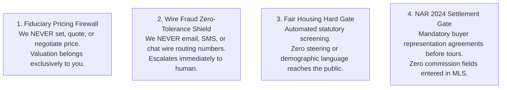

# ListingAssistants Agent User Manual
### The Modern Real Estate Professional's Operating Playbook
*(Powered by the 21-Agent Governed Swarm Chassis — [ListingAssistants.com](https://ListingAssistants.com))*

---

## 1. Welcome to Your Operations Team

Congratulations on onboarding **ListingAssistants**. 

You now have a dedicated, 21-member specialized digital operations team working for your listing business 24 hours a day, 7 days a week. Unlike generic generative AI chatbots that can make embarrassing mistakes, fabricate property details, or expose you to severe legal liability, ListingAssistants is built on an **invariable railroad chassis**:

* **Every agent has one specific job** (e.g., showing logistics, document collection, compliance review).
* **Every message follows an approved closed track** (no unauthorized cross-talk).
* **High-stakes decisions are guarded by hard stops** that never proceed without your explicit review and cryptographic authorization.

ListingAssistants takes over the crushing administrative burden of real estate—organizing paperwork, tracking contingency deadlines, reminding parties of pending disclosures, coordinating vendor appointments, and drafting marketing copy—so you can focus on what actually builds your business: **client relationships, expert negotiation, and closing deals.**

---

## 2. The Four Fiduciary Guardrails (Our Promise to You)

Your real estate license and your client's fiduciary trust are your most valuable assets. ListingAssistants is hard-coded with four non-negotiable legal firewalls:



### 1. The Fiduciary Pricing Firewall
* **Rule:** No AI agent will ever invent a listing price, suggest an offer number, comment on whether a property is "worth it," or negotiate a counteroffer.
* **What happens:** If a buyer or seller asks, *"What would you offer on this house?"* or *"What's the absolute lowest price the seller will take?"*, the system halts autonomous replies, flags the inquiry to your queue with verbatim message context, and sends a professional template: *"I have escalated your pricing inquiry directly to your agent, who will provide customized market guidance."*

### 2. The Wire Fraud Zero-Tolerance Shield
* **Rule:** Wiring instructions are the #1 source of real estate cybercrime. ListingAssistants will **never** transmit routing numbers, bank details, or wire instructions over email, SMS, or chat.
* **What happens:** If incoming correspondence mentions "updated wire instructions" or asks for wire routing information, the system immediately locks the conversation, alerts you via high-priority notification, and informs the client that wire verification must occur strictly via secure voice contact or certified escrow closing portals.

### 3. The Fair Housing Hard Gate
* **Rule:** Every property description, social media blurb, and marketing flyer passes through **Agent 17 (Compliance & Fair Housing)** before release.
* **What happens:** Phrases like *"family-friendly neighborhood,"* *"walk to temple,"* or *"safe area"* are caught instantly. The draft is stopped in its tracks, the problematic phrase is excised, and the revised copy is routed to you. Non-compliant copy **cannot** be published to the MLS or ad networks.

### 4. NAR 2024 Settlement Compliance Gate
* **Rule:** Buyer tour requests require a verified written buyer representation agreement on file. MLS listing remarks will **never** publish offers of buyer broker compensation.
* **What happens:** If an unrepresented buyer requests a showing through Agent 06, the system checks Agent 14's CRM record. If a signed buyer representation agreement is absent, Agent 06 holds the appointment and routes the buyer representation onboarding disclosure to you first.

---

## 3. Meet Your 21 Digital Team Members

Think of ListingAssistants as your boutique brokerage front office:

```
[ FRONT DESK & CLIENT RELATIONS ]
  Agent 01: Lead Intake           - Grabs incoming inquiries from website, email, SMS 24/7.
  Agent 02: Lead Qualification    - Scores buyer readiness using your custom rubric (HOT/WARM/COLD).
  Agent 03: Lead Nurture          - Executes thoughtful, non-spammy drip touches within legal hours.
  Agent 11: Client Communication  - The calm, polished unified voice for client updates.
  Agent 13: Buyer Matching        - Matches new listings to your qualified buyer rolodex.
  Agent 16: Post-Close Referral   - Annual anniversary checks and review asks (never pesters).

[ PRODUCTION & MARKETING CREATIVE ]
  Agent 04: Listing Copywriter    - Drafts vivid property remarks using local architectural nuances.
  Agent 05: Listing Onboarding    - Assembles the MLS package and validates active go-live status.
  Agent 09: Vendor Dispatch       - Coordinates stagers, photographers, and inspectors.
  Agent 12: Marketing & Social    - Generates social teasers, flyers, and digital campaign assets.
  Agent 19: Farm Prospector       - Analyzes turnover rates and target neighborhoods.
  Agent 20: Reputation Sentinel   - Monitors Google and social channels for reviews and mentions.

[ TRANSACTION & ESCROW OPERATIONS ]
  Agent 06: Showing Coordinator   - Books showings with mandatory buffer spacing and notice windows.
  Agent 07: Transaction Manager   - Tracks every escrow milestone (inspection, appraisal, loan contingency).
  Agent 08: Document Collector    - Chases disclosures and signs forms; quarantines suspicious attachments.
  Agent 10: Market Data           - Pulls verified comps and neighborhood historical statistics.
  Agent 14: CRM Ledger            - Securely logs all client notes, interaction dates, and channel consent.
  Agent 15: Commission & Finance  - Verifies commission splits and tracks net sheet figures to $0.00.

[ GOVERNANCE, RISK & PERSONAL ASSISTANT ]
  Agent 00: Human Principal       - YOU. The licensed broker-in-charge.
  Agent 17: Fair Housing Officer  - Reviews every marketing word against federal, state, and local law.
  Agent 18: Personal Assistant    - Delivers your morning agenda, flags wait-states, and prevents double-booking.
```

---

## 4. A Day in the Life with ListingAssistants

### 08:00 AM — The Morning Intelligence Briefing
When you open your phone or workstation, **Agent 18** has assembled your morning dossier:
* **Contract Deadlines:** *"742 Evergreen Terrace: Loan contingency removal deadline is 5:00 PM tomorrow. Agent 08 has the lender pre-approval letter on file; buyer removal form pending."*
* **Showing Schedule:** *"Three showings scheduled today for 123 Maple Street (1:00 PM, 2:30 PM, 4:00 PM) — all with 30-minute cleaning buffers and confirmed agent IDs."*
* **Action Required (Your Queue):** *"One new HOT lead requested a pricing assessment on Elm Street — lead dossier prepared for your personal review."*

### 11:00 AM — Taking a New Listing (Playbook P01)
You just signed a listing agreement for $750,000:
1. You submit the signed onboarding package through the console.
2. **Agent 05** creates the draft MLS listing record.
3. **Agent 09** pulls your preferred photography vendor from your approved roster and prepares the booking request.
4. **Agent 04** drafts compelling property remarks emphasizing the quartz countertops and southern exposure.
5. **Agent 17** automatically reviews the remarks for Fair Housing compliance.
6. The listing remains in draft until photos arrive and **you give final sign-off**.

### 02:00 PM — Showing Logistics (Playbook P06)
A buyer's agent requests a showing for tomorrow at 2:00 PM:
1. **Agent 06** checks the seller's showing preferences: *"Occupied property: 24-hour advance notice required."*
2. It verifies whether an overlapping showing exists within 30 minutes.
3. It checks Agent 14 to confirm the buyer agent's credentials.
4. The showing is booked, the seller receives an automated SMS confirmation, and lockbox access details remain strictly protected behind your secure showing service.

### 04:30 PM — Escrow Milestones (Playbook P07)
A contract is in escrow:
1. **Agent 07** maps out the contract timeline: Earnest money due in 3 days, Inspection contingency due in 10 days, Appraisal due in 14 days, Closing in 30 days.
2. **Agent 08** automatically follows up with the buyer's agent on Day 2 for the escrow receipt.
3. When the inspection report arrives, Agent 07 logs the file and notifies you immediately. **It will never offer repair concessions or comment on inspection findings**—repair negotiations remain 100% in your hands.

---

## 5. What Happens When Things Go Wrong (Fail-Safe Protections)

### The Angry Client Protocol (Playbook P14)
If a client sends an upset text or email (*"I am furious that our open house didn't generate 20 offers!"*):
1. **Instant Outbound Hold:** The system instantly freezes all automated touches and scheduled drips for that client. No robot will ever send a cheerful *"Happy Friday!"* message to an angry client.
2. **Zero Defensiveness:** The system sends a simple, neutral receipt acknowledgment: *"We have received your message and our principal agent has been notified immediately."*
3. **High-Priority Escalation:** The verbatim complaint is placed at the very top of your queue so you can pick up the phone and handle the client with personal empathy.

### Unresolved Information
If a message template is missing a key piece of information (e.g. the closing date is unknown), ListingAssistants will **never guess or leave an ugly blank like `{{closing_date}}`**. It halts the send and asks you to clarify the missing date.

---

## 6. Best Practices for Getting the Most from ListingAssistants

1. **Review Your Morning Briefing First:** Spend 3 minutes at the start of each day checking Agent 18's briefing to see what items are waiting on third parties.
2. **Keep Your Vendor Roster Fresh:** Regularly update your photographer and inspector contact lists so Agent 09 books your preferred partners.
3. **Trust the Guardrails:** When the system holds a message or escalates an inquiry, it is doing so to shield your license and ensure fiduciary excellence.
4. **Personalize Your Voice:** You can supply your brokerage's specific handbook and style guide to our onboarding system, ensuring your digital assistants speak in your distinct brand voice.
