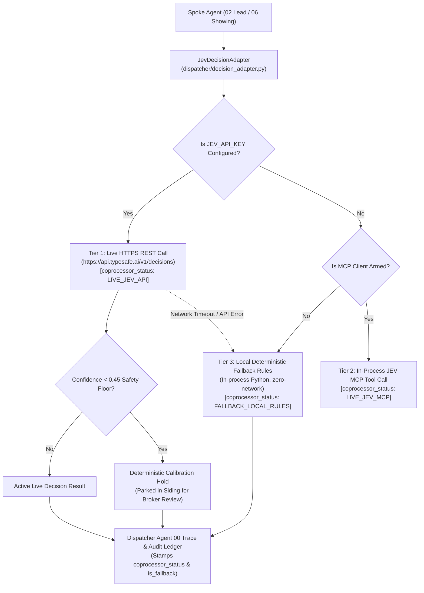

# JEV AI Decision Platform: Live Integration & Explicit Fallback Architecture

## Overview

The **JEV AI Decision Platform** (TypeSafe) serves as an external structured decision coprocessor for the ListingAssistants residential real estate operations team. It provides high-efficiency evaluation of multi-attribute decision problems—specifically lead qualification scoring (Agent 02) and showing schedule arbitration (Agent 06).

To preserve the engine's strict **Closed Track**, **data sovereignty**, and **tamper-evident audit** invariants, JEV AI is integrated using a tiered model with **100% explicit fallback transparency**.

---

## The Three-Tier Operational Hierarchy



---

## Fallback Transparency: Declared Not Silent

Per the repository's foundational architectural doctrine:
> **"UNARMED / FALLBACK IS AUDITED, never a crash and NEVER SILENT — declared not silent!"**

When `JEV_API_KEY` is not provided (or when operating on an air-gapped on-premise workstation without internet access), the system executes its built-in local deterministic fallback rules. When this happens:

1. **Every Decision Output is Explicitly Stamped:**
   ```json
   {
     "tier": "HOT",
     "score": 100,
     "coprocessor_status": "FALLBACK_LOCAL_RULES",
     "is_fallback": true,
     "fallback_warning": "DECISION EVALUATED UNDER LOCAL DETERMINISTIC FALLBACK RULES (Live JEV coprocessor unconfigured or offline)",
     "fallback_reason": "JEV_API_KEY unconfigured (local fallback active)"
   }
   ```
2. **Dispatcher Agent 00 Audit Trail:**
   At boot time, Dispatcher Agent 00 checks coprocessor readiness and appends the status to the immutable audit ledger:
   * **If Unarmed / Local Fallback:** Emits `jev.unarmed_fallback` with `coprocessor_status: FALLBACK_LOCAL_RULES` (declared not silent).
   * **If Armed Live:** Emits `jev.armed_live` with `coprocessor_status: LIVE_JEV_API`.
3. **Spoke Trace Transparency:**
   Spoke Agents (02 and 06) record their exact coprocessor execution mode into `hub.ingest_spoke_trace`:
   `thought="scored: tier=HOT score=100 | coprocessor_status=FALLBACK_LOCAL_RULES (is_fallback=True)"`
   This ensures a broker or operator is never misled into believing an external cloud service made a decision when local fallback rules were used.

---

## Decision Contracts & Calibrated Guardrails

### 1. Lead Qualification (`lead_qualification` — Agent 02)
* **Spoke Consumer:** Agent 02 ([`dispatcher/listing_spokes_02.py`](file:///C:/Users/halfm/.gemini/antigravity/scratch/listing-agents/dispatcher/listing_spokes_02.py))
* **Rubric Schema:** Requires `budget_threshold`, `budget_weight`, `timeline_days_threshold`, `timeline_weight`, `financing_weight`, `hot_threshold`, `warm_threshold`.
* **Guardrails Enforced Across Both Live & Fallback Modes:**
  * **Verified Document Priority:** Preapproval letter dollar amount strictly overrides conflicting stated buyer budget.
  * **Financing Precedence:** Verifiable financing progress outranks stated urgency claims ("high").
  * **Conservative Boundary Assignment:** A score falling exactly on a tier boundary (e.g. score = 70 with `hot_threshold = 70`) is assigned the **lower tier** (`WARM`) and escalated to a human for verification.
  * **0.45 Confidence Floor:** Any evaluation where data certainty scores below `0.45` triggers a deterministic calibration hold (`held_confidence_underflow`), parking the file in siding for broker review rather than guessing.
  * **Incomplete Data Handling:** If all rubric inputs are null, returns tier `UNKNOWN` rather than guessing `COLD`.

### 2. Showing Conflict Resolution (`showing_conflict` — Agent 06)
* **Spoke Consumer:** Agent 06 ([`dispatcher/listing_spokes_06.py`](file:///C:/Users/halfm/.gemini/antigravity/scratch/listing-agents/dispatcher/listing_spokes_06.py))
* **Conflict Arbitration Rules:**
  * **Contractual Milestone Protection:** Calendar blocks originating from Agent 07 (contingency deadlines, appraisal, inspection) strictly outrank soft showing bookings.
  * **Notice Window Enforcement:** Same-day or short-notice bookings on occupied properties require adherence to seller notice buffers.
  * **Buffer-Aware Spacing:** Overlapping showings within the configurable buffer window (e.g. 30 minutes) are sequenced, never double-booked.

---

## Configuration & Activation

To activate Tier 1 Live Cloud API mode, provide your TypeSafe JEV credentials:

### Method 1: Environment Variable
```bash
export JEV_API_KEY="your_actual_jev_api_key_here"
export JEV_ENDPOINT_URL="https://api.typesafe.ai/v1/decisions"
```

### Method 2: On-Premise Config File (`config/integrations.json`)
```json
{
  "ai_coprocessors": {
    "jev_ai": {
      "enabled": true,
      "api_key": "your_actual_jev_api_key_here",
      "endpoint_url": "https://api.typesafe.ai/v1/decisions",
      "model": "jev-1.13.0",
      "confidence_threshold": 0.45,
      "timeout_seconds": 3.0
    }
  }
}
```

If neither is provided, ListingAssistants continues running smoothly in **Tier 3 Local Fallback Mode** with 100% offline predictability.
