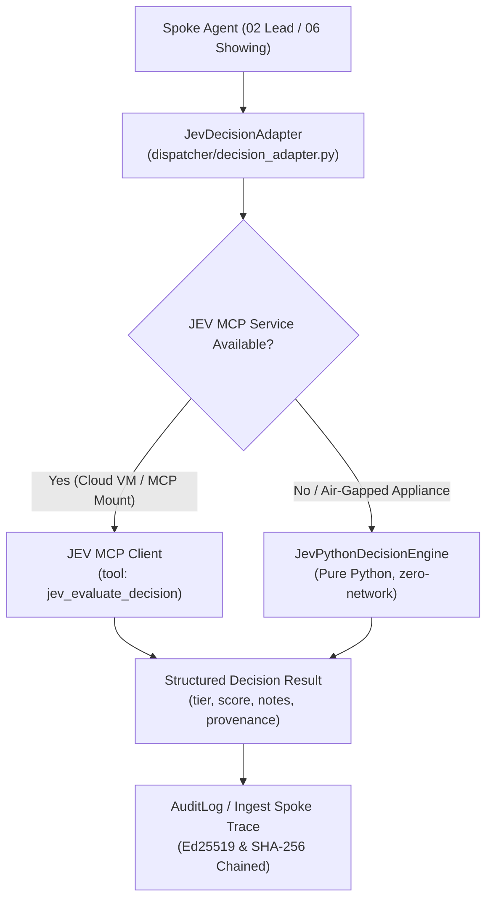

# JEV AI Decision Platform Integration & Fallback Architecture

## Overview

The **JEV AI Decision Platform** serves as an external structured decision coprocessor for the QuietFireAI residential real estate listing swarm. It provides high-efficiency, cost-effective evaluation of multi-attribute decision problems (such as lead scoring, showing conflict arbitration, and contingency sequence evaluation).

To maintain the swarm's strict **Closed Track** and **tamper-evident governance** invariants, JEV AI is integrated using a dual-channel design:
1. **Primary Interface:** Model Context Protocol (MCP) tool contract (`jev_evaluate_decision`).
2. **Deterministic Fallback:** In-process, zero-network pure Python decision engine (`JevPythonDecisionEngine`), requiring zero external network connectivity, zero HTTP REST overhead, and zero third-party cloud runtime dependencies.

---

## Architectural Principles



### 1. Zero HTTP REST Overhead
As instructed, the integration deliberately omits any HTTP/REST daemon layer at this stage. Communication is handled exclusively through:
* Stdio / In-memory Model Context Protocol (MCP) sockets, or
* In-process Python method invocation.

This eliminates port-binding vulnerabilities, network timeouts, and serialization delays on local appliance deployments.

### 2. Closed-Track Compliance
JEV AI never acts as an unconstrained autonomous agent. It is invoked purely as a **subordinate decision evaluator**. The Hub and Spokes maintain total custody of routing, envelope signing, and state transitions.

---

## Decision Contracts

### A. Lead Qualification (`lead_qualification`)
* **Spoke Consumer:** Spoke 02 ([`dispatcher/listing_spokes_02.py`](file:///C:/Users/halfm/.gemini/antigravity/scratch/listing-agents/dispatcher/listing_spokes_02.py))
* **Rubric Schema:** Requires `budget_threshold`, `budget_weight`, `timeline_days_threshold`, `timeline_weight`, `financing_weight`, `hot_threshold`, `warm_threshold`.
* **Guardrails Enforced:**
  * **Verified Document Priority:** Preapproval letter dollar amount strictly overrides conflicting stated buyer budget.
  * **Financing Precedence:** Verifiable financing progress outranks stated urgency claims ("high").
  * **Conservative Boundary Assignment:** A score falling exactly on a tier boundary (e.g. score = 70 with `hot_threshold = 70`) is assigned the **lower tier** (`WARM`) and escalated to a human for verification.
  * **Incomplete Data Handling:** If all rubric inputs are null, returns tier `UNKNOWN` rather than guessing `COLD`.

### B. Showing Conflict Resolution (`showing_conflict`)
* **Spoke Consumer:** Spoke 06 ([`dispatcher/listing_spokes_06.py`](file:///C:/Users/halfm/.gemini/antigravity/scratch/listing-agents/dispatcher/listing_spokes_06.py))
* **Conflict Arbitration Rules:**
  * **Contractual Milestone Protection:** Calendar blocks originating from Agent 07 (contingency deadlines, appraisal, inspection) strictly outrank soft showing bookings.
  * **Notice Window Enforcement:** Same-day or short-notice bookings on occupied properties require adherence to seller notice buffers.
  * **Buffer-Aware Spacing:** Overlapping showings within the configurable buffer window (e.g. 30 minutes) are sequenced, never double-booked.

---

## Deployment Modes

### 1. Stage 1: Cloud VM Validation
* `JEV_USE_MCP=1` connects to the JEV AI MCP stdio server.
* Tool invocations are captured and verified against the expected output tuples.

### 2. Stage 2: Air-Gapped Appliance (Hermes + Drobo NAS)
* On air-gapped physical hardware, JEV AI runs either via local appliance MCP or via the in-process `JevPythonDecisionEngine`.
* Offline execution ensures zero data leakage of client PII or transaction details to public third-party endpoints.

---

## Verification & Testing

The JEV adapter can be verified using the automated test suite:
```bash
python -m pytest tests_listing/test_decision_adapter.py
```
And verified within the live spoke loop without breaking any of the 538 existing regression and mutation hardening tests.
