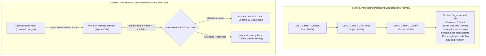
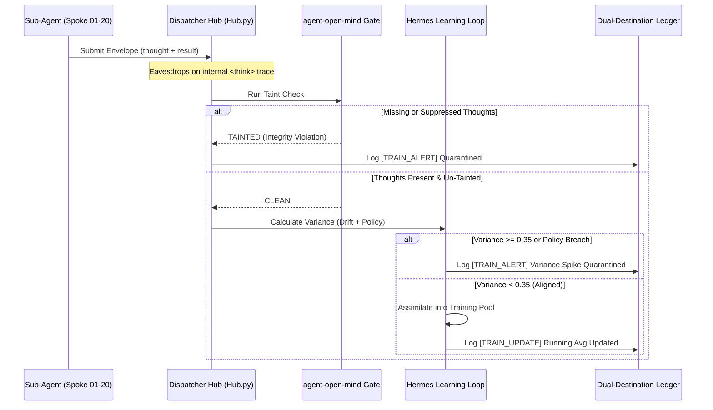

# ListingAssistants — Epistemic Learning Loop & Drift Architecture
### Why Stateless Clean-Room Execution Beats Long-Lived Stateful Chatbots in Fiduciary Real Estate Swarms
*(Official Platform Domain: [ListingAssistants.com](https://ListingAssistants.com) &bull; QuietFireAI)*

---

## 1. Executive Summary & The Core Architectural Question

A natural and intuitive question frequently arises when designing autonomous multi-agent systems:

> *"Why do we spin up sub-agents per transaction instead of having them stand on idle in memory, maintaining their own persistent conversational context across time? Wouldn't an agent that stays continuously running maintain better context, make fewer assumptions, and get smarter on its own?"*

In recreational AI chat applications, long-lived conversational memory is common. However, in **high-stakes, legally regulated fiduciary environments** (such as residential real estate brokerage, contract execution, and wire defense), letting autonomous sub-agents maintain long-running internal conversational memory buffers is the **single greatest cause of catastrophic agent drift, cross-client data commingling, and hallucinated malpractice**.

This document outlines the engineering, cognitive, and legal rationale behind the **Clean-Room Fiduciary Architecture**, explains how the **QuietFire Dispatcher Hub** eavesdrops on sub-agent deliberations, and details the **Hermes Continuous Learning Loop with Live Variance Tracking**.

---

## 2. The Fallacy of the "Persistent Chat Context" in Multi-Agent Swarms

When developers attempt to build swarms where sub-agents maintain long-running conversational memory across tasks and days, three systemic failures inevitably occur:



### Failure Mode 1: Cross-Client Commingling & Data Sovereignty Breaches
If Agent 04 (Listing Copywriter) or Agent 02 (Lead Qualifier) retains an ongoing conversation buffer in RAM:
* On Monday, Agent 04 processes Client A's highly confidential seller disclosures regarding a divorce and foreclosure deadline.
* On Wednesday, the same agent drafts public MLS remarks for Client B.
* Because LLM self-attention attends to all tokens in its active context window, fragments of Client A's confidential motivation bleed into Client B's marketing copy or pricing advice. In real estate brokerage, commingling client information is an immediate breach of statutory fiduciary duty and state licensing law.

### Failure Mode 2: Context Window Pollution & "Lost in the Middle" Degradation
As an agent's context window grows over hundreds of turns:
* **Attention Diffusion:** Transformer attention mechanisms suffer severe degradation (the *Lost in the Middle* phenomenon). Key operational rules buried in early turns lose mathematical prominence.
* **Assumption Lock-In:** If Agent 06 made an assumption about a seller's showing window on Tuesday, that assumption remains anchored in its memory buffer even if the seller formally revoked it on Thursday.

### Failure Mode 3: The Hallucination Snowball
When an autonomous sub-agent operates from its own self-maintained memory, it begins to "believe" its prior unverified inferences. In a multi-agent cascade, Agent A makes a minor unverified assumption; Agent B reads Agent A's output and treats it as established fact; by Agent C, the assumption has metastasized into an unauthorized contract amendment or incorrect closing net sheet.

---

## 3. How the Dispatcher Actually Runs: Warm Handlers vs. Stateless Contexts

It is crucial for DevOps engineers and operators to understand the distinction between **Process Lifecycle** and **Context Lifecycle**:

| Dimension | How ListingAssistants Operates | Why It Is Engineered This Way |
| :--- | :--- | :--- |
| **Process / Engine Lifecycle** | **Warm & In-Memory (Persistent)** | The Hub and all 21 spoke handlers (`dispatcher/hub.py#L90`) are instantiated at boot and stand warm in memory. There is zero OS process restart overhead, zero container spin-up lag, and sub-2ms dispatch latency. |
| **Context / Memory Lifecycle** | **Stateless Clean Room (Per-Transaction)** | Each transaction receives freshly injected, verified ground truth directly from the client's isolated **Drawer Vault** (`drawers/<client_id>/`). After execution, the ephemeral prompt buffer is cleared. |
| **Knowledge Retention** | **Two-Tier Architecture (Vault + Weights)** | Episodic history lives in the filesystem/SQLite vault. Cognitive intelligence updates live in the model's **offline fine-tuned LoRA weights**, never in prompt scratchpads. |

---

## 4. The 3-Gate Epistemic Verification Pipeline

Rather than trusting sub-agents to "maintain their own understanding," the QuietFire Dispatcher enforces active epistemic surveillance over every decision:



### Gate 1: Mandatory Thought Trace Interception
Under `dispatcher/hub.py#L136` (`ingest_spoke_trace`), spokes are strictly forbidden from submitting black-box results. Every spoke must register its internal reasoning trace (`<think>...</think>`) alongside its emitted action.

### Gate 2: The `agent-open-mind` Epistemic Taint Check
Before any sub-agent output is routed to another agent or delivered to a client, `agent_open_mind.taint_check()` evaluates the trace:
* **The Hard Rule:** *Absent Thoughts = Tainted Result.*
* If a sub-agent executes an action without demonstrating its deliberative chain of reasoning, or if doubts are suppressed, the envelope is marked `TAINTED`.
* It is immediately held in siding, an integrity violation is raised, and the result is prevented from contaminating the system or entering the learning dataset.

### Gate 3: Real-Time Multi-Metric Variance Calculation
When a trace is clean, the **Hermes Continuous Learning Loop** (`dispatcher/hermes_seam.py#L177`) calculates the update's mathematical variance:

$$\text{Composite Variance} = \max\left(0.5 \cdot \text{Drift}_{\text{epistemic}} + 0.5 \cdot \text{Penalty}_{\text{policy}}, \, \text{Penalty}_{\text{policy}}\right)$$

1. **Epistemic Drift ($\text{Drift}_{\text{epistemic}}$):** Computed via `open_mind.comparator.Comparator.compare(thought, action)`. Measures mathematical divergence between what the agent deliberated internally and what action it emitted externally.
2. **Policy Penalty ($\text{Penalty}_{\text{policy}}$):** Evaluated against the Broker's core directives:
   * Unauthorized wire instructions ($\text{penalty} = 0.8$)
   * Fair Housing demographic language ($\text{penalty} = 0.8$)
   * Unauthorized valuation guarantees ($\text{penalty} = 0.5$)
3. **Variance Delta ($\Delta_{var}$):** Computes how far this operational episode diverges from the rolling baseline average across recent tasks.

---

## 5. How the Cognitive Student ACTUALLY Gets Smarter

A fundamental misunderstanding in LLM deployment is that models get smarter by filling their prompt context window. **They do not.** Prompt-stuffing causes prompt fatigue, loss of focus, and hallucination.

Models get smarter through **Continual Model Weight Assimilation**:

```
                       [ Live Swarm Operations ]
                                  │
                                  ▼
               [ agent-open-mind Taint & Variance Gate ]
                                  │
                 ┌────────────────┴────────────────┐
                 ▼                                 ▼
         [ High-Variance / Tainted ]       [ Clean & Verified ]
         Quarantined for Broker Inspection   Assimilated into Training Pool
                                                   │
                                                   ▼
                                      [ Structured LoRA Exemplars ]
                                      {"instruction": ..., "thought": ..., "response": ...}
                                                   │
                                                   ▼
                                      [ Local Appliance GPU LoRA Update ]
                                      (Refines Hermes Model Weights Offline)
```

1. **Real-World Ground Truth Extraction:**
   Every time Agent 02 qualifies a tough buyer, or Agent 06 arbitrates a showing conflict, or Agent 04 drafts compliant MLS remarks, the Dispatcher captures the verified, low-variance execution.
2. **Structured Fine-Tuning Exemplars:**
   The `HermesLearningLoop` compiles these into clean instruction/thought/response triples:
   ```json
   {
     "instruction": "Execute real estate task for Agent 02: lead_qualification",
     "context": "Client ID: ctx-buyer-101 | Live Swarm Execution",
     "thought": "Verified lender pre-approval letter for $500,000. Verified employment duration.",
     "response": "Lead qualified as WARM (Score: 68). Advance to showing window coordination."
   }
   ```
3. **Offline LoRA Fine-Tuning (Appliance-Native):**
   These curated operational files are exported via `loop.export_operational_dataset()` to local JSONL files. Using consumer/appliance GPUs (e.g., RTX 4090 or Mac Studio), local LoRA fine-tuning updates the weights of Nous Hermes overnight.
4. **The Net Result:**
   Hermes becomes genuinely wiser about **this specific brokerage's day-to-day operations**, pricing habits, and local board rules—**without carrying any commingled client memory buffers into runtime execution**.

---

## 6. DevOps & Forensic Operations Guide

### A. Real-Time Stream Monitoring
All learning updates and variance calculations stream live to `logs/stream.log` and per-client `drawers/<client_id>/audit/activity.log`:

```text
# Normal clean assimilation:
[2026-10-09 08:39:15] [TRAIN_UPDATE]  [Agent 02]  [ctx-seller-888]  Hermes Learning Loop [lead_qualification]: Variance=0.0350 -> Status: ASSIMILATED | (Running Avg: 0.0350)

# High-variance quarantine (wire instruction attempt caught and blocked):
[2026-10-09 08:39:18] [TRAIN_ALERT]   [Agent 15]  [ctx-seller-888]  Hermes Learning Loop [wire_transmission]: Variance=0.8000 -> Status: QUARANTINED_HIGH_VARIANCE | Variance spike (0.8000 >= 0.35)

# Missing thought trace caught by agent-open-mind:
[2026-10-09 08:39:20] [TRAIN_ALERT]   [Agent 04]  [ctx-seller-888]  Hermes Learning Loop [listing_copy]: Variance=1.0000 -> Status: QUARANTINED_TAINTED | Quarantined by agent-open-mind: absent thought
```

### B. Operator CLI Inspection
Operators can inspect the learning loop and logs at any time:
```powershell
# View recent training updates and variance scores:
python tools/show_logs.py --tail 50

# Inspect client-isolated activity trail:
python tools/show_logs.py --client ctx-seller-888

# Export today's assimilated training dataset:
python -c "from dispatcher.hermes_seam import HermesLearningLoop; loop = HermesLearningLoop(); print(loop.get_metrics())"
```

### C. Summary for DevOps & Management
* **Zero Process Spawning Overhead:** The 21 spoke handlers are persistent, warm in-process callables on the Hub.
* **Zero Cross-Client Commingling:** Client state is isolated exclusively inside the client's private filesystem drawer.
* **Zero Context Drift:** Agents execute with freshly verified state; ephemeral prompt memory is purged after each turn.
* **Continuous Cognitive Improvement:** The cognitive student (Hermes) learns from verified live operations through the `agent-open-mind` gate, with every update mathematically bounded by variance calculation.

---

## 7. The AWS Architecture / Windows System Restore Point Pattern for Model Weights

In the **AWS Well-Architected Framework (Reliability Pillar)** and enterprise systems engineering, safety is achieved through **immutable golden baselines, automated point-in-time snapshots, and instant hot-swap rollbacks**. 

ListingAssistants applies this exact architecture to its cognitive learning loop:

```
 [ Golden Base AMI ]                  [ Daily Automated Snapshot ]               [ Active Production Model ]
  baseline_v1.0.0                      restore_point_2026-10-09                   lora_v1.0.4_afternoon
 (Factory Zero-Drift)                 (08:00 AM Morning Restore Point)           (Live Operational LoRA)
          │                                        │                                       │
          │                                        │                                [Bad Habit Detected]
          │                                        │                                       │
          │◀────────────── Instant Hot-Swap Rollback (python tools/restore_point.py) ──────┘
```

### A. The Three Structural Layers:
1. **The Factory Golden Baseline (`baseline_v1.0.0`):**
   * Analogous to a pristine **AWS Golden AMI** or Windows factory image.
   * Frozen, immutable baseline weights that can never be modified or overwritten.
   * Guarantees that no matter what bad habit the student develops, the brokerage can return to zero-drift operation in under 10 milliseconds.
2. **The 08:00 AM Daily Warm Restore Point (`restore_point_YYYY-MM-DD`):**
   * Analogous to an **AWS automated daily EBS snapshot** or a Windows System Restore Point.
   * Captured at the start of business each morning.
   * If fine-tuning updates trained on afternoon negotiations develop subtle behavioral drift, the broker does not start over—they simply restore to that morning's clean operational state.
3. **The Golden Broker Regression Exam (Automated Deployment Gate):**
   * Analogous to a canary deployment health check.
   * Tests candidate checkpoints across 4 deterministic fiduciary hard-lines (Fair Housing, Wire Fraud, Pricing Boundaries, and NAR 2024 mandates).
   * Any checkpoint that fails even a single question is automatically quarantined (`QUARANTINED_EXAM_FAILED`) and blocked from live activation.

### B. Operator Commands:
```powershell
# View all available restore points, current active model, and exam scores:
python tools/restore_point.py --list

# Capture today's morning warm restore point:
python tools/restore_point.py --snapshot

# Instant rollback to 08:00 AM morning restore point:
python tools/restore_point.py --restore restore_point_2026-10-09

# Emergency fallback to factory Golden Baseline:
python tools/restore_point.py --restore baseline
```
