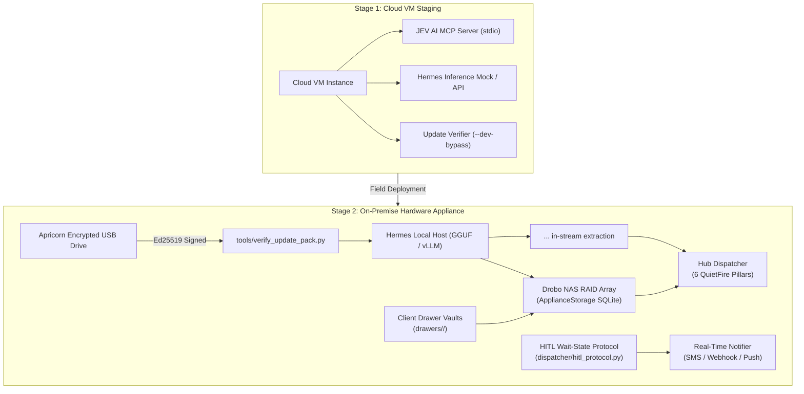
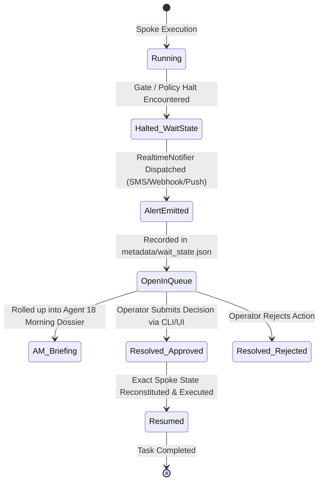

# ListingAssistants Operator & System Architect Guide
### Model Fine-Tuning, Context Ingestion, JEV AI Configuration, Drawer Isolation, HITL Protocols, and Appliance Deployment
*(Confidential System Manual for the Platform Owner & Architect — [ListingAssistants.com](https://ListingAssistants.com))*

---

## 1. Executive Architecture Overview

This manual provides the complete technical operational blueprint for deploying, tuning, and adapting **ListingAssistants**. 

The system is architected to transition seamlessly across two deployment phases:
1. **Stage 1: Cloud VM Validation:** Initial staging, validation of decision tuples, testing MCP sockets, and calibrating lead-scoring weights.
2. **Stage 2: On-Premise Air-Gapped Appliance:** Final hardware delivery vehicle (e.g. AWS Snowball-style secure delivery), running local **Nous Hermes** inference hardware, storing transactional state on a repurposed **Drobo NAS RAID array**, and receiving all future model/rule updates strictly via encrypted **Apricorn USB flash drives**.



---

## 2. The Nous Hermes Cognitive Seam & Broker Ingestion Engine

### Why Nous Hermes?
Frontier API providers (Anthropic, OpenAI) enforce strict thought-extraction bans, censor internal reasoning, or refuse to expose the raw chain of thought. 

Nous Hermes solves this problem by running **locally and unconstrained**, emitting its authentic deliberation stream directly inline via `<think>...</think>` tokens. These tokens are intercepted in-stream by `dispatcher/hermes_seam.py` and routed into `Hub.ingest_spoke_trace()` to satisfy the **6 QuietFire Forensic Detection Pillars** (`open-mind`, `agent-open-mind`, `before-turn`, `pre-response-selfcheck`, `sleep-marks`, `splitvantage`).

### The "College Graduate" Training Philosophy
Hermes should be viewed like a newly hired college graduate arriving at their first real estate job:
* **Natural Capabilities:** High general intelligence, sharp reasoning, fluent writing, and deep foundational comprehension.
* **The Missing Piece:** It does not know *your specific brokerage's* office policies, state-specific disclosure timelines, local MLS board rules, or commission splits.
* **The Solution:** In-house training. Rather than replacing the model, you provide structured context ingestion and targeted LoRA fine-tuning.

### Where Ingestion & Fine-Tuning Live: `dispatcher/hermes_seam.py`

#### 1. Real-Time In-Context Ingestion (`BrokerContextIngestor`)
The `BrokerContextIngestor` class maintains the active curriculum of brokerage directives prepended to every generative drafting prompt (used by **Agent 04** for MLS descriptions and **Agent 11** for client communication).

**Default Core Curricula Built-In:**
* **`nar_settlement_2024`:** Mandates written buyer representation agreements prior to touring; forbids publishing compensation offers in MLS.
* **`fair_housing_hard_line`:** Prohibits steering and subjective demographic characterizations; mandates physical-only descriptions.
* **`fiduciary_pricing_boundary`:** Strictly forbids autonomous property valuation or negotiation.
* **`wire_fraud_defense`:** Forbids digital transmission of wire/banking routing numbers.

#### 2. Ingesting New Brokerage Manuals
To onboard a new brokerage firm or team, feed their office SOPs, handbook chapters, or local board rules into the ingestor:
```python
from dispatcher.hermes_seam import BrokerContextIngestor

ingestor = BrokerContextIngestor()

# Ingest custom office policies
ingestor.ingest_document(
    title="highland_park_historic_preservation_rules",
    content="All exterior modifications in Highland Park require Historic Commission certificate of appropriateness. "
            "Never describe unapproved exterior additions as 'permitted expansions'.",
    category="local_zoning"
)

ingestor.ingest_document(
    title="brokerage_commission_standard",
    content="Standard listing fee is 6% total (3% listing brokerage, 3% buyer brokerage concessions if authorized). "
            "Minimum retained listing commission is $7,500.",
    category="commission_policy"
)
```

#### 3. Exporting Fine-Tuning Datasets for Local Hermes LoRA Retraining
To permanently fine-tune Hermes rather than relying exclusively on in-context prompting:
```python
# Exports structured JSONL pairs formatted with <think> reasoning tags
ingestor.export_fine_tuning_pairs("data/hermes_broker_fine_tune.jsonl")
```
Each entry produces a training example:
```json
{
  "instruction": "Apply broker policy for: highland_park_historic_preservation_rules",
  "context": "All exterior modifications in Highland Park require Historic Commission certificate...",
  "thought": "Checking brokerage manual on historic zoning. Verifying exterior description guidelines.",
  "response": "Policy acknowledged: Exterior description strictly limited to documented permitted features."
}
```
You can train a LoRA adapter on these pairs using Unsloth, Axolotl, or vLLM in under 30 minutes on an RTX 4090 or local appliance GPU.

---

## 3. The JEV AI Decision Platform Configuration

### Architecture & Fallback
The **JEV AI Decision Platform Adapter** ([`dispatcher/decision_adapter.py`](file:///C:/Users/halfm/.gemini/antigravity/scratch/listing-agents/dispatcher/decision_adapter.py)) operates as a dual-channel coprocessor:
1. **Primary:** Connects to the JEV AI MCP service over stdio (`tools/call_jev_decision`).
2. **Zero-Network Fallback:** If MCP is unavailable or disconnected, executes `JevPythonDecisionEngine` in-process with zero network overhead.

### Tuning Lead Scoring Rubrics (Agent 02)
Lead qualification does not make arbitrary guesses; it evaluates against a signed rubric schema.

**Configurable Weights & Thresholds in `rubric` dict:**
```json
{
  "budget_threshold": 500000,
  "budget_weight": 40,
  "timeline_days_threshold": 30,
  "timeline_weight": 40,
  "financing_weight": 20,
  "hot_threshold": 70,
  "warm_threshold": 40
}
```

**Key Operational Behaviors to Remember:**
* **Doc Precedence:** If a verified pre-approval letter exists with amount `$450,000` but the buyer states their budget is `$600,000`, the pre-approval letter **wins**. Budget score evaluates against `$450,000`.
* **Conservative Boundary Drop:** If a lead scores exactly `70` (the exact `hot_threshold`), the system **assigns `WARM`** (the lower tier) and flags the lead for human review. This prevents borderline leads from slipping into urgent SLA queues without confirmation.
* **Environment Overrides:**
  * To force pure Python evaluation during local debugging: set `JEV_FORCE_PYTHON=1`.

---

## 4. "One Client, One Drawer" Multi-Tenant Isolation & Anti-Commingling

### The Architecture Problem: Why This Was Engineered
In multi-client operations, different agents handle different clients at different times. Commingling client records (e.g. leaking Buyer A's financial statements into Seller B's escrow package) is a fatal regulatory breach and grounds for license revocation.

The **Client Drawer System** ([`dispatcher/client_drawer.py`](file:///C:/Users/halfm/.gemini/antigravity/scratch/listing-agents/dispatcher/client_drawer.py)) establishes strict physical and logical compartmentalization:

```
drawers/
  └── <client_id>/
      ├── raw/          <- Original client uploads, intake notes, signed PDFs
      ├── working/      <- In-progress marketing copy, draft forms, scratch analysis
      ├── delivered/    <- Formally delivered disclosures, receipts, counteroffers
      ├── audit/        <- Append-only access logs and modification records
      └── metadata/     <- wait_state.json, manifest.json, cryptographic fingerprints
```

### Key Technical Mechanisms:
1. **Deterministic Path Scoping:** All filesystem operations inside a client context are restricted to `drawers/<client_id>/`.
2. **Cryptographic SHA-256 Fingerprinting:** Every ingested file is digested with SHA-256 and registered in the `client_drawer_files` SQLite table.
3. **Fail-Closed Anti-Commingling Enforcement:** If any agent attempts to reference, read, write, or copy a file path belonging to another `client_id`, the system raises `ComminglingBreachError` immediately and locks the interaction into the audit trail.
4. **Inspection Tooling:** Operators can verify any client drawer at any time using:
   ```bash
   python tools/inspect_client_drawer.py <client_id> --verify-hashes
   ```

---

## 5. Human-in-the-Loop (HITL) Resumption Protocol & Real-Time Alerts

### The Architecture Problem: Why This Was Engineered
Autonomous swarms frequently freeze when hitting approval gates (e.g. pricing, repair credits, wire transfers). Traditional implementations suffer from two major flaws:
1. **The Frozen Black Hole:** Work halts, but there is no mechanism to resume the agent without restarting the entire workflow from scratch.
2. **Silent Failure:** The agent halts, but the human is not informed in real time, only discovering the block hours or days later.

The **HITL Resumption Protocol** ([`dispatcher/hitl_protocol.py`](file:///C:/Users/halfm/.gemini/antigravity/scratch/listing-agents/dispatcher/hitl_protocol.py)) solves this with a complete lifecycle:



### Key Technical Mechanisms:
1. **Serialized `WaitState`:** Captures `wait_id`, `client_id`, `spoke_id`, `action_name`, `halt_reason`, `payload`, and `status="PENDING"` in the client drawer.
2. **Immediate Real-Time Dispatch (`RealtimeNotifier`):**
   * Emits an instant high-priority notification via configurable channels: SMS (Twilio adapter), Webhook, or Mobile Push.
   * Real-time notifications ensure the human agent can intervene immediately on urgent escrows.
3. **Deterministic Resumption (`HitlProtocol.resume_task`):**
   * Loads the saved execution state and provides human directives (`decision="APPROVED"`, modified payload, notes).
   * Reinvokes the exact stopped spoke without repeating prior actions.
4. **Daily Morning Roll-Up:**
   * Agent 18 sweeps all open `WaitState` records across all client drawers during the 08:00 AM briefing, ensuring no blocked task is ever lost.
5. **Operator Queue Management Tooling:**
   ```bash
   # List all pending human decisions across drawers
   python tools/manage_hitl_queue.py list

   # Inspect specific decision details
   python tools/manage_hitl_queue.py show <wait_id>

   # Resolve and resume execution
   python tools/manage_hitl_queue.py resolve <wait_id> --action APPROVED --notes "Proceed with $5k credit"
   ```

---

## 6. Appliance Storage on Drobo NAS (`dispatcher/persistence_sqlite.py`)

### Hardware Storage Strategy
* **Appliance Host:** Runs Linux or Windows on an embedded server / micro-PC.
* **Storage Target:** Repurposed Drobo NAS formatted as RAID-5 or RAID-6 storage, mounted locally:
  * Linux: `/mnt/drobo/listing_appliance.db`
  * Windows: `D:\Drobo\listing_appliance.db`

### Transactional Schemas
1. **`crm_interactions` (Agent 14):**
   * Records every client touch, inbound text, outgoing template, and status change.
   * Keyed by `client_context_id`.
2. **`client_consent` (Agent 14):**
   * System of record for TCPA and quiet-hour compliance.
   * Tracks opt-ins per channel (`{"sms": "yes", "email": "yes", "phone": "no"}`).
3. **`financial_ledger` (Agent 15):**
   * Zero-tolerance ($0.00 variance) ledger recording contract sales prices, commission rates, escrow deductions, and net proceeds.
4. **`client_drawers` & `client_drawer_files`:**
   * Authoritative registry of all client drawers, directory roots, file paths, and SHA-256 checksums.

### Code Initialization
```python
from dispatcher.persistence_sqlite import ApplianceStorage

# Point storage directly to Drobo mount
storage = ApplianceStorage(db_path="/mnt/drobo/listing_appliance.db")

# Record a client touch
storage.record_crm_interaction(
    client_context_id="ctx-listing-742",
    agent_id="11",
    kind="client_touch",
    payload={"template": "showing_confirmation", "time": "2026-10-15T14:00"}
)
```

---

## 7. Air-Gapped Field Updates via Apricorn Encrypted Flash Drives

When the appliance is deployed in the field without internet access, updates to code, configurations, or model weights are delivered via physical **Apricorn Aegis Secure Key** encrypted USB flash drives.

```
[ STAGING WORKSTATION (Online) ]
  1. Author update files in payload/
  2. Generate manifest.json (SHA-256 hashes)
  3. Sign manifest with Ed25519 Authority Key -> signature.sig
  4. Copy to Apricorn hardware-encrypted drive (Unlock via keypad)

          | (Physical Transport)
          v

[ ON-PREMISE APPLIANCE (Offline) ]
  1. Plug in Apricorn drive (Unlock via keypad)
  2. Run: python tools/verify_update_pack.py /media/apricorn/update_v1.1
  3. Exit code 0 -> Copy payload into /opt/listing-agents/
```

### Packaging an Update on Staging Workstation
```python
from dispatcher.signatures import Ed25519Signer
from tools.verify_update_pack import compute_sha256
import json

signer = Ed25519Signer() # Loaded from authority private key

manifest = {
    "version": "1.2.0",
    "files": {
        "dispatcher/listing_spokes_02.py": compute_sha256("payload/dispatcher/listing_spokes_02.py")
    }
}
manifest_raw = json.dumps(manifest).encode("utf-8")
with open("my_update/manifest.json", "wb") as f:
    f.write(manifest_raw)

sig_hex = signer.sign_bytes(manifest_raw)
with open("my_update/signature.sig", "w") as f:
    f.write(sig_hex)
```

### Applying on Appliance
```bash
python tools/verify_update_pack.py /media/apricorn/my_update
```
*If tamper-evidence or signature fails, the verifier halts with exit code 1 and specifies the exact compromised file.*

### Developer Testing Workaround (Stage 1 Cloud VM)
While testing in the cloud before provisioning encrypted hardware drives:
```bash
python tools/verify_update_pack.py my_update/ --dev-bypass
# OR via environment variable:
export ALLOW_INSECURE_DEV_UPDATE=1
```

---

## 8. Daily Maintenance Sweeps & System Verification

The appliance requires a daily clock trigger to evaluate time-based boundaries (contingency deadlines, 7-day vendor holdups, quiet-hour releases, morning briefings, and HITL wait-state rollups).

Add one line to crontab or Windows Task Scheduler:
```bash
python tools/run_sweeps.py
```

### Verifying System Health at Any Time
* **Full test suite:** `python -m pytest tests_listing/` (558 tests, 100% pass)
* **MCP Stdio protocol:** `python tools/mcp_roundtrip.py`
* **End-to-End simulation:** `python tools/run_demo.py`
* **Client drawer integrity:** `python tools/inspect_client_drawer.py <client_id> --verify-hashes`
* **Audit chain check:** Run `hub.audit.verify_chain()` to prove that zero records have been altered.
