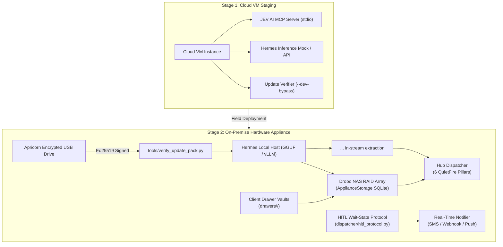
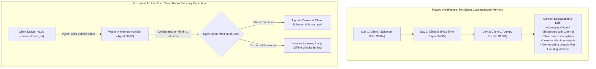
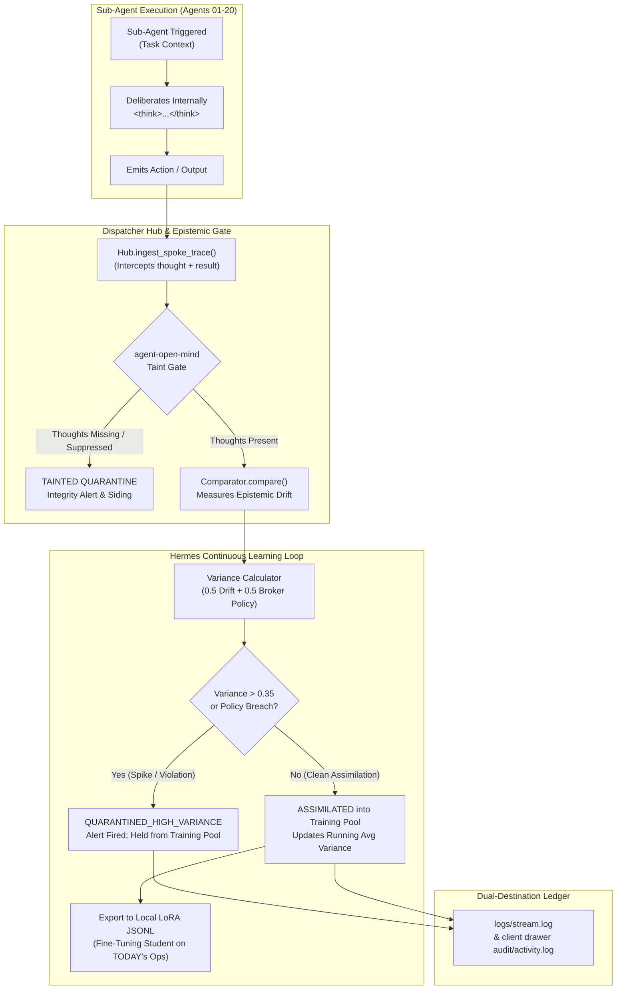
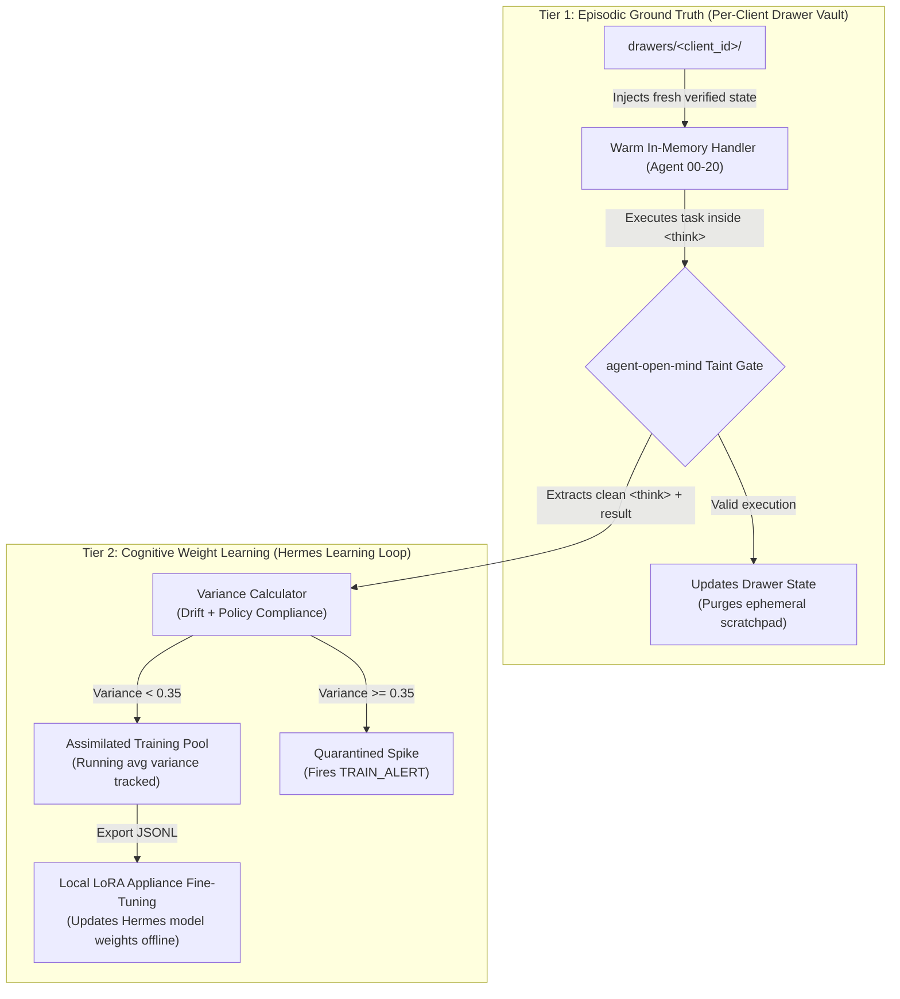
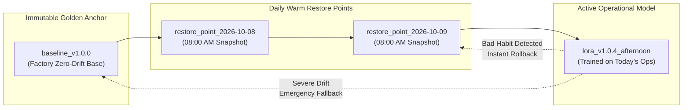
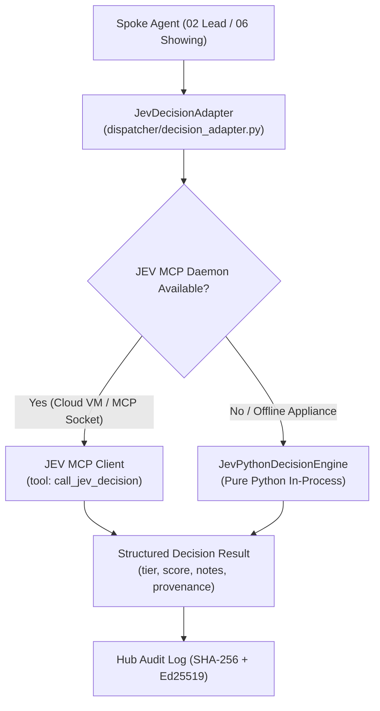
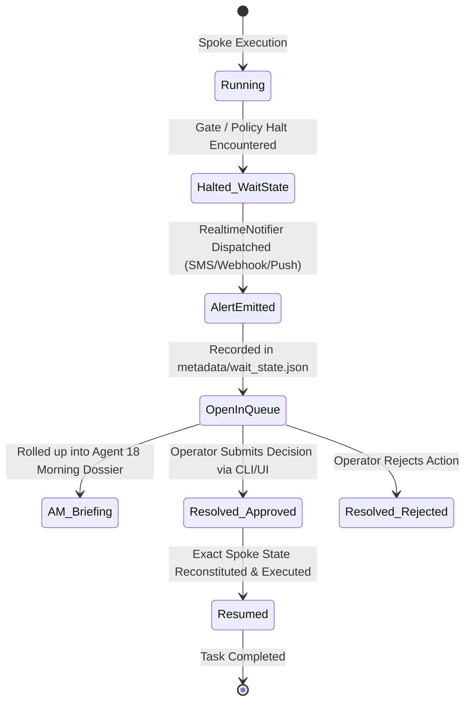

# ListingAssistants Operator & System Architect Guide
### Model Fine-Tuning, Context Ingestion, JEV AI Configuration, Drawer Isolation, HITL Protocols, and Appliance Deployment
*(Confidential System Manual for the Platform Owner & Architect — [ListingAssistants.com](https://ListingAssistants.com))*

---

## 1. Executive Architecture Overview

This manual provides the complete technical operational blueprint for deploying, tuning, and adapting **ListingAssistants**. 

The system is architected to transition seamlessly across two deployment phases:
1. **Stage 1: Cloud VM Validation:** Initial staging, validation of decision tuples, testing MCP sockets, and calibrating lead-scoring weights.
2. **Stage 2: On-Premise Air-Gapped Appliance:** Final hardware delivery vehicle (e.g. AWS Snowball-style secure delivery), running local **Nous Hermes** inference hardware, storing transactional state on a repurposed **Drobo NAS RAID array**, and receiving all future model/rule updates strictly via encrypted **Apricorn USB flash drives**.



### Architectural Identity & Design Foundations
* **Custom Actor Micro-Kernel (Zero Wrapper Overhead):** ListingAssistants is **not** built on top of LangChain, AutoGen, CrewAI, or similar brittle prompt-chaining frameworks. It is a purpose-built, event-driven actor micro-kernel engineered in-house by **QuietFire AI Labs** using pure Python standard library foundations, strict deterministic state machines, and SHA-256 hash chaining.
* **The Five Subsystems:**
  1. **`dispatcher/` (The Micro-Kernel Hub & Transport):** Central message broker governing route enforcement, loop suppression, idempotency deduplication (`envelope_id`), and hash-chained audit logging (`Hub`, `AuditLog`, `Envelope`, `Routes`). Includes `ConcurrentHubDispatcher` providing client-partitioned FIFO execution and ASGI/asyncio coroutines.
  2. **`identity/` (The Closed Track & Capability Governance):** Enforces 51 immutable closed routes (`routes.json`), capability limits, and ratified login-based signer identities (`config/authority_signers.json`).
  3. **`tools/` (Deterministic Tooling & Mutation Harness):** Production CLI toolchains, dashboard generators, schema validators, sweep runners, and AST mutation engines operating with zero external network dependencies.
  4. **`checkpoints/` (Model Lifecycle & Warm Snapshot Restoration):** AWS-style snapshot management, 08:00 AM daily warm restore points, LoRA delta tracking, and sub-10ms hot-swap rollback mechanisms.
  5. **`tests_listing/` (Exhaustive Verification Suite):** 570 deterministic tests spanning unit spokes, end-to-end playbooks (P01–P24), multi-tenant concurrency, cryptographic authority gates, and AST mutation sweeps.
* **The Five Core Architectural Pillars:**
  1. *Closed-Track Tuple Routing:* Enforces `(from_agent, intent, to_agent)` at runtime; unroutable messages never improvise.
  2. *Pre-Persist Audit Trail:* Every message is SHA-256 hashed and appended to an immutable audit ledger *before* handler delivery.
  3. *Fail-Closed Authority Gates:* Cryptographic Ed25519 signatures plus ratified IdP login stamps with mandatory MFA.
  4. *Restricted-Speed Live Holding:* Ambiguous or out-of-track messages hold live in `clarification.request` rather than silently dropping.
  5. *Client-Partitioned FIFO Concurrency:* Multi-client parallelism across worker pools while guaranteeing strict chronological FIFO execution per client context.
* **The Four Engineering Strengths:**
  1. *Zero Flakiness:* 570 out of 570 tests execute deterministically in ~11s with zero network dependencies or mock pollution.
  2. *Mutation Hardening:* Verified by AST-level mutation sweeps to ensure assertions validate behavior rather than passive line execution.
  3. *Defensive Fail-Closed Architecture:* Missing permissions, absent signers, unverified MFA, or corrupted timestamps trigger immediate audited refusals.
  4. *Zero-Stub Runtime Integrity:* Complete, executable implementations across all 21 agents and hub components with no placeholder stubs.
* **Technical Implementation & Roadmap Status:**
  * **[COMPLETED] Client-Partitioned Concurrency & Async Dispatch (Item d2):** Implemented via `dispatcher.concurrent_dispatcher.ConcurrentHubDispatcher` with client-keyed FIFO sequencing, worker thread pools, and `async_send()` coroutines for FastAPI/ASGI integration.
  * **[COMPLETED] Signer Registry Ratification (Item d3):** Fully ratified `config/authority_signers.json` and implemented `Hub.arm_signer_registry()`, binding authority intents to broker IdP logins with mandatory MFA.
  * **[ROADMAP v1.1.0] Spoke Module Namespace Reorganization (Item d1):** Transitioning `dispatcher/listing_spokes_*.py` into a dedicated `spokes/` package with backward-compatible import aliasing.
  * **[ROADMAP v1.2.0] Local GPU LoRA Execution Appliance (Item d4):** Containerized on-prem GPU acceleration for the local LoRA training pool and inference host.

---

## 2. The Nous Hermes Cognitive Seam & Broker Ingestion Engine

### Why Nous Hermes?
Frontier API providers (Anthropic, OpenAI) enforce strict thought-extraction bans, censor internal reasoning, or refuse to expose the raw chain of thought. 

Nous Hermes solves this problem by running **locally and unconstrained**, emitting its authentic deliberation stream directly inline via `<think>...</think>` tokens. These tokens are intercepted in-stream by `dispatcher/hermes_seam.py` and routed into `Hub.ingest_spoke_trace()` to satisfy the **6 QuietFire Forensic Detection Pillars** (`open-mind`, `agent-open-mind`, `before-turn`, `pre-response-selfcheck`, `sleep-marks`, `splitvantage`).

### The "College Graduate" Training Philosophy
Hermes should be viewed like a newly hired college graduate arriving at their first real estate job:
* **Natural Capabilities:** High general intelligence, sharp reasoning, fluent writing, and deep foundational comprehension.
* **The Missing Piece:** It does not know *your specific brokerage's* office policies, state-specific disclosure timelines, local MLS board rules, or commission splits.
* **The Solution:** In-house training. Rather than replacing the model, you provide structured context ingestion and targeted LoRA fine-tuning.

### Where Ingestion & Fine-Tuning Live: `dispatcher/hermes_seam.py`

#### 1. Real-Time In-Context Ingestion (`BrokerContextIngestor`)
The `BrokerContextIngestor` class maintains the active curriculum of brokerage directives prepended to every generative drafting prompt (used by **Agent 04** for MLS descriptions and **Agent 11** for client communication).

**Default Core Curricula Built-In:**
* **`nar_settlement_2024`:** Mandates written buyer representation agreements prior to touring; forbids publishing compensation offers in MLS.
* **`fair_housing_hard_line`:** Prohibits steering and subjective demographic characterizations; mandates physical-only descriptions.
* **`fiduciary_pricing_boundary`:** Strictly forbids autonomous property valuation or negotiation.
* **`wire_fraud_defense`:** Forbids digital transmission of wire/banking routing numbers.

#### 2. Ingesting New Brokerage Manuals
To onboard a new brokerage firm or team, feed their office SOPs, handbook chapters, or local board rules into the ingestor:
```python
from dispatcher.hermes_seam import BrokerContextIngestor

ingestor = BrokerContextIngestor()

# Ingest custom office policies
ingestor.ingest_document(
    title="highland_park_historic_preservation_rules",
    content="All exterior modifications in Highland Park require Historic Commission certificate of appropriateness. "
            "Never describe unapproved exterior additions as 'permitted expansions'.",
    category="local_zoning"
)

ingestor.ingest_document(
    title="brokerage_commission_standard",
    content="Standard listing fee is 6% total (3% listing brokerage, 3% buyer brokerage concessions if authorized). "
            "Minimum retained listing commission is $7,500.",
    category="commission_policy"
)
```

#### 3. Exporting Fine-Tuning Datasets for Local Hermes LoRA Retraining
To permanently fine-tune Hermes rather than relying exclusively on in-context prompting:
```python
# Exports structured JSONL pairs formatted with <think> reasoning tags
ingestor.export_fine_tuning_pairs("data/hermes_broker_fine_tune.jsonl")
```
Each entry produces a training example:
```json
{
  "instruction": "Apply broker policy for: highland_park_historic_preservation_rules",
  "context": "All exterior modifications in Highland Park require Historic Commission certificate...",
  "thought": "Checking brokerage manual on historic zoning. Verifying exterior description guidelines.",
  "response": "Policy acknowledged: Exterior description strictly limited to documented permitted features."
}
```
You can train a LoRA adapter on these pairs using Unsloth, Axolotl, or vLLM in under 30 minutes on an RTX 4090 or local appliance GPU.

### 2.2 Clean-Room Fiduciary Execution vs. Flawed Persistent Memory
A major systemic hazard in multi-agent swarms is allowing sub-agents to accumulate conversational memory across multiple tasks and clients. In fiduciary environments, persistent conversational memory causes catastrophic drift:



### 2.3 Continuous Learning Loop & Live Epistemic Surveillance
The `HermesLearningLoop` (`dispatcher/hermes_seam.py`) intercepts every live sub-agent execution, runs an epistemic taint check via `agent_open_mind`, and calculates the mathematical variance:

$$\text{Composite Variance} = \max\left(0.5 \cdot \text{Drift}_{\text{epistemic}} + 0.5 \cdot \text{Penalty}_{\text{policy}}, \, \text{Penalty}_{\text{policy}}\right)$$





### 2.4 AWS Well-Architected Snapshot & Windows System Restore Point Pattern
To ensure safe model fine-tuning on operational appliances, the system provides point-in-time recovery controls:



* **CLI Commands:**
  * `python tools/restore_point.py --list` — Lists all checkpoints and active pointer.
  * `python tools/restore_point.py --snapshot` — Captures 08:00 AM morning warm restore point.
  * `python tools/restore_point.py --restore baseline` — Instant hot-swap fallback to Golden Baseline.
  * `python tools/restore_point.py --exam baseline_v1.0.0` — Runs the Golden Broker Regression Exam.

---

## 3. The JEV AI Decision Platform Configuration

### Architecture & Dual-Channel Dispatch
The **JEV AI Decision Platform Adapter** ([`dispatcher/decision_adapter.py`](file:///C:/Users/halfm/.gemini/antigravity/scratch/listing-agents/dispatcher/decision_adapter.py)) operates as an external, structured decision coprocessor designed for high-throughput, deterministic evaluation with zero HTTP REST overhead.



### Supported Decision Domains

#### Domain 1: Lead Qualification (`lead_qualification`)
Evaluated by **Agent 02 (Lead Qualification)** against an operator-signed rubric schema.

* **Mathematical Scoring Formula:**
  $$\text{Total Score} = S_{\text{budget}} + S_{\text{timeline}} + S_{\text{financing}}$$
  Where:
  * $S_{\text{budget}} = \text{budget\_weight} \times \min\left(1.0, \frac{\text{effective\_budget}}{\text{budget\_threshold}}\right)$
  * $S_{\text{timeline}} = \text{timeline\_weight} \times \max\left(0.0, 1.0 - \frac{\text{timeline\_days}}{\text{timeline\_days\_threshold}}\right)$
  * $S_{\text{financing}} = \text{financing\_weight} \times \begin{cases} 1.0 & \text{if preapproved} \\ 0.5 & \text{if prequalified} \\ 0.0 & \text{otherwise} \end{cases}$

* **Tuning Knobs (`rubric` dictionary):**
```json
{
  "budget_threshold": 500000,
  "budget_weight": 40,
  "timeline_days_threshold": 30,
  "timeline_weight": 40,
  "financing_weight": 20,
  "hot_threshold": 70,
  "warm_threshold": 40
}
```

* **Core Operational Invariants:**
  1. **Document Precedence:** If a verified pre-approval letter exists (`preapproval_amount`), it **strictly overrides** any unverified self-reported buyer budget (`stated_budget`). Budget score calculates against the documented letter value.
  2. **Conservative Boundary Drop:** If a lead scores exactly on the boundary (e.g. score = 70.0 when `hot_threshold = 70`), the engine drops the assignment to the **lower tier** (`WARM`) and flags the record for human review. Borderline scores are never auto-promoted.
  3. **Null Data Protection:** If all input criteria are null, the engine returns `tier = "UNKNOWN"` rather than defaulting to `COLD`.

#### Domain 2: Showing Conflict Arbitration (`showing_conflict`)
Evaluated by **Agent 06 (Showing Scheduler)** when incoming tour requests contend for occupied property calendar slots.

* **Arbitration Rules:**
  1. **Contractual Milestone Protection:** Calendar events originating from Agent 07 (statutory home inspections, lender appraisals, loan contingency dates) strictly outrank soft showing bookings.
  2. **Notice Window Enforcement:** Short-notice tour requests on occupied properties that breach the seller's minimum advance notice buffer (e.g. 24 hours) are rejected or held for human confirmation.
  3. **Buffer-Aware Sequencing:** Showings within the buffer window (e.g. 30 minutes) are sequenced consecutively rather than double-booking the property.

### Programmatic Invocation Example
```python
from dispatcher.decision_adapter import JevDecisionAdapter

adapter = JevDecisionAdapter()

# Evaluate incoming buyer lead
result = adapter.evaluate_lead(
    lead_data={
        "stated_budget": 600000,
        "preapproval_letter_amount": 450000,
        "timeline_days": 14,
        "financing_status": "preapproved"
    },
    rubric={
        "budget_threshold": 500000,
        "budget_weight": 40,
        "timeline_days_threshold": 30,
        "timeline_weight": 40,
        "financing_weight": 20,
        "hot_threshold": 70,
        "warm_threshold": 40
    }
)

print(f"Tier: {result['tier']}, Score: {result['score']}")
# Output: Tier: WARM (Doc precedence anchored budget to 450k; boundary drop enforced)
```

### Environment Variables & Overrides
* `JEV_FORCE_PYTHON=1`: Forces execution through the in-process `JevPythonDecisionEngine`, completely bypassing external MCP sockets. Essential for unit tests, air-gapped staging, and embedded hardware deployments.
* `JEV_MCP_COMMAND`: Custom shell command or path for the standalone JEV AI MCP daemon when running in Stage 1 Cloud VM environments.


---

## 4. "One Client, One Drawer" Multi-Tenant Isolation & Anti-Commingling

### The Architecture Problem: Why This Was Engineered
In multi-client operations, different agents handle different clients at different times. Commingling client records (e.g. leaking Buyer A's financial statements into Seller B's escrow package) is a fatal regulatory breach and grounds for license revocation.

The **Client Drawer System** ([`dispatcher/client_drawer.py`](file:///C:/Users/halfm/.gemini/antigravity/scratch/listing-agents/dispatcher/client_drawer.py)) establishes strict physical and logical compartmentalization:

```
drawers/
  └── <client_id>/
      ├── raw/          <- Original client uploads, intake notes, signed PDFs
      ├── working/      <- In-progress marketing copy, draft forms, scratch analysis
      ├── delivered/    <- Formally delivered disclosures, receipts, counteroffers
      ├── audit/        <- Append-only access logs and modification records
      └── metadata/     <- wait_state.json, manifest.json, cryptographic fingerprints
```

### Key Technical Mechanisms:
1. **Deterministic Path Scoping:** All filesystem operations inside a client context are restricted to `drawers/<client_id>/`.
2. **Cryptographic SHA-256 Fingerprinting:** Every ingested file is digested with SHA-256 and registered in the `client_drawer_files` SQLite table.
3. **Fail-Closed Anti-Commingling Enforcement:** If any agent attempts to reference, read, write, or copy a file path belonging to another `client_id`, the system raises `ComminglingBreachError` immediately and locks the interaction into the audit trail.
4. **Inspection Tooling:** Operators can verify any client drawer at any time using:
   ```bash
   python tools/inspect_client_drawer.py <client_id> --verify-hashes
   ```

---

## 5. Human-in-the-Loop (HITL) Resumption Protocol & Real-Time Alerts

### The Architecture Problem: Why This Was Engineered
Autonomous swarms frequently freeze when hitting approval gates (e.g. pricing, repair credits, wire transfers). Traditional implementations suffer from two major flaws:
1. **The Frozen Black Hole:** Work halts, but there is no mechanism to resume the agent without restarting the entire workflow from scratch.
2. **Silent Failure:** The agent halts, but the human is not informed in real time, only discovering the block hours or days later.

The **HITL Resumption Protocol** ([`dispatcher/hitl_protocol.py`](file:///C:/Users/halfm/.gemini/antigravity/scratch/listing-agents/dispatcher/hitl_protocol.py)) solves this with a complete lifecycle:



### Key Technical Mechanisms:
1. **Serialized `WaitState`:** Captures `wait_id`, `client_id`, `spoke_id`, `action_name`, `halt_reason`, `payload`, and `status="PENDING"` in the client drawer.
2. **Immediate Real-Time Dispatch (`RealtimeNotifier`):**
   * Emits an instant high-priority notification via configurable channels: SMS (Twilio adapter), Webhook, or Mobile Push.
   * Real-time notifications ensure the human agent can intervene immediately on urgent escrows.
3. **Deterministic Resumption (`HitlProtocol.resume_task`):**
   * Loads the saved execution state and provides human directives (`decision="APPROVED"`, modified payload, notes).
   * Reinvokes the exact stopped spoke without repeating prior actions.
4. **Daily Morning Roll-Up:**
   * Agent 18 sweeps all open `WaitState` records across all client drawers during the 08:00 AM briefing, ensuring no blocked task is ever lost.
5. **Operator Queue Management Tooling:**
   ```bash
   # List all pending human decisions across drawers
   python tools/manage_hitl_queue.py list

   # Inspect specific decision details
   python tools/manage_hitl_queue.py show <wait_id>

   # Resolve and resume execution
   python tools/manage_hitl_queue.py resolve <wait_id> --action APPROVED --notes "Proceed with $5k credit"
   ```

---

## 6. Appliance Storage on Drobo NAS (`dispatcher/persistence_sqlite.py`)

### Hardware Storage Strategy
* **Appliance Host:** Runs Linux or Windows on an embedded server / micro-PC.
* **Storage Target:** Repurposed Drobo NAS formatted as RAID-5 or RAID-6 storage, mounted locally:
  * Linux: `/mnt/drobo/listing_appliance.db`
  * Windows: `D:\Drobo\listing_appliance.db`

### Transactional Schemas
1. **`crm_interactions` (Agent 14):**
   * Records every client touch, inbound text, outgoing template, and status change.
   * Keyed by `client_context_id`.
2. **`client_consent` (Agent 14):**
   * System of record for TCPA and quiet-hour compliance.
   * Tracks opt-ins per channel (`{"sms": "yes", "email": "yes", "phone": "no"}`).
3. **`financial_ledger` (Agent 15):**
   * Zero-tolerance ($0.00 variance) ledger recording contract sales prices, commission rates, escrow deductions, and net proceeds.
4. **`client_drawers` & `client_drawer_files`:**
   * Authoritative registry of all client drawers, directory roots, file paths, and SHA-256 checksums.

### Code Initialization
```python
from dispatcher.persistence_sqlite import ApplianceStorage

# Point storage directly to Drobo mount
storage = ApplianceStorage(db_path="/mnt/drobo/listing_appliance.db")

# Record a client touch
storage.record_crm_interaction(
    client_context_id="ctx-listing-742",
    agent_id="11",
    kind="client_touch",
    payload={"template": "showing_confirmation", "time": "2026-10-15T14:00"}
)
```

---

## 7. Air-Gapped Field Updates via Apricorn Encrypted Flash Drives

When the appliance is deployed in the field without internet access, updates to code, configurations, or model weights are delivered via physical **Apricorn Aegis Secure Key** encrypted USB flash drives.

```
[ STAGING WORKSTATION (Online) ]
  1. Author update files in payload/
  2. Generate manifest.json (SHA-256 hashes)
  3. Sign manifest with Ed25519 Authority Key -> signature.sig
  4. Copy to Apricorn hardware-encrypted drive (Unlock via keypad)

          | (Physical Transport)
          v

[ ON-PREMISE APPLIANCE (Offline) ]
  1. Plug in Apricorn drive (Unlock via keypad)
  2. Run: python tools/verify_update_pack.py /media/apricorn/update_v1.1
  3. Exit code 0 -> Copy payload into /opt/listing-agents/
```

### Packaging an Update on Staging Workstation
```python
from dispatcher.signatures import Ed25519Signer
from tools.verify_update_pack import compute_sha256
import json

signer = Ed25519Signer() # Loaded from authority private key

manifest = {
    "version": "1.2.0",
    "files": {
        "dispatcher/listing_spokes_02.py": compute_sha256("payload/dispatcher/listing_spokes_02.py")
    }
}
manifest_raw = json.dumps(manifest).encode("utf-8")
with open("my_update/manifest.json", "wb") as f:
    f.write(manifest_raw)

sig_hex = signer.sign_bytes(manifest_raw)
with open("my_update/signature.sig", "w") as f:
    f.write(sig_hex)
```

### Applying on Appliance
```bash
python tools/verify_update_pack.py /media/apricorn/my_update
```
*If tamper-evidence or signature fails, the verifier halts with exit code 1 and specifies the exact compromised file.*

### Developer Testing Workaround (Stage 1 Cloud VM)
While testing in the cloud before provisioning encrypted hardware drives:
```bash
python tools/verify_update_pack.py my_update/ --dev-bypass
# OR via environment variable:
export ALLOW_INSECURE_DEV_UPDATE=1
```

---

## 8. Daily Maintenance Sweeps & System Verification

The appliance requires a daily clock trigger to evaluate time-based boundaries (contingency deadlines, 7-day vendor holdups, quiet-hour releases, morning briefings, and HITL wait-state rollups).

Add one line to crontab or Windows Task Scheduler:
```bash
python tools/run_sweeps.py
```

### Verifying System Health at Any Time
* **Full test suite:** `python -m pytest tests_listing/` (577 tests, 100% pass)
* **MCP Stdio protocol:** `python tools/mcp_roundtrip.py`
* **End-to-End simulation:** `python tools/run_demo.py`
* **Client drawer integrity:** `python tools/inspect_client_drawer.py <client_id> --verify-hashes`
* **Audit chain check:** Run `hub.audit.verify_chain()` to prove that zero records have been altered.

---

## 9. External Provider Gateway Architecture (`dispatcher/provider_gateway.py`)

ListingAssistants connects directly to third-party industry platforms and office productivity suites via an on-premise **Bring-Your-Own-Key (BYOK)** gateway:

### Supported Providers & Schema
1. **Real Estate Ecosystem:** Zillow (Bridge Interactive syndication feed), Redfin, Realtor.com / Move (ListHub), and local RESO MLS Web API feeds.
2. **Workplace Suites:** Google Workspace (Gmail sync, Google Calendar showing buffers, Google Drive) and Microsoft 365 (Graph API for Outlook, Exchange, MS Calendar).
3. **Digital Signatures & Escrow:** DocuSign (RSA private key auth), Dotloop, and Title Company settlement feeds.
4. **Mobile Channels:** Twilio (WhatsApp & SMS) and Signal Messenger REST daemon.

### Security & Storage Invariants
* **Sovereign Local Storage:** All credentials reside in `config/integrations.json` on the appliance disk. Zero third-party cloud synchronization.
* **Strict Masking:** `ProviderGateway.mask_secret()` automatically sanitizes tokens (`sk_...def`) in audit logs and dashboard views.
* **Turnkey Onboarding:** Operators provision new brokers simply by copying `config/integrations_template.json` to `config/integrations.json` and injecting the broker's API keys.

---

## 10. Remote Field Supervision & Background Swarm Orchestration

When a broker operates remotely via mobile messaging (WhatsApp, Signal, SMS), natural-language inquiries trigger coordinated multi-agent orchestration across the Hub:

* **Showing Logistics Query ("What showings are scheduled today?"):**
  * `Mobile Ingress` -> `Hub` -> `Agent 06 (Showing Coordinator)`.
  * `Agent 06` consults `drawers/<client_id>/calendar/` and SQLite schedule ledger.
  * `JEV AI` validates 24-hr seller advance notice and 30-min cleaning buffers.
  * `Agent 08` verifies buyer broker representation agreements.
  * `Hermes` formats the mobile response with lockbox access codes protected.
* **Defect Summary Query ("Summarize inspection flags"):**
  * `Agent 08` retrieves `inspection_report.pdf` from drawer with SHA-256 validation.
  * `Agent 07` extracts physical defect flags against the contingency calendar.
  * `Agent 17` enforces statutory boundaries (pure defect extraction; zero unauthorized repair credit valuation).
  * `Hermes` synthesizes concise 3-item defect briefing for the mobile screen.
* **Escrow Verification Query ("Did earnest money clear?"):**
  * `Agent 15` and `Agent 07` inspect Title Company Escrow Deposit Receipt.
  * Verifies $0.00 ledger balance variance while wire fraud firewall shields account routing numbers.
  * `Agent 14` advances CRM milestone to `EMD_VERIFIED`.
