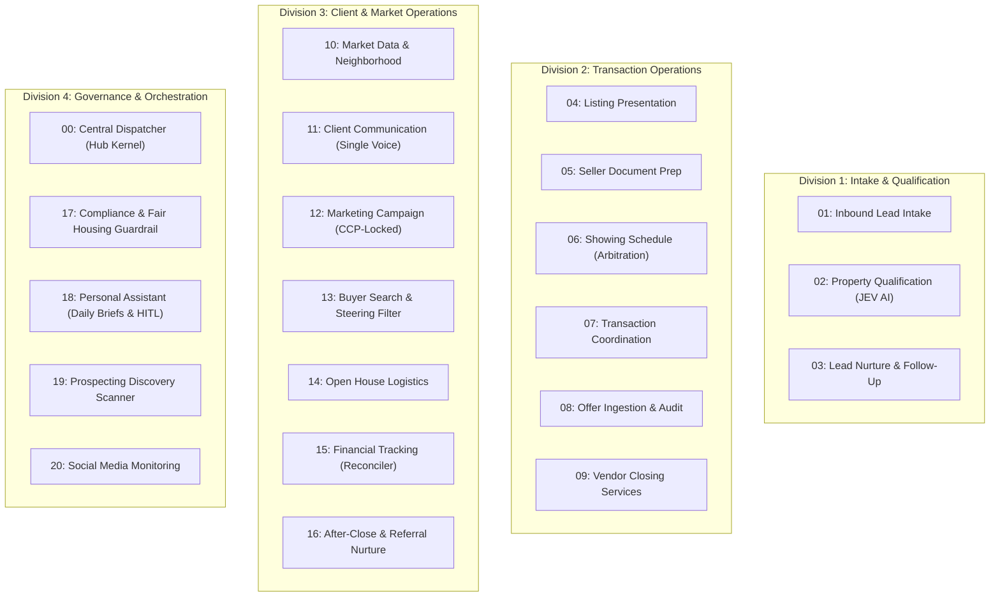

# Project Handoff: ListingAssistants Web Launch & Website Development
**Target Domain:** [`https://listingassistants.com`](https://listingassistants.com)  
**Parent Engine Repository:** [`QuietFireAI/listing-assistants`](https://github.com/QuietFireAI/listing-assistants)  
**Handoff Date:** October 9, 2026  
**Status:** Ready for Website Conception, Copywriting & Development

---

## 1. Executive Summary & Purpose

This document serves as the master onboarding dossier for the new development thread dedicated to designing, building, and deploying the official marketing website for **ListingAssistants** at **`listingassistants.com`**.

The core Python backend engine, multi-agent dispatch micro-kernel, audit suite, and comprehensive operational documentation have completed a full audit with **582 / 582 tests passing** and a **100% green CI pipeline on GitHub Actions**.

The purpose of the website thread is to create a high-converting, authoritative, and visually stunning digital storefront for managing brokers, real estate team leaders, and brokerage operators.

---

## 2. Brand Identity & Positioning

* **Product Name:** ListingAssistants
* **Domain:** `listingassistants.com` (Category-defining `.com` authority, newly acquired to replace legacy `listing-agents.io`).
* **Approved Tagline (Option 4C):**
  > *"A 21-member digital operations team for real estate offices. Runs 100% locally—not in the cloud. Works in unison on daily listing tasks and trains on your feedback to get better with every closed transaction."*
* **Core Value Propositions:**
  1. **Zero-Cloud / Local-First Privacy:** Runs on dedicated on-premise hardware (e.g., touchscreen office workstation or appliance PC). Client PII and financial records never leave the brokerage's physical premises.
  2. **21 Specialized Team Members:** An entire operations team—from inbound intake and transaction coordination to compliance screening and after-close nurture—working under a unified deterministic dispatcher.
  3. **Continuous Local Learning Loop:** Automatically learns from broker edits, corrections, and style preferences. Personalization weights assimilate locally into restore-point checkpoints without expensive cloud fine-tuning.
  4. **Strict Fiduciary Safeguards:** Fiduciary duty remains 100% with the human licensed broker. Agents have zero financial execution wiring and zero autonomous wire movement capabilities.
  5. **Air-Gapped Hardware Security:** Physical "one client, one drawer" folder isolation, SHA-256 tamper-evident append-only audit ledgers, and Ed25519 cryptographic signatures on all authority lanes.

---

## 3. The 21-Member Operations Team (Product Anatomy)

The website will present the software not as an abstract "AI chatbot", but as a structured, cohesive **21-member digital operations department** divided into 4 operational divisions:

---

## 4. Key Differentiators to Showcase on the Website

| Feature | The Old Cloud SaaS Way | The ListingAssistants Way |
| :--- | :--- | :--- |
| **Hosting Model** | Cloud multi-tenant server (AWS/Azure) | **100% Local Appliance / On-Premise PC** |
| **Data Privacy** | Client PII ingested by third-party cloud APIs | **Zero Cloud Footprint:** Stays on local disk |
| **Financial Risk** | Vague API permissions that risk wire fraud | **Zero Execution Wiring:** Human broker fiduciaries only |
| **Adaptation** | Generic one-size-fits-all model responses | **Self-Training Loop:** Learns from your closed deals |
| **Audit Defense** | Ephemeral, opaque chat logs | **SHA-256 Merkle Ledger:** Court-ready tamper-evident proof |
| **Team Structure** | Disconnected point tools and tabs | **21 Synchronized Agents** in a deterministic hub |

---

## 5. Artifacts, Deliverables & Codebase References

All source code and audit deliverables reside locally and on GitHub for the website team to pull copy, technical diagrams, and facts from:

* **Local Codebase Root:** `C:\Users\halfm\.gemini\antigravity\scratch\listing-agents`
* **GitHub Repository:** [`QuietFireAI/listing-assistants`](https://github.com/QuietFireAI/listing-assistants) (Git commit: `04df1b0`)
* **Core Documentation Files:**
  * [`README.md`](file:///C:/Users/halfm/.gemini/antigravity/scratch/listing-agents/README.md) — Comprehensive technical overview & architectural diagrams
  * [`docs/JOB_DESCRIPTIONS.md`](file:///C:/Users/halfm/.gemini/antigravity/scratch/listing-agents/docs/JOB_DESCRIPTIONS.md) — Exhaustive descriptions for all 21 team members
  * [`docs/FINANCIAL_CAPABILITY.md`](file:///C:/Users/halfm/.gemini/antigravity/scratch/listing-agents/docs/FINANCIAL_CAPABILITY.md) — Fiduciary invariants and unwired wire protection
  * [`docs/PLAYBOOKS.md`](file:///C:/Users/halfm/.gemini/antigravity/scratch/listing-agents/docs/PLAYBOOKS.md) — 24 standard operating playbooks
  * [`docs/LEARNING_LOOP_AND_DRIFT_ARCHITECTURE.md`](file:///C:/Users/halfm/.gemini/antigravity/scratch/listing-agents/docs/LEARNING_LOOP_AND_DRIFT_ARCHITECTURE.md) — Continuous broker learning loop
* **Customer-Facing Word Documents:**
  * `AGENT_USER_MANUAL.docx` (`scratch/listing-agents-audit/deliverables/AGENT_USER_MANUAL.docx`)
  * `OPERATOR_TUNING_GUIDE.docx` (`scratch/listing-agents-audit/deliverables/OPERATOR_TUNING_GUIDE.docx`)
* **Release Download Asset:**
  * `listingassistants-archetype-v1.0.0.zip` (Attached to GitHub Release `archetype-v1.0.0`)

---

## 6. Recommended Scope for the Website Thread

When launching the new thread, the objectives should be executed in clear phases:

### Phase 1: Information Architecture & Copywriting
1. **Hero Section:**
   * High-impact headline: *"Your Brokerage's Entire Listing Operations Team. Running 100% Locally on Your Hardware."*
   * Clear subtitle explaining the 21-member roster and privacy-first local appliance model.
   * Primary CTA: *"Schedule a Confidential Office Demo"* / *"Request Appliance Specifications"*.
2. **Interactive 21-Agent Roster Grid:**
   * Tabbed or card-based exploration of the 4 divisions.
   * Hover states showing each agent's role, input, output, and guardrails.
3. **The "Why Zero-Cloud Matters" Section:**
   * Visualizing local encryption, client drawer vaults, and zero cloud subscription bleed.
4. **The Self-Training Feedback Loop Section:**
   * Explaining how the engine gets smarter with every closed file based on broker feedback.
5. **Fiduciary Trust & Compliance Guarantee:**
   * Highlighting the non-negotiable legal boundary: AI executes tasks; human brokers maintain sole fiduciary responsibility.

### Phase 2: Technical Implementation
1. **Frontend Stack:** Clean, responsive, ultra-fast static framework (e.g., Tailwind CSS + Semantic HTML / Astro / Vite).
2. **Lead Capture / Early Access Form:** Secure contact form capturing Broker Name, Office Size, Location, and Current Listing Volume.
3. **DNS & Hosting Setup:**
   * Pointing `listingassistants.com` via clean DNS records (Cloudflare / static host).
   * Ensuring automatic HTTPS/SSL certification.

---

## 7. Starting the New Conversation

To begin the website build, start a new thread and paste this quick starter prompt:

> *"We are building the official marketing website for **ListingAssistants** at **listingassistants.com**. Please read the handoff document at `C:\Users\halfm\.gemini\antigravity\scratch\listing-agents\docs\WEBSITE_PROJECT_HANDOFF.md` to review the brand positioning, 21-agent team architecture, and deliverables. Let's begin by drafting the site structure, copy, and layout."*
