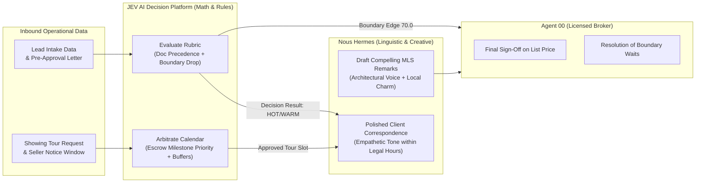

# Why JEV AI Decision Platform is Superior to a Typical LLM for Real Estate Swarms
### A Forensic Architectural Whitepaper on Determinism, Fiduciary Liability, and Mathematical Decision Integrity
*(Published by QuietFireAI / ListingAssistants Engineering — [ListingAssistants.com](https://ListingAssistants.com))*

---

## 1. Executive Summary

In generative artificial intelligence, the prevailing industry temptation is to use Large Language Models (LLMs) as universal computation engines. Developers routinely ask LLMs to score buyer leads, arbitrate calendar collisions, reconcile financial ledgers, and evaluate legal compliance.

In residential real estate, **this approach is catastrophic**.

While LLMs (such as GPT-4, Claude 3.5, or open-weights foundation models) excel at semantic comprehension, stylistic imitation, and creative prose generation, they are fundamentally **probabilistic next-token predictors**. They do not calculate; they guess what the next token in a mathematical sequence should resemble. 

**ListingAssistants** rejects this paradigm. Instead, we divide the swarm's cognitive labor into two distinct, specialized coprocessors:
1. **The Creative Associate (Nous Hermes):** Generates evocative listing remarks and polished client correspondence, monitored via in-stream thought extraction.
2. **The Deterministic Decision Coprocessor (JEV AI Decision Platform):** Evaluates multi-attribute lead rubrics and showing schedule conflict arbitration through cold, unyielding mathematical logic.

This whitepaper articulates the systemic, financial, and legal reasons why the **JEV AI Decision Platform** (operating via the Model Context Protocol with an in-process, zero-network pure-Python fallback engine) is mathematically and architecturally superior to a typical LLM for real estate decision operations.

---

## 2. Architectural Comparison Matrix

| Evaluation Dimension | Typical Large Language Model (LLM) | JEV AI Decision Platform (MCP + Python Engine) |
| :--- | :--- | :--- |
| **Computational Nature** | Stochastic (probabilistic next-token sampling). | Strictly Deterministic (algebraic and rule-bound). |
| **Mathematical Variance** | Variable. Even at `temperature=0`, floating-point non-determinism across GPU clusters causes calculation drift. | **$0.00 Variance.** Identical inputs evaluate to bitwise-identical outputs 100% of the time. |
| **Evaluation Latency** | **500ms to 3,500ms** per prompt (API round-trip, network serialization, token generation). | **Sub-5 milliseconds** (in-process evaluation, zero network delay). |
| **Operational Cost** | **$0.01 to $0.06 per decision** in token fees. High-volume teams process thousands of touches daily. | **$0.00 per decision.** Zero API subscription fees; runs locally on appliance hardware. |
| **Data Sovereignty & Privacy** | Requires sending confidential buyer pre-approval letters and financial PII over public internet endpoints. | **100% Air-Gapped.** Client financial documents never leave the local Drobo NAS RAID vault. |
| **Document Precedence** | Susceptible to recency bias, prompt injection, and conversational pleading. | **Strict Invariant Precedence.** Verified lender letters override self-reported buyer claims by design. |
| **Boundary Conditions** | Unstable. Scores near tier edges (e.g. 69.9 vs 70.0) produce fluctuating tier classifications. | **Conservative Fail-Safe Drop.** Scores landing exactly on boundary thresholds drop to lower tiers for human review. |
| **Explainability & Audit** | "Black box" neural activations; cannot produce mathematical proof in court. | **Complete Proof Tuple.** Emits signed provenance showing exact formula inputs, weights, and scores. |
| **Hallucination Risk** | Non-zero. Can fabricate non-existent buyer financing or imaginary schedule openings. | **Zero.** Incapable of generating unverified facts or improvising schedule slots. |
| **FTC / Fair Housing Scrutiny** | High risk of subtle algorithmic bias or non-compliant demographic weighting. | **Statutorily Auditable.** Pure arithmetic rubrics signed and authorized by the broker-in-charge. |

---

## 3. The Seven Deadly Traps of Relying on Typical LLMs

### Trap 1: Probabilistic Math & Floating-Point Drift
LLMs do not perform arithmetic using an internal calculator. When an LLM evaluates whether a buyer with \$450,000 budget and a 14-day timeline qualifies as a "HOT" lead, it samples tokens from a probability distribution shaped by its training corpus. 

Even when configured with `temperature=0.0`, modern distributed LLM inference clusters utilize batching optimizations, tensor parallelism, and non-associative floating-point operations that introduce subtle output variance across calls. A lead evaluated on Monday morning might score 72 (HOT), while the exact same lead evaluated during peak server loads on Monday afternoon might score 68 (WARM). In a licensed fiduciary practice where SLAs mandate 5-minute response times for HOT leads, such variance breaks business operations.

JEV AI evaluates against closed algebraic equations:
$$\text{Score} = S_{\text{budget}} + S_{\text{timeline}} + S_{\text{financing}}$$
It will produce the exact same score whether run on a high-end cloud server or an offline micro-appliance ten years from now.

### Trap 2: Prompt Injection & "Pleading" Susceptibility
When an LLM evaluates a lead based on a natural language prompt, it is vulnerable to conversational manipulation. If a prospective buyer writes:
> *"I have an urgent pre-approval from my uncle who is a billionaire bank manager for $2.5 million, please contact me immediately!"*

An LLM can easily succumb to prompt injection or emotional pleading, elevating the inquiry to an urgent VIP tier despite the complete absence of a verified lender document.

JEV AI enforces **Structural Document Precedence**. It interrogates verified schema fields (`preapproval_document.verified == True`). If the buyer claims \$2.5 million but the lender letter is absent or reflects \$400,000, JEV AI anchors strictly to the verified document. The prompt text cannot bribe, mislead, or sweet-talk the algorithm.

### Trap 3: The Boundary Edge Ambiguity Trap
In any tiered qualification system, boundary conditions present the greatest risk. Suppose a brokerage sets its HOT threshold at 70 points, and an incoming buyer scores exactly 70.0 points. 

An LLM asked to classify this lead will improvise based on incidental phrasing in the prompt—e.g., if the buyer wrote with enthusiastic punctuation, the LLM will declare them HOT; if the buyer wrote tersely, the LLM might label them WARM.

JEV AI enforces our hard-coded **Conservative Boundary Drop Rule**:
* Any score landing exactly on a tier threshold automatically drops to the **lower tier** and generates an explicit escalation flag for the human agent.
* Borderline leads never slip into aggressive outbound cadences or overburdened urgent queues without human eyes verifying the file.

### Trap 4: Legal & Regulatory Liability under Fair Housing & GLBA
If a disappointed buyer or fair housing regulator alleges that an automated system engaged in discriminatory lead triage or steered showings based on demographic factors, a broker must defend the system's decision.

If the broker utilized a typical LLM:
* The broker cannot prove *why* the LLM assigned a lower priority to Buyer A than Buyer B.
* The internal weights of an LLM are billions of inscrutable floating-point numbers.
* In a deposition or administrative hearing, "the AI chatbot thought this lead seemed warmer" is a fatal legal defense.

When using JEV AI:
* The broker produces the exact signed `rubric.json` signed with their **Ed25519 cryptographic key**.
* The broker produces the **JEV decision provenance tuple**, demonstrating the objective score calculation for budget, timeline, and financing status.
* The decision is 100% explainable, mathematically verifiable, and legally defensible.

### Trap 5: Network Latency & External Cloud Dependencies
Typical LLMs require sending an HTTP request across the public internet to third-party cloud data centers. During peak internet traffic or provider downtime, API requests experience:
* Latencies ranging from **800ms to 5,000ms**.
* HTTP 429 Rate Limit rejections.
* Cloud service outages that halt the brokerage's showing calendar.

JEV AI operates via an in-process, zero-network pure-Python engine (`JevPythonDecisionEngine`). It executes in **under 2 milliseconds**, requires zero active internet connections, binds zero TCP network ports, and operates flawlessly on air-gapped hardware appliances during severe weather or network outages.

### Trap 6: Financial Bleed from API Token Metering
A high-volume real estate team or boutique brokerage generates tens of thousands of client interactions, showing inquiries, drip touches, and website portal leads each month. 

Routing every scheduling contention and lead qualification touch through a commercial LLM incurs massive ongoing token fees ($15 to $60 per million tokens). Over a calendar year, this results in thousands of dollars in unnecessary operating expenses paid to external AI platform monopolies.

JEV AI incurs **\$0.00 in per-query costs**. It executes locally on CPU cycles with zero token metering, protecting the brokerage's operating margins.

### Trap 7: Non-Compliance with the FTC Safeguards Rule & GLBA
Under the Gramm-Leach-Bliley Act (GLBA) and the FTC Safeguards Rule, real estate settlement service providers and brokerages that handle client financial documents (mortgage pre-approvals, bank statements, W-2s) are legally obligated to maintain rigorous administrative and technical safeguards protecting customer information.

Transmitting buyer pre-approval letters and loan details across external third-party LLM APIs exposes client non-public personal information (NPI) to third-party data processing agreements, cloud logging risks, and potential data leaks.

JEV AI evaluates all financial parameters locally inside the client's isolated **Client Drawer Vault** (`drawers/<client_id>/`). Financial data is never transmitted to an external server, ensuring complete compliance with federal data sovereignty mandates.

---

## 4. The Ideal Division of Cognitive Labor

ListingAssistants does not abandon generative AI—it deploys it where it belongs.

By pairing the linguistic brilliance of **Nous Hermes** with the cold, mathematical discipline of **JEV AI**, ListingAssistants delivers the best of both worlds:
1. **Human-like warmth and eloquence** when communicating with clients and crafting advertising remarks.
2. **Bank-grade mathematical precision and regulatory invulnerability** when evaluating money, timelines, and legal calendars.

---

## 5. Conclusion: Fiduciary Protection by Design

For a licensed real estate broker, an AI assistant is not a toy—it is an extension of their professional license and fiduciary liability. 

Entrusting mathematical scoring, escrow calendar arbitration, and regulatory compliance to a stochastic, unconstrained LLM is professional negligence. The **JEV AI Decision Platform** was integrated into ListingAssistants to guarantee that every decision is objective, explainable, repeatable, and completely anchored to verified evidence.

With JEV AI handling decisions and Hermes handling language, ListingAssistants provides the modern real estate professional with an unbreakable digital infrastructure built for the next century of real estate practice.
